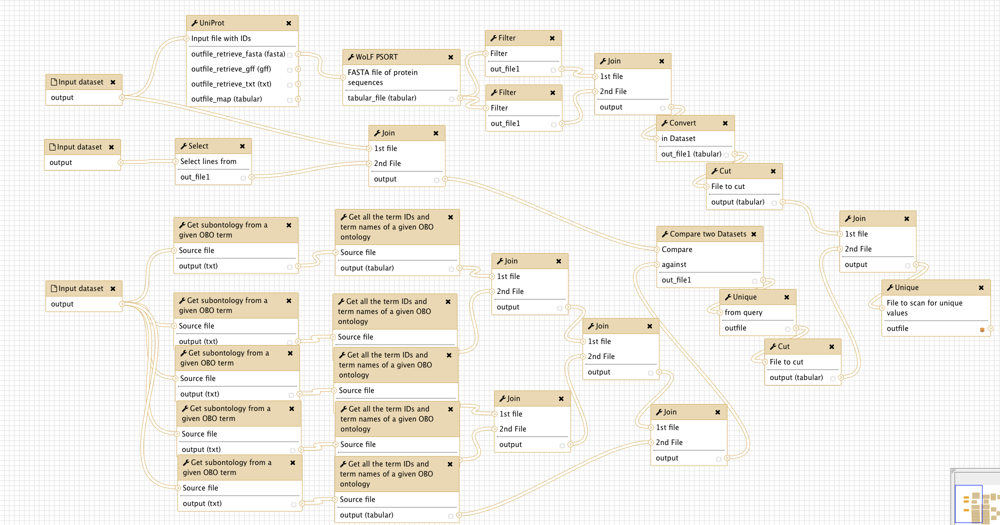

# Secretome Prediction using GO annotations and WoLF PSORT

A workflow to predict secretome proteins, originally published in [(Sigloch et al., BBA, 2016)](https://www.ncbi.nlm.nih.gov/pubmed/?term=sigloch+cathepsin).

## Introduction

The cellular secretome contains both proteins that are secreted by cells and proteins that are shed from the cellular surface. Here, we describe an approach to predict those proteins in an input list that would be expected in the cellular secretome. This approach combines Gene Ontology (GO) annotation and the [WoLF PSORT](https://www.ncbi.nlm.nih.gov/pmc/articles/PMC1933216/) algorithm for localization prediction. 

We chose to include all proteins that are annotated as, or predicted to be, lysosomal proteins. Lysosomal proteins are routinely secreted by malignant and non-malignant cells in high amounts, due to "leakiness" of the mannose-6-phosphate receptor pathway [1,2]. 
Furthermore, we chose to exclude proteins annotated as being part of extracellular organelles, e.g. exosomes. While exosomes are secreted by malignant and non-malignant cells, exosomal proteins are expected in the secretome at very low amounts, if not especially enriched for.

## Overview

The figure below gives an overview of the Galaxy workflow:

## Input

The workflow needs three input files:

  1) A tabular file, the first column containing uniprot accession numbers of the proteins of interest. [Test data](test_data.tabular)
  2) The complete uniprot GO database for the organism of interest.
  3) The complete GO Open Biomedical Ontology (OBO), i.e. "GO term tree", accessible at http://purl.obolibrary.org/obo/go/go.obo.

> ### :nut_and_bolt: Comment: Test data
> The provided test dataset for input 1 is a list of human proteins, identified by LC-MS/MS in the cellular supernatant of MDA-MB-231 cells, originally published in [(Sigloch et al., BBA, 2016)](https://www.ncbi.nlm.nih.gov/pubmed/?term=sigloch+cathepsin).
> {: .comment}

## Citation

If you use this workflow directly, or a derivative of it, in work leading to a scientific publication,
please cite:

F.C. Sigloch, J.D. Knopf, J. Weißer, A. Gomez-Auli, M.L. Biniossek, A. Petrera, et al., Proteomic analysis of silenced cathepsin B expression suggests non-proteolytic cathepsin B functionality, Biochim. Biophys. Acta - Mol. Cell Res. 1863 (2016) 2700–2709. doi:10.1016/j.bbamcr.2016.08.005. https://www.ncbi.nlm.nih.gov/pubmed/27526672

## Literature

[1] B. Schröder, C. Wrocklage, A. Hasilik, P. Saftig, The proteome of lysosomes., Proteomics. 10 (2010) 4053–76. doi:10.1002/pmic.201000196.

[2] J. Reiser, B. Adair, T. Reinheckel, Specialized roles for cysteine cathepsins in health and disease, J. Clin. Invest. 120 (2010) 3421–3431. doi:10.1172/JCI42918.