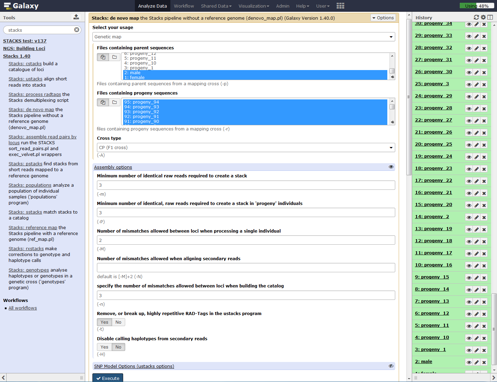
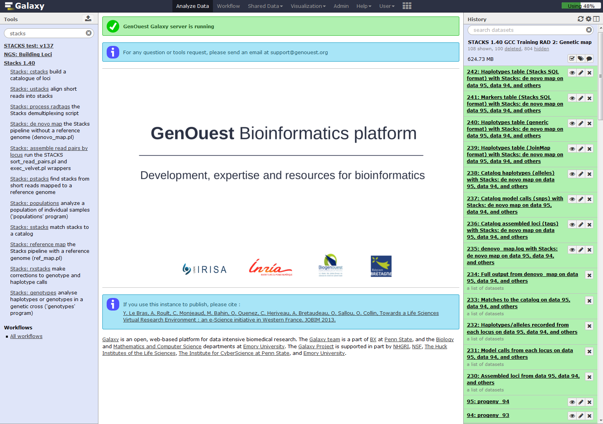

# Introduction

Original description is reachable on a [dedicated page of the official STACKS website](http://catchenlab.life.illinois.edu/stacks/tut_gar.php). Writers describe that they developed a genetic map in the spotted gar and present here data from a single linkage group. The gar genetic map is an F1 pseudotest cross between two parents and 94 of their F1 progeny. They took the markers that appeared in one of the linkage groups and worked backwards to provide the raw reads from all of the stacks contributing to that linkage group. 

We here proposed to re-analyze these data at least until genotypes determination. Data are already clean so you don't have to demultiplex it using barcode information through Process Radtags tool.

> ### Agenda
>
> In this tutorial, we will deal with:
>
> 1. [Pretreatments](#pretreatments)
> 2. [Building loci using STACKS](#snp-calling-from-radtags)
> 3. [Genotypes determination](#genotypes-determination)

# Pretreatments

## Data upload

The original data is available at [STACKS website](http://creskolab.uoregon.edu/stacks/tutorial/stacks_samples.tar.gz). 

To download all training datasets, you need to use the corresponding [Zenodo](xxxxxxxxxxxxxxxxxxx) repository.

> ### :pencil2: Hands-on: Data upload
>
> 1. Create a new history for this RAD-seq exercise. If you are not inspired, you can name it "STACKS 1.42 RAD: genetic map" for example...
> 2. Import Fasta files (*e.g.*  [`SRR034310`](ftp://ftp.sra.ebi.ac.uk/vol1/fastq/SRR034/SRR034310/SRR034310.fastq.gz)  as population map information file [`Population_map.txt`](https://zenodo.org/record/218574/files/Population_map) and barcodes file [`Barcodes_SRR034310`](https://zenodo.org/record/218574/files/Barcodes_SRR034310.tabular)) from [Zenodo](http://doi.org/10.5281/zenodo.218574)
>
>    > ### :nut_and_bolt: Comments
>    > If you are using the [GenOuest Galaxy instance](http://galaxy.genouest.org), you can load the dataset using 'Shared Data' <i class="fa fa-long-arrow-right"></i> 'Data Libraries' <i class="fa fa-long-arrow-right"></i> '1 Galaxy teaching folder' <i class="fa fa-long-arrow-right"></i> 'EnginesOn' <i class="fa fa-long-arrow-right"></i> 'RADseq' <i class="fa fa-long-arrow-right"></i> 'Genetic map' 
>
>    > ### :bulb: Tip: Importing data via links
>    >
>    > * Copy the link location
>    > * Open the Galaxy Upload Manager
>    > * Select **Paste/Fetch Data**
>    > * Paste the link into the text field
>    > * Paste the following links into the text field
>    >     * https://cesgo.genouest.org/resources/375/download/female.fa
>    >     * https://cesgo.genouest.org/resources/376/download/male.fa
>    >     * https://cesgo.genouest.org/resources/377/download/progeny_1.fa
>    >     * https://cesgo.genouest.org/resources/378/download/progeny_2.fa
>    >     * https://cesgo.genouest.org/resources/379/download/progeny_3.fa
>    >     * https://cesgo.genouest.org/resources/380/download/progeny_4.fa
>    >     * https://cesgo.genouest.org/resources/381/download/progeny_5.fa
>    >     * https://cesgo.genouest.org/resources/382/download/progeny_6.fa
>    >     * https://cesgo.genouest.org/resources/383/download/progeny_7.fa
>    >     * https://cesgo.genouest.org/resources/384/download/progeny_8.fa
>    >     * https://cesgo.genouest.org/resources/385/download/progeny_9.fa
>    >     * https://cesgo.genouest.org/resources/386/download/progeny_10.fa
>    >     * https://cesgo.genouest.org/resources/387/download/progeny_11.fa
>    >     * https://cesgo.genouest.org/resources/388/download/progeny_12.fa
>    >     * https://cesgo.genouest.org/resources/389/download/progeny_13.fa
>    >     * https://cesgo.genouest.org/resources/390/download/progeny_14.fa
>    >     * https://cesgo.genouest.org/resources/391/download/progeny_15.fa
>    >     * https://cesgo.genouest.org/resources/392/download/progeny_16.fa
>    >     * https://cesgo.genouest.org/resources/393/download/progeny_17.fa
>    >     * https://cesgo.genouest.org/resources/394/download/progeny_18.fa
>    >     * https://cesgo.genouest.org/resources/395/download/progeny_19.fa
>    >     * https://cesgo.genouest.org/resources/417/download/progeny_20.fa
>    > * Press **Start**  
>
>    As default, Galaxy takes the link as name. It also do not link the dataset to a database or a reference genome.
> 

# Building loci using STACKS

Run `Stacks: De novo map` Galaxy tool. This program will run ustacks, cstacks, and sstacks on each individual, accounting for the alignments of each read.

> ### :nut_and_bolt: Comment
>
> Information on denovo_map.pl and its parameters can be found online: http://creskolab.uoregon.edu/stacks/comp/denovo_map.php.

> **Stacks: De novo map** :wrench:: Run **Stacks** selecting the Genetic map usage. Specify each parent as a sample in the appropriate box, then each of the 20 progenies and specify a CP Cross type, 3 for the Minimum number of identical raw reads required to create a stack, 3 for minimum number of identical, raw reads required to create a stack in 'progeny' individuals, 3 for the number of mismatches allowed between loci when building the catalog and activate the option "remove, or break up, highly repetitive RAD-Tags in the ustacks program".
>
>    

>    Once Stacks has completed running, you will see 5 new data collections and 8 datasets.
>
>    
>
>     Investigate the output files: `result.log` and `catalog.*` (snps, alleles and tags).
>
>    Looking at the first file, denovo_map.log, you can see the command line used and the start as end execution time.
>
>    
>
>    Then are the different STACKS steps:
>    ustacks
>
>    
>
>    cstacks
>
>    
>
>
>    > ### :question: Question
>    >
>    > 1. Can you identify to what correspond the number 425?
>    > 2. Looking at the catalog.tags file, identify specific and shared loci from each parent.
>    >
>    >    

>    >    
Click to view answers

>    >    <ol type="1">
>    >    <li>0.75</li>
>    >    <li>3500</li>
>    >    </ol>
>    >    

>    sstacks
>
>    
>
# Genotypes determination
> **Stacks: populations** :wrench:: Run the last step of **Stacks: De novo map** pipeline specifying data filtering options (minimum percentage of individuals in a population required to process a locus for that population: 0.75 , output options (VCF and Structure) and enabling SNP and haplotype-based F statistics calculation.
>
>    
>
>    

>	Now look at the output in the file `batch_1.sumstats` nammed `SNP and Haplotype-based F statistics with Stacks: populations ...` on your history. This file is also reachable on the data collection nammed `Full output from ref_map .....` with his original name `batch_1.sumstats`. There are a large number of statistics calculated at each SNP, so use Galaxy tools like filter, cut, and sort to focus on some.

>
>    > ### :question: Question
>    >
>    > 1. What is the maximum value of FST at any SNP?
>    > 2. How many SNPs reach this FST value?
>    >
>    >    

>    >    
Click to view answers

>    >    <ol type="1">
>    >    <li>0.75</li>
>    >    <li>3500</li>
>    >    </ol>
>    >    

# Conclusion

In this tutorial, we have analyzed real RAD sequencing data to extract useful information, such as which loci are candidate regarding the genetic differentiation between freshwater and oceanic Stickelback populations. To answer these questions, we analyzed RAD sequence datasets using a de novo RAD-seq data analysis approach. This approach can be sum up with the following scheme:

