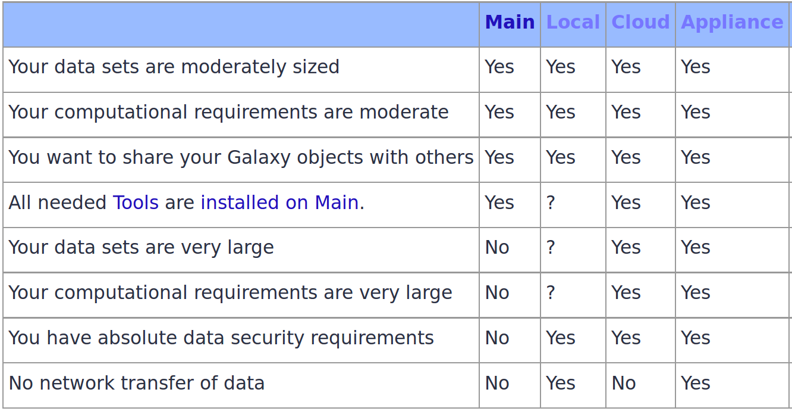
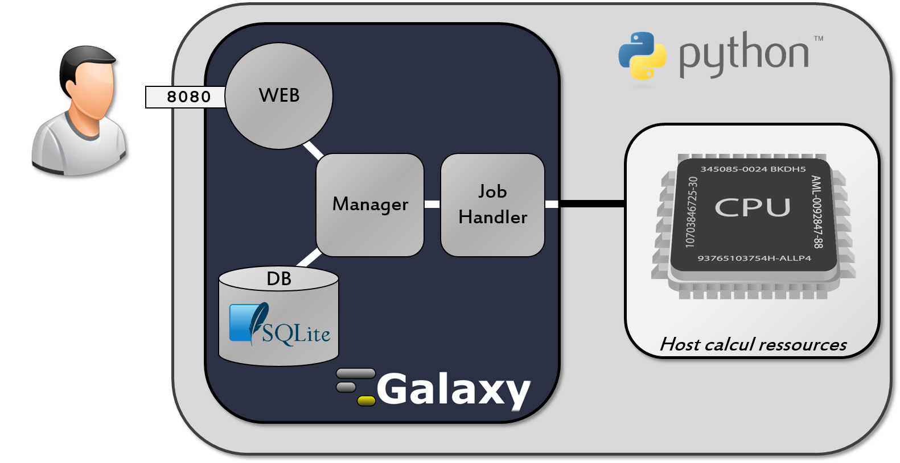
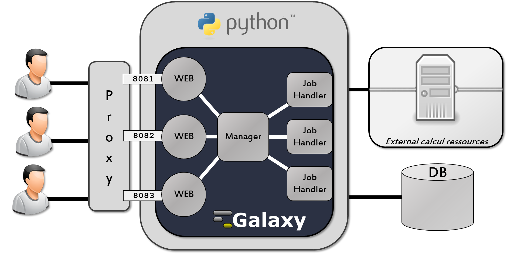

## Galaxy is available in several different ways 

---

###  Several different ways

- [Main](http://usegalaxy.org/) and [others](https://galaxyproject.org/public-galaxy-servers/) free public servers
- Run your [local instance](https://galaxyproject.org/admin/get-galaxy/) or a [docker](https://github.com/bgruening/docker-galaxy-stable) image
- Use Galaxy on the [Cloud](https://galaxyproject.org/cloud/)
- Get the SlipStream [Galaxy Appliance](https://bioteam.net/products/galaxy-appliance/)

---

### Which option to choose ?

---

## Galaxy Locally

---

### Reasons to Install Your Own Galaxy

- You want to run a local [production Galaxy](https://galaxyproject.org/admin/config/performance/production-server/) 
- You want to develop [Galaxy tools](https://galaxyproject.org/admin/tools/add-tool-tutorial)
- You to [Develop Galaxy](https://galaxyproject.org/develop/) itself

---

### Requirements

- UNIX/Linux or Mac OS X (or [Windows](https://galaxyproject.org/admin/config/windows))
- Python 2.7
- Git (optional)
- GNU Make, gcc to compile and install tool dependencies

---

## Galaxy in production

---

## Reasons to install Galaxy in production

- [install](https://galaxyproject.org/admin/tools/add-tool-tutorial) and use tools unavailable on [public Galaxies](https://galaxyproject.org/public-galaxy-servers)
- use sensitive data (e.g. clinical) 
- process large datasets that are too big for public Galaxies 
- [plug-in](https://galaxyproject.org/admin/internals/data-sources) new datasources 

---

### By default Galaxy
<!-- - Uses SQLite
- Uses a built-in HTTP Server
- Runs all tools locally
- Runs in a single process --> 

---

### Galaxy in production, basic configuration
<!-- - Switching to a database server
- Using a proxy server
- Using a compute cluster -->

---

### What's next ?

- You want to intall Galaxy locally ?
- And You want to configure Galaxy for production ?

---

### See the tutorial:

#### ["Move from dev instance to production instance"](dev_to_production.html)

---

### Tutorials

- [Move from dev instance to production instance](dev_to_production.html)
- ['10 rules' for Setting up a Galaxy Instance as a Service](10rules_for_GaaS.html)
- [Galaxy and Docker](galaxy_docker.html)
- [Galaxy Database schema](database_schema.html)
