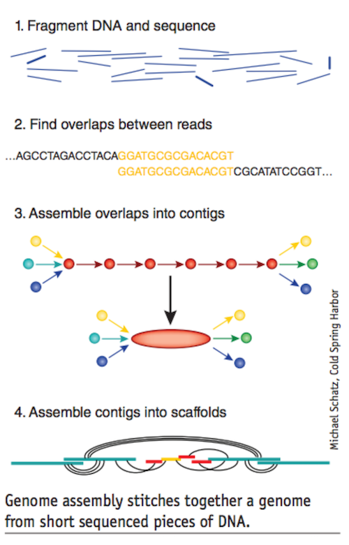
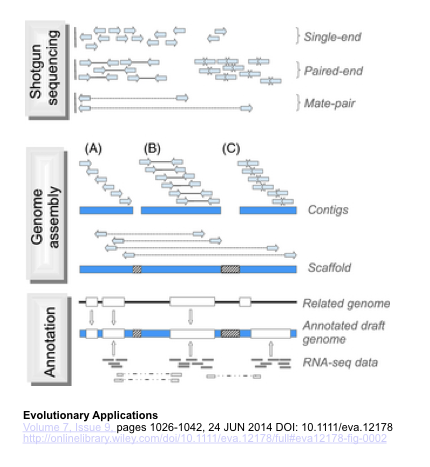
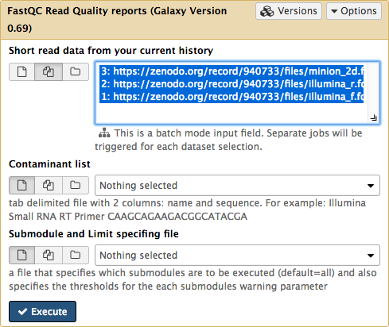
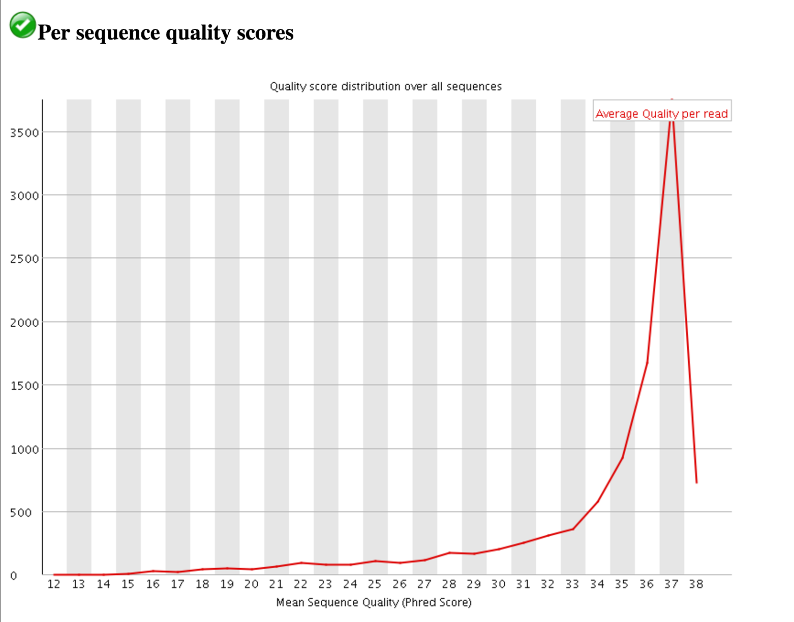

# Introduction
{:.no_toc}
# Small bacterial genome Assembly with Unicycler - an introduction 

A few definitions to start : 
 * **Alignment** : Similarity-based arrangement of DNA, RNA or protein sequences. In this context, subject and query sequence should be orthologous and reflect evolutionary, not functional or structural relationships
 * **Assembly** : Computational reconstruction of a longer sequence from smaller sequence reads
 * **Contig** : A contiguous linear DNA or RNA consensus sequence. Constructed from the assembly of smaller, partially overlapping, sequence fragments (reads)
 * **Coverage** : Also known as ‘sequencing depth’. Sequence coverage refers to the average number of reads per locus.
 * **De novo assembly** : Refers to the reconstruction of contiguous sequences without making use of any reference sequence
 * **Library** : Collection of DNA (or RNA) fragments modified in a way that is appropriate for downstream analyses
 * **Mapping** : Alignment of short sequence reads to a longer reference sequence
 * **Masking** : Converting a DNA sequence [A,C,G,T] (usually repetitive or of low quality) to the uninformative character state N or to lower case characters [a,c,g,t] (soft masking)
 * **Mate-pair** : Sequence information from two ends of a DNA fragment, usually several thousand base-pairs long
 * **N50** : A statistic of a set of contigs or scaffolds : the length for which the collection of all contigs of that length or longer contains at least half of the total of the lengths of the contigs
 * **N90** : Equivalent to the N50 statistic describing the length for which the collection of all contigs of that length or longer contains at least 90% of the total of the lengths of the contigs
 * **Paired-end sequencing** : Sequence information from two ends of a short DNA fragment, usually a few hundred base pairs long
 * **Read** : Short base-pair sequence inferred from the DNA/RNA template by sequencing
 * **Scaffold** : Two or more contigs joined together using read-pair information
 
There is two types of genome assembly, de novo assembly or against reference assembly.
Reference assembly is performed by mapping small DNA fragment issued from sequencing technologies against a reference genome from the same or a close species.
De novo genome assembly is performed by aligning and merging these fragments without a reference genome. The fragments are then align against each other to form bigger fragments.

<small> Figure from [Baker:2012](http://www.nature.com/nmeth/journal/v9/n4/full/nmeth.1935.html) </small> 

Two currently available technologies are most attractive for small genome sequencing. Illumina’s reversible terminator process offers high coverage and accuracy at low cost (~$2K for a paired-end 2 x 300bp run) but can at most generate reads 300 bp in length. On the other hand, Oxford Nanopore’s molecular ratcheting through nanopore technology generates reads with mean length in thousands of bases and outliers over 100,000 kb in length. 

Both technologies provides very different data, Illumina producing shorter reads of higher quality, and Oxford Nanopore longer read with higher error rates.
The use of both technologies together is a good way to obtain longer contigs and precise sequencing.

A de novo assembly can be realised through the following steps : i) Library Preparation; ii) Assessment of quality and coverage of the reads; iii) Genome assembly ; iv) Genome annotation ; v) Evaluation of Assembly quality. An hybrid assembly is realised through the same steps, with in addition the preparation of NGS libraries if needed, for example by combining separated Illumina reads and quality file into a fastq file  

<small> Shotgun Sequencing is a method for sequencing long DNA strands, small fragment are sequenced randomly on the genome to get a certain depth.These fragments can be single reads (50 to 1000 bp), or paired-end reads with variable insert size like mate pair librairies that have larger insert (2 to 20 kb insert). The long read technologies allow to sequences up to several thousand of bases.
From this fragments, an assembly allows to merge reads into contigs and then scaffolds. Once the genome assembli has been made, an annotation is performed by comparing to related genome or using RNA-seq data for example. </small>

### Library preparation and read quality 

The sequencing technologies provide raw data that may need to be preparated before performing an assembly. 
The Oxford Nanopore Technology produces fast5 files, one for each read, that need to be converted in fastq format. The poretools suite offer a toolkit for working with Oxford Nanopore sequencing data, and allows to convert from fast5 to fastq and to get statistics about the reads. 
We will consider in this tutorial that this step has been completed and that we are in possession of the fastq file.
The quality of Illumina reads can be assessed with tools such as [FastQC](http://www.bioinformatics.babraham.ac.uk/projects/fastqc) that provides a summary of different statistics.
A wide variety of tools can be used to improve the quality of the reads that won't be discussed in this tutorial (More info [here](http://www.nature.com/nmeth/journal/v10/n1/full/nmeth.2276.html)).

Once the libraries are in fastq format with a satisfying quality, the assembly can be performed. 

### Assembly with Unicycler

Unicycler is an assembly pipeline for bacterial genomes, based on Spades to which it adds a cicularisation process. The Spades tool has been described in an other tutarial, we therefore won't discuss it further here. 
Unicycler provides an assembly graph in addition to he fasta file and can handle plasmid rich genomes.
Like Spades, it can assemble Illumina or hybrid sets.

On illumina assembly, Unicycler optimises Spades by : Selecting a range of k-mer sizes and selecting the best, and applying several filter to optimize the results.
On hybrid assembly, Unicycler uses long reads to build bridges to resolve high repeat regions and obtain longer assemblies. You can find more informations in 
[Wick:2017](http://journals.plos.org/ploscompbiol/article/file?id=10.1371/journal.pcbi.1005595&type=printable)

### Annotation with Prokka

The annotation of the newly assembled genomes will allow the identification of probable gene location and coding region. In this tutorial we will use Prokka, which is a software performant for the quick annotation of small genomes. 
Prokka uses Blast+ or HMMer on databases derived from UniProtKB to assign function to the predicted CDS.

## Let's try it

> ### Agenda
>
> In this tutorial, we will deal with:
>
> 1. [Get the data](#get-the-data)
> 2. [Assess the reads quality](#assess-read-quality)
> 3. [Assembly with Unicycler](#assemble-with-unicycler)
> 4. [Annotate with Prokka](#annotate-with-prokka)
{: .agenda}

### Get the data

In this example we will use a downsampled version of Ecoli_C Illumina and Oxford Nanopore Sequancing. These include 3 files : forward and reverse reads for Illumina, and Long read file .

Here is what to do to load the data:

> ### :pencil2: Hands-on: Getting the data
>
> 1. Create and name a new history for this tutorial.
> 2. Go to the [data library](https://usegalaxy.org/library/list#folders/Ff4ce53393dae30ee) and select all fastq files. Then Click `to History` button:
>  
> 3. Once the files have been uploaded, change their types to fastqsanger 
>
>    > ### :bulb: Tip: Changing a dataset datatype
>    >
>    > * Click on the pencil icon of the dataset in the history 
>    > * Open the Datatype tab
>    > * Change the data-type to **fastqsanger**
>    > * Save
>    {: .tip}
>
>
{: .hands_on}

The datasets will appear in your history:

#### Assess Read Quality

You can assess the quality of your reads by using FastQc on your short read file.

<small>Use Fastqc to get quality informations about your reads. </small>

FastQc will provide you with a raw text statistic files and html file about your read quality.

In addition to basic informations about the library (type of file, encoding read range of lengths and percentage of GC in the sequences), the html files display several graphes for different quality metrics.
First, a boxplot showing the sequence quality per base. 

<small>The central red line is the median value and, the yellow box represent the inter-quartile range, the whiskers represent the extreme 10 percentiles, and the blue line represent the mean quality. The higher the score in the y-axis, the better the quality, and is devided in three categories : very good quality in green, reasonable quality in orange, and poor quality in red. We can see here that our Illumina files have a good perbase sequence quality in average.</small>

Another plot raresent the quality per sequence.

<small> We can see the average quality per read is high for our library. This metric can be useful to detect a problem if a significant portion of the reads are of lower quality.</small>

The Quality read per tile represent the flowcell tiles from wich the reads came.  

<small>The color scale goes from blue to red, the blue colors describing tiles with above average quality and the red color describing tiles with below average quality. We can see here our read have a above average quality, except for one green tile that describe an average quality of read.</small>

The metrics on Illumina read shows a library of high quality reads, we can now perform the assembly with Unicycler.

#### Assembly with Unicycler 

The unicyler tool take as input fastqsanger files. If your files are identified as generic fastq files you will need to change the type of your files.

<small>Click on the pen bouton of a dataset in your history to edit its attributes.</small>

<small>Click on the Datatype tab and select the appropriate type in the list, here fastqsanger.</small>

Repeat the process for the 3 datasets.

You can now run Unicycler to perform the assembly with the following parameters : 
* **Paired or Single end data?** : Select the appropriate option to describe you data. In this example we are using Paired end Data.
* **Select first set of reads** : Specify the dataset containing the forward reads, often specified by a "-1" in the file name, but specified here by the "R1".
* **Select second set of reads** : Specify the dataset containing the forward reads, often specified by a "-2" in the file name, but specified here by the "R2".
* **Select long reads** : Optional, here specify you Oxford Nanopore dataset.

<small> Run Unicycler with your sequencing dataset in fastqsanger format.</small>

Unicycler returns two output files : a fasta file containing the result of the assembly, and a graph file. 
You can then evaluate the quality of the resulting alignement by using the Quast tool on the fasta file.

#### Assess Assembly quality with Quast

Quast is a tool providing quality metrics on assemblies, and can also be used to compare several assemblies. The tool can also take an optional reference file as input, and will provide complementary metrics.
For this tutorial we will simply use quast on the fasta file resulting from the Unicycler assembly.

The Quast tool ouput the metrics in several format, and an html file with metrics and graphs.

Quast provides different statistics such as the number of contigs or scaffolds, the N50 and N75, and the total length of the assembly. You can also access 3 plots, the cumulative length of the contigs, the Nx, or the GC content. 
Once you are satisfied with the quality of your assembly, you can use Prokka to annotate your genome.

#### Annotation with Prokka

Run Prokka with the following paramters:
* **Contigs to annotate** : Specify the fasta file resulting from your assembly with Unicycler.
* **Locus tag prefix** : Specify the format you desire for your locus tags. By Default PROKKA.
* **Locus tag counter increment** : By default 1, but a 10 increment facilitate the insertion of new genes when manually correcting the annotation.
* **Force GenBank/ENA/DDJB compliance** : Select "yes" if you desire to force the GenFank Locus tag formatting. If you do so be aware of the length limitation. Here we select no for more convenience.
* **Add 'gene' features for each 'CDS' feature** : Select yes to get the gene feature in addition to the CDS feature in the gff3.
* **Genus name** : Specify the Genus of your organism. Here "Escherichia".
* **Species name** : Specify the species of your organism. Here "Coli".
* **Strain name** : Specify the strain of your organism. Here "C".
* **Kingdom** : Select the kingdom to which your organism belong. Here "Bacteria".
* **Use genus-specific BLAST database** : Select "yes" to use the genus-specific Blast.

Prokka outputs 10 datasets. One of the is the Prokka log, another is the error repport,  but 8 are diverse result files : 
* **txt file** : Provides Statistics on the annotation : number of CDS predicted, number of rRNA etc.
* **tbl file** : Provides a tabulated list of annotated features.
* **fsa file** : Nucleotide fasta file of the input contig sequence.
* **sqn file** : ASN1 format file for submission to GenBank.
* **ffn file** : Nucleotide FASTA file of all the prediction transcripts.
* **faa file** : Protein FASTA file of the translated CDS sequences.
* **fna file** : Nucleotide fasta file of the input contig sequence.
* **gbk file** : GenBank file.
* **gff file** : gff3 file.

