### Why IEs?

- Embedded access to third-party application inside of Galaxy
- Interactively analyze data, access analysis products within Galaxy

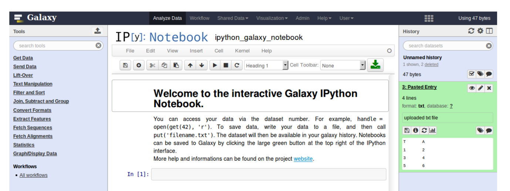

- Bring external analysis platform to the data instead of vice-versa
  - no need to download/re-upload your data

---

### Who should use IEs?

- Everyone!
- Programing Environments for Bioinformaticians and Data Scientists
  - Jupyter
  - Rstudio
- Visualization IEs are great for life scientists
  - IOBIO (bam/vcf visualizations)
  - Phinch (metagenomics visualizations)

---

### How to launch an IE?

- Can be bound to specific datatypes
  - Available under the visualizations button on the dataset

.image-25[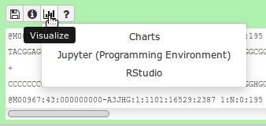]

- Or more general-purpose applications (Jupyter/Rstudio)
- IE launcher

.image-25[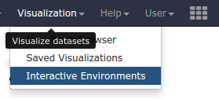]
---

### IE Launcher

- Choose between different available docker images
- Attach one or more datasets from history

.image-75[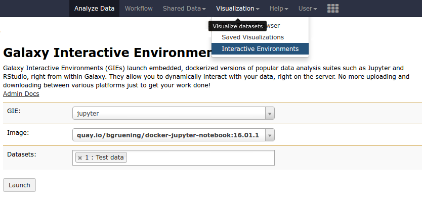]

---

### How does it work?

- Docker Containers are launched on-demand by users..
- ..and killed automatically when users stop using them

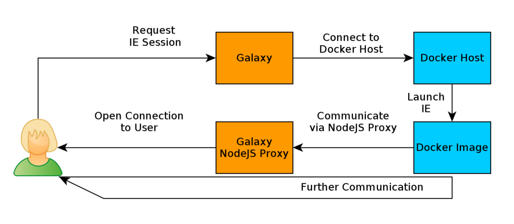

.footnote[ Admin Docs: https://docs.galaxyproject.org/en/master/admin/interactive_environments.html ]

---

### Jupyter

  - General purpose/ multi-dataset
  - Provides special functions to interact with the Galaxy history (get/put datasets)
  - Ability to save and load notebooks
  - [Video demo](https://www.youtube.com/watch?v=UOFFkDuJxgk)

.image-75[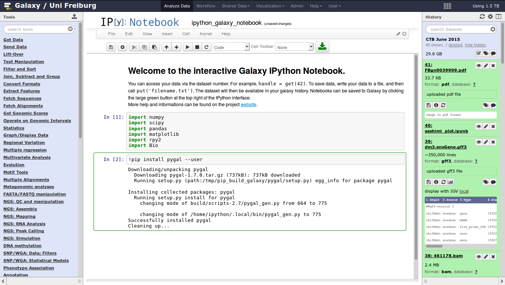]

---

### Jupyter

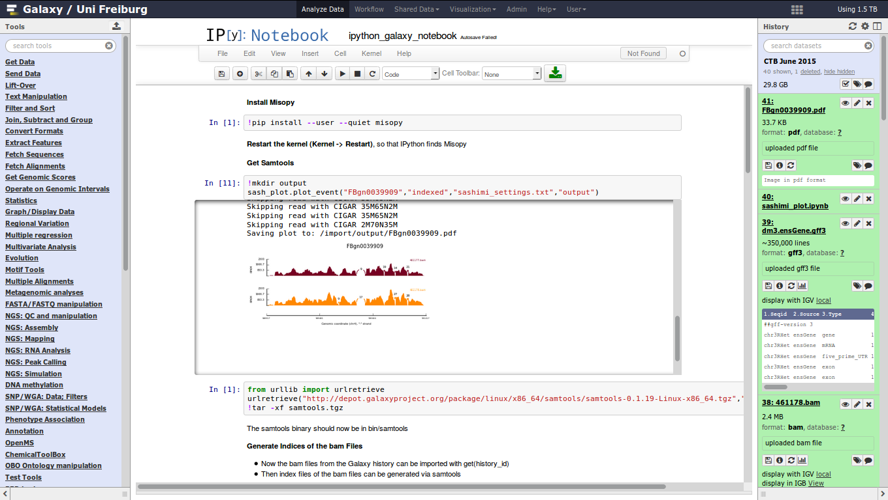

---

### Jupyter

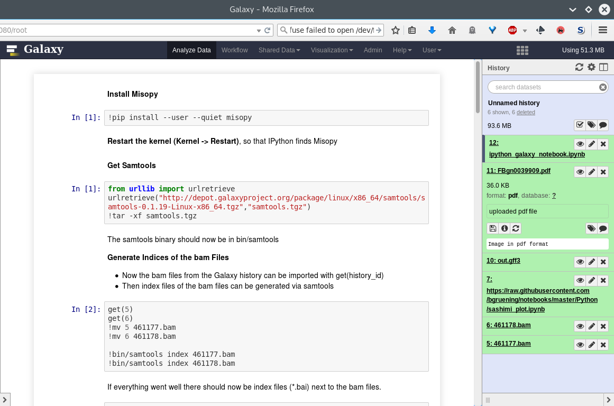

---

### Rstudio

- General purpose/ multi-dataset
- Provides special functions to interact with the Galaxy history
- Ability to save and load workbook and R history object

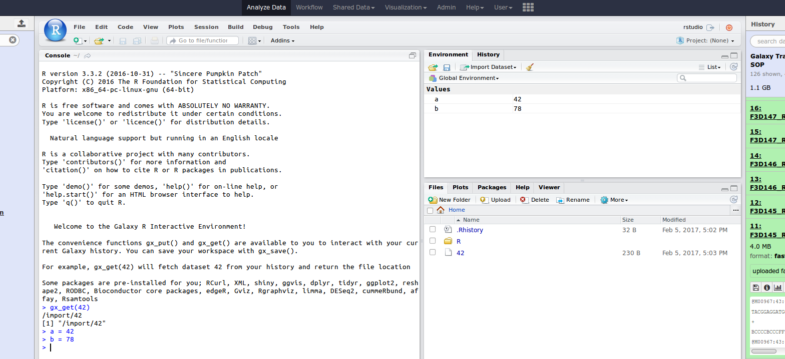

---

### IOBIO

- Visualizes single dataset
- Only available for datasets of specific formats

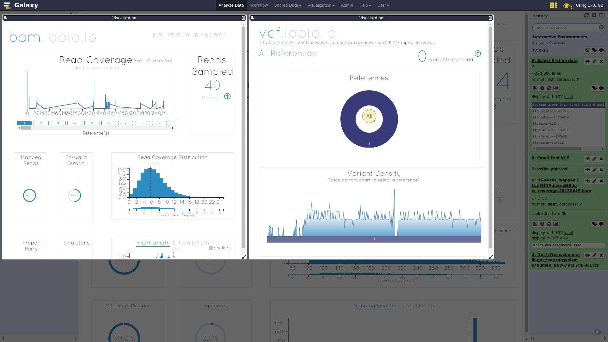

---

### IOBIO

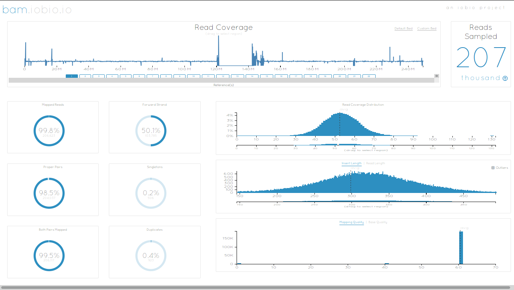

---

### Phinch

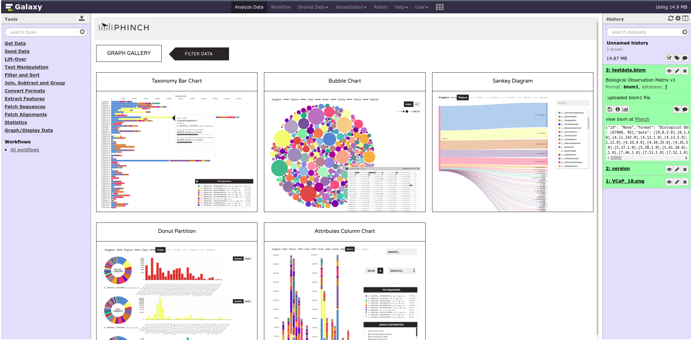

---

### Admin

- Prerequisites: NodeJs (npm) and Docker; Galaxy user must be able to talk to the docker daemon
- Enable IEs in `galaxy.ini`
  ```bash
  interactive_environment_plugins_directory = config/plugins/interactive_environments
  ```
- Install node proxy
  ```bash
  $ cd $GALAXY/lib/galaxy/web/proxy/js/
  $ npm install .
  ```
- Can configure GIEs to run on another host

.footnote[ Advanced configurations: https://docs.galaxyproject.org/en/master/admin/interactive_environments.html]

---

### Development

- Not hard to build!
- All the magic is in:
  ```bash
  $GALAXY/config/plugins/interactive_environments/$ie_name/
  ```


| Component                          | File                         |
|------------------------------------|------------------------------|
| Visualization Plugin Configuration | ../config/${ie_name}.xml     |
| IE specific Configuration          | ../config/${ie_name}.ini     |
| Mako Template                      | ../templates/${ie_name}.mako |

---

### Development


---

### Hello World Example

- All files in this example available from
  https://github.com/erasche/hello-world-interactive-environment/
- Create a GIE that shows the directory listing of `import` folder (datasets loaded into GIE by user)

```bash
$ tree $GALAXY_ROOT/config/plugins/interactive_environments/helloworld/
config/plugins/interactive_environments/helloworld/
├── config
│   ├── helloworld.ini
│   ├── helloworld.ini.sample
│   └── helloworld.xml
├── static
│   └── js
│       └── helloworld.js
└── templates
    └── helloworld.mako
```

---

Create GIE plugin XML file `config/helloworld.xml`

```xml
<?xml version="1.0" encoding="UTF-8"?>
<!DOCTYPE interactive_environment SYSTEM "../../interactive_environments.dtd">
<!-- This is the name which will show up in the User's Browser -->
<interactive_environment name="HelloWorld">
  <data_sources>
    <data_source>
      <model_class>HistoryDatasetAssociation</model_class>

      <!-- filter which types of datasets are appropriate for this GIE -->
      <test type="isinstance" test_attr="datatype"
            result_type="datatype">tabular.Tabular</test>
      <test type="isinstance" test_attr="datatype"
            result_type="datatype">data.Text</test>
      <to_param param_attr="id">dataset_id</to_param>
    </data_source>
  </data_sources>
  <params>
    <param type="dataset" var_name_in_template="hda" required="true">dataset_id</param>
  </params>
  <!-- Be sure that your entrypoint name is correct! -->
  <entry_point entry_point_type="mako">helloworld.mako</entry_point>
</interactive_environment>
```

---

Set up `.ini` file, which controls docker interaction `config/helloworld.ini.sample`

```ini
[main]
# Unused

[docker]
# Command to execute docker. For example `sudo docker` or `docker-lxc`.
#command = docker {docker_args}

# The docker image name that should be started.
image = hello-ie

# Additional arguments that are passed to the `docker run` command.
#command_inject = --sig-proxy=true -e DEBUG=false

# URL to access the Galaxy API with from the spawn Docker container, if empty
# this falls back to galaxy.ini's galaxy_infrastructure_url and finally to the
# Docker host of the spawned container if that is also not set.
#galaxy_url =

# The Docker hostname. It can be useful to run the Docker daemon on a different
# host than Galaxy.
#docker_hostname = localhost

[..]
```

---

- Create mako template `templates/helloworld.mako`
  - Loads configuration from `ini` file
  - launches docker container,
  - builds a URL to the correct endpoint through Galaxy NodeJS proxy
  - set environment variable `CUSTOM` to be passed to containter
  - attach dataset selected by user (`hda`)

```mako
<%namespace name="ie" file="ie.mako" />
<%
# Sets ID and sets up a lot of other variables
ie_request.load_deploy_config()

# Define a volume that will be mounted into the container.
# This is a useful way to provide access to large files in the container,
# if the user knows ahead of time that they will need it.
user_file = ie_request.volume(
    hda.file_name, '/import/file.dat', how='ro')

# Launch the IE. This builds and runs the docker command in the background.
ie_request.launch(
    volumes=[user_file],
    env_override={
        'custom': '42'
    }
)
[..]
```

---

(continued)

```mako
[..]
# Only once the container is launched can we template our URLs. The ie_request
# doesn't have all of the information needed until the container is running.
url = ie_request.url_template('${PROXY_URL}/helloworld/')
%>

<html>
<head>
${ ie.load_default_js() }
</head>
<body>
<script type="text/javascript">
${ ie.default_javascript_variables() }
var url = '${ url }';
${ ie.plugin_require_config() }
requirejs(['interactive_environments', 'plugin/helloworld'], function(){
    load_notebook(url);
});
</script>
<div id="main" width="100%" height="100%">
</div>
</body>
</html>
```

---
Lastly we must write the `load_notebook` function, `static/hs/helloworld.js`

```javascript
function load_notebook(url){
    $( document ).ready(function() {
        test_ie_availability(url, function(){
            append_notebook(url)
        });
    });
}
```

---

### Hello World Example

- The only thing missing now is the GIE (Docker :whale:) container itself
- Container typically consists of:
  - Dockerfile
  - Proxy configuration (e.g. nginx)
  - Custom startup script/entrypoint
  - Script to monitor traffic and kill unused containers
  - The actual application for the users (here: simple python process which serves
    directory contents of `/import` folder of container)

.footnote[ :whale:]
---

```dockerfile
FROM ubuntu:14.04
# These environment variables are passed from Galaxy to the container
# and help you enable connectivity to Galaxy from within the container.
# This means your user can import/export data from/to Galaxy.
ENV DEBIAN_FRONTEND=noninteractive \
    API_KEY=none \
    DEBUG=false \
    PROXY_PREFIX=none \
    GALAXY_URL=none \
    GALAXY_WEB_PORT=10000 \
    HISTORY_ID=none \
    REMOTE_HOST=none

RUN apt-get -qq update && \
    apt-get install --no-install-recommends -y \
    wget procps nginx python python-pip net-tools nginx

# Our very important scripts. Make sure you've run `chmod +x startup.sh
# monitor_traffic.sh` outside of the container!
ADD ./startup.sh /startup.sh
ADD ./monitor_traffic.sh /monitor_traffic.sh

# /import will be the universal mount-point for IPython
# The Galaxy instance can copy in data that needs to be present to the
# container
RUN mkdir /import

[..]
```

.footnote[ :whale:]
---

(continued)

```dockerfile
[..]
# Nginx configuration
COPY ./proxy.conf /proxy.conf

VOLUME ["/import"]
WORKDIR /import/

# EXTREMELY IMPORTANT! You must expose a SINGLE port on your container.
EXPOSE 80
CMD /startup.sh
```

.footnote[ :whale:]
---

- Proxy configuration (nginx)
  - reverse proxy our directory listing process running on port 8000

```nginx
server {
    listen 80;
    server_name localhost;
    access_log /var/log/nginx/localhost.access.log;

    # Note the trailing slash used everywhere!
    location PROXY_PREFIX/helloworld/ {
        proxy_buffering off;
        proxy_pass         http://127.0.0.1:8000/;
        proxy_redirect     http://127.0.0.1:8000/ PROXY_PREFIX/helloworld/;
    }
}
```

.footnote[ :whale:]
---

- Create the `startup.sh` file which starts our directory listing service

```bash
#!/bin/bash
# First, replace the PROXY_PREFIX value in /proxy.conf with the value from
# the environment variable.
sed -i "s|PROXY_PREFIX|${PROXY_PREFIX}|" /proxy.conf;
# Then copy into the default location for ubuntu+nginx
cp /proxy.conf /etc/nginx/sites-enabled/default;

# Here you would normally start whatever service you want to start. In our
# example we start a simple directory listing service on port 8000
cd /import/ && python -mSimpleHTTPServer &

# Launch traffic monitor which will automatically kill the container if
# traffic stops
/monitor_traffic.sh &
# And finally launch nginx in foreground mode. This will make debugging
# easier as logs will be available from `docker logs ...`
nginx -g 'daemon off;'
```

.footnote[ :whale:]
---

- Lastly, the script to monitor traffic and shut down if user is no longer connected, `monitor_traffic.sh`

```bash
#!/bin/bash
while true; do
    sleep 60
    if [ `netstat -t | grep -v CLOSE_WAIT | grep ':80' | wc -l` -lt 3 ]
    then
        pkill nginx
    fi
done
```
.footnote[ :whale:]
---

### Hello World Example

- We are now ready to build our container, and try out our new GIE!
- If the container is hosted on a service like Dockerhub or quay.io, it will be automatically
fetched on first run.

```bash
$ cd hello-ie
$ docker build -t hello-ie .
```

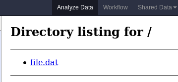

.footnote[Try it yourself: https://github.com/erasche/hello-world-interactive-environment]
