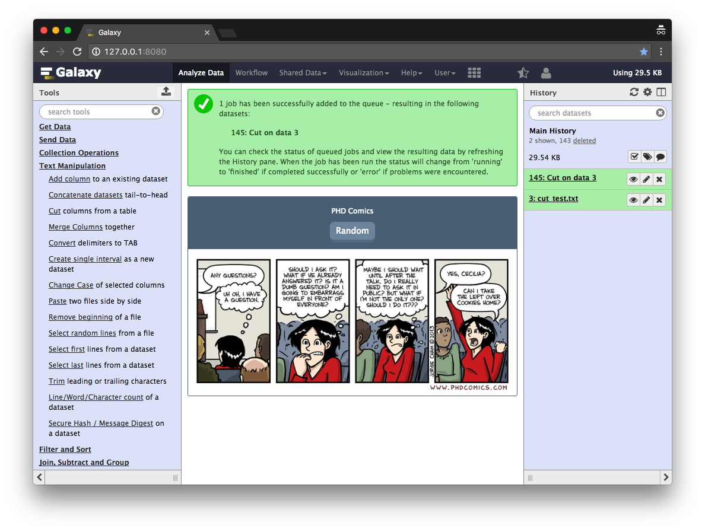

## Introduction

In this tutorial we are going to demonstrate how to add a webhook to the tool-execution endpoint. This is the web-page that appears
after you have executed a tool. As a more useful example we are going to ask [phdcomics](http://phdcomics.com) for a random comic that we can
display to entertain our users.


> ### :pencil2: Hands-on
>
> 1. Create a file named `config/phdcomics.yaml` with the following content:
>
>    ```yaml
>       name: phdcomics
>       type:
>         - tool
>         - workflow
>       activate: true
>    ```


> ### :pencil2: Hands-on
>
> 1. Create a file named `helpers/__init__.yp` with the following content:
>
>    ```python
>    import urllib
>    import re
>    import random
>    import logging
>
>    log = logging.getLogger(__name__)
>
>
>    def main(trans, webhook, params):
>        error = ''
>        comic_src = ''
>
>        try:
>            # Third-party dependencies
>            try:
>                from bs4 import BeautifulSoup
>            except ImportError as e:
>                log.exception(e)
>                return {'success': False, 'error': str(e)}
>
>            # Get latest id
>            if 'latest_id' not in webhook.config.keys():
>                url = 'http://phdcomics.com/gradfeed.php'
>                content = urllib.urlopen(url).read()
>                soap = BeautifulSoup(content, 'html.parser')
>                pattern = '(?:http://www\.phdcomics\.com/comics\.php\?f=)(\d+)'
>                webhook.config['latest_id'] = max([
>                    int(re.search(pattern, link.text).group(1))
>                    for link in soap.find_all('link', text=re.compile(pattern))
>                ])
>
>            random_id = random.randint(1, webhook.config['latest_id'])
>            url = 'http://www.phdcomics.com/comics/archive.php?comicid=%d' % \
>                random_id
>            content = urllib.urlopen(url).read()
>            soup = BeautifulSoup(content, 'html.parser')
>            comic_img = soup.find_all('img', id='comic2')
>
>            try:
>                comic_src = comic_img[0].attrs.get('src')
>            except IndexError:
>                pattern = '                comic_src = re.search(pattern, content).group(1)
>
>        except Exception as e:
>            error = str(e)
>
>        return {'success': not error, 'error': error, 'src': comic_src}
>   ```


> ### :pencil2: Hands-on
>
> 1. Create a file named `static/script.js` with the following content:
>
>    ```js
>        $(document).ready(function() {
>
>            var galaxyRoot = typeof Galaxy != 'undefined' ? Galaxy.root : '/';
>
>            var PHDComicsAppView = Backbone.View.extend({
>                el: '#phdcomics',
>
>                appTemplate: _.template(
>                    '<div id="phdcomics-header">' +
>                       '<div id="phdcomics-name">PHD Comics</div>' +
>                        '<button id="phdcomics-random">Random</button>' +
>                    '</div>' +
>                    '<div id="phdcomics-img"></div>'
>                ),
>
>                imgTemplate: _.template('"">'),
>
>                events: {
>                    'click #phdcomics-random': 'getRandomComic'
>                },
>
>                initialize: function() {
>                    this.render();
>                },
>
>                render: function() {
>                    this.$el.html(this.appTemplate());
>                    this.$comicImg = this.$('#phdcomics-img');
>                    this.getRandomComic();
>                    return this;
>                },
>
>                getRandomComic: function() {
>                    var me = this,
>                        url = galaxyRoot + 'api/webhooks/phdcomics/get_data';
>
>                    this.$comicImg.html($('<div/>', {
>                        id: 'phdcomics-loader'
>                    }));
>
>                    $.getJSON(url, function(data) {
>                        if (data.success) {
>                            me.renderImg(data.src);
>                        } else {
>                            console.error('[ERROR] "' + url + '":\n' + data.error);
>                        }
>                    });
>                },
>
>                renderImg: function(src) {
>                    this.$comicImg.html(this.imgTemplate({src: src}));
>                }
>            });
>
>            new PHDComicsAppView();
>        });
>    ```


> ### :pencil2: Hands-on
>
> 1. Create a file named `static/styles.css` with the following content:
>
>    ```css
>        #phdcomics {
>            border: 1px solid #52697d;
>            text-align: center;
>            border-radius: 3px;
>            overflow: hidden;
>        }
>
>        #phdcomics-header {
>            background: #52697d;
>            border-bottom: 1px solid #52697d;
>            padding: 15px 0;
>        }
>
>        #phdcomics-name {
>            color: #fff;
>            padding-bottom: 10px;
>        }
>
>        #phdcomics-header button {
>            color: #fff;
>            font-size: 14px;
>            background-color: #768fa5;
>            border: none;
>            border-radius: 7px;
>            box-shadow: 0 5px #5c768c;
>            padding: 5px 10px;
>        }
>
>        #phdcomics-header button:focus {
>            outline: 0;
>        }
>
>        #phdcomics-header button:hover {
>            background-color: #67839b;
>        }
>
>        #phdcomics-header button:active {
>            background-color: #67839b;
>            box-shadow: 0 0 #5c768c;
>            transform: translateY(5px);
>        }
>
>        #phdcomics-img {
>            background: #fff;
>        }
>
>        #phdcomics-img img {
>            padding: 10px;
>            max-width: 100%;
>            margin-bottom: -4px;
>        }
>
>        #phdcomics-loader {
>            border: 5px solid #f3f3f3;
>            border-top: 5px solid #52697d;
>            border-radius: 50%;
>            width: 25px;
>            height: 25px;
>            animation: spin 1.5s linear infinite;
>            margin: 15px auto;
>        }
>
>        @keyframes spin {
>            0% { transform: rotate(0deg); }
>            100% { transform: rotate(360deg); }
>        }
>    ```





## Conclusion

First of all, thank you for completing this tutorial. We have learned how to add webhooks to your Galaxy.
