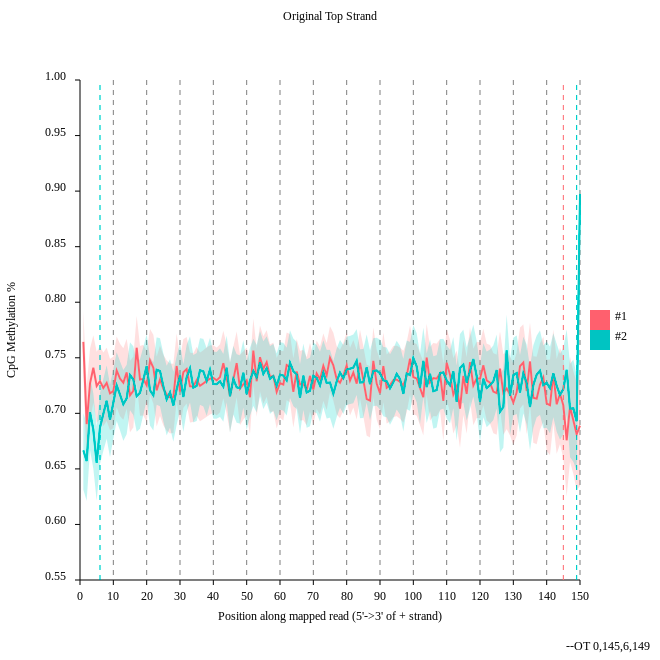
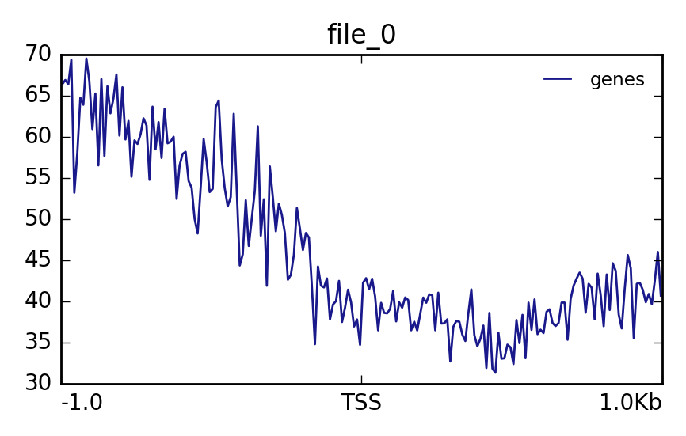

> ### Agenda
>
> In this tutorial we will:
>
> 1. [Load data and quality control](#load-data-and-quality-control)
> 2. [Align the data](#alignment)
> 3. [Methylation bias and metric extraction](#methylation-bias-and-metric-extraction)
> 4. [Visualize the mapped data](#visualization)
> 5. [Metilene](#metilene)
>
>
> This tutorial is based on [I-Hsuan Lin et al.: 'Hierarchical Clustering of Breast Cancer Methylomes Revealed Differentially Methylated and Expressed Breast Cancer Genes'](https://dx.doi.org/10.1371/journal.pone.0118453).
>
> The data we use in this tutorial is available at [Zenodo](https://zenodo.org/record/557099).
>
{: .agenda}


# Load data and quality control
> ### :pencil2: Hands-on: Get the data and look at the quality
>
> We load now the example dataset which will be used for the tutorial.
>
> 1. Load the two example datasets from our data library: subset_1.fastq.gz and subset_2.fastq.gz.
>
>    > ### :bulb: Tip: Get data from the library
>    >
>    > * Click on ```Shared Data``` --> ```Data Libraries``` and here ```MethylSeq_2017```
>    > * Select the uploaded datasets ```subset_1.fastq.gz``` and ```subset_2.fastq.gz``` as the fastq files
>    {: .tip}
>
> 2. **FastQC**
>
>    > ### :bulb: Tip: Search for tools
>    >
>    > * Click into the search field on the left
>    > * Type **fastqc**
>    > * Select **FastQC**
>    > * Select the uploaded datasets ```subset_1.fastq.gz``` and ```subset_2.fastq.gz``` as the fastq files
>    {: .tip}
>
> 3. Go to the web page result page and have a closer look at 'Per base sequence content'
>
>    
>
>    > ### :question: Questions
>    >
>    > - Note the GC distribution and percentage of "T" and "C". Why is this so weird?
>    > - Is everything as expected?
>    >
>    >
>    >    <details>
>    >    <summary>Click to view answers</summary>
>    >    <ol type="1">
>    >    <li>The attentive audience of the theory part knows: Every C-meth stays a C and every normal C becomes a T during the bisulfite conversion. </li>
>    >    <li>Yes it is. Always be careful and have the specific characteristics of your data in mind during the interpretation of FastQC results.</li>
>    >    </ol>
>    >    </details>
>    {: .question}
>
{: .hands_on}

# Alignment

> ### :pencil2: Hands-on: Mapping with bwameth
>
> We will map now the imported dataset against a reference genome.
>
> 1. **Galaxy** :wrench:: Search for the tool ```bwameth```
> 2. **bwameth** :wrench:: Select for the option ```Select a genome reference from your history or a built-in index?``` ```Use a built-in idex``` and here the human ```hg38``` genome.
> 3. **bwameth** :wrench:: Choose for the option ```Is this library mate-paired?``` ```Paired-end``` and use the two imported datasets as an input.
> 4. **bwameth** :wrench:: Compute now the alignment. Please notice that depending on your system this computation can take some time. If you want to skip this, we provide for you a precomputed alignment. Import ```aligned_subset.bam``` to your history.
>
>    > ### :question: Questions
>    >
>    > -  Why we need other alignment tools for bisulfite sequencing data?
>    >
>    >
>    >    <details>
>    >    <summary>Click to view answers</summary>
>    >    <ol type="1">
>    >    <li>You may have noticed that all the C's are C-meth's and a T can be a T or a C. A mapper for methylation data needs to find out what is what.</li>
>    >    </ol>
>    >    </details>
>    {: .question}
>
{: .hands_on}

# Methylation bias and metric extraction

> ### :pencil2: Hands-on: Methylation bias
>
> We will extract the methylation on the resulting BAM file of the alignment step.
>
> 1. **Galaxy** :wrench:: Search for the tool ```MethylDackel```
> 2. **MethylDackel** :wrench:: Choose at the first option ```Load reference genome from``` ```Local cache``` and for ```Using reference genome``` the value ```hg38```.
> 3. **MethylDackel** :wrench:: Select for the option ```sorted_alignments.bam``` the computed bam file of step 4 of the ```bwameth``` alignment.
> 4. **MethylDackel** :wrench:: Use for ```What do you want to do?``` the value ```Determine the position-dependent methylation bias in the dataset, producing diagnostic SVG images```.
> 5. **MethylDackel** :wrench:: Set the parameters ```keepSingleton``` and ```keepDiscordant``` to ```Yes```.
> 6. **MethylDackel** :wrench:: Click ```Execute```.
>
>    
>
>    > ### :question: Questions
>    >
>    > - Consider the ```original top strand``` output. Is there a methylation bias?
>    > - If we would trim, what would be the start and the end positions?
>    >
>    >
>    >
>    >    <details>
>    >    <summary>Click to view answers</summary>
>    >    <ol type="1">
>    >    <li>The distribution of the methylation is more or less equal. Only at the start and the end we could trim a bit but a +- 5% variation is acceptable. </li>
>    >    <li>To trim the reads we would include for the first strand only the positions 0 to 145, for the second 6 to 149.</li>
>    >    </ol>
>    >    </details>
>    {: .question}
>
>
{: .hands_on}


> ### :pencil2: Hands-on: Methylation extraction with MethylDackel
>
>
> 1. **Galaxy** :wrench:: Search for the tool 'MethylDackel'
> 2. **MethylDackel** :wrench:: Choose at the first option ```Load reference genome from``` the value: ```Local cache``` and for ```Using reference genome``` the value: ```hg38```.
> 3. **MethylDackel** :wrench:: Select for the option ```sorted_alignments.bam``` the computed bam file of step 4 of the ```bwameth``` alignment.
> 4. **MethylDackel** :wrench:: Use for ```What do you want to do?``` the value ```Extract methylation metrics from an alignment file in BAM/CRAN format```.
> 5. **MethylDackel** :wrench:: Choose ```Yes``` for the option ```Merge per-Cytosine metrics from CpG and CHG contexts into per-CPG or per-CHG metrics```.
> 6. **MethylDackel** :wrench:: Set the parameter ```fraction``` to ```Yes```.
> 7. **MethylDackel** :wrench:: All other options use the default value.
>
>
>
{: .hands_on}


# Visualization

> ### :pencil2: Hands-on:
>
> We visualize the example with the help of deepTools.
>
> 1. **Galaxy** :wrench:: Search for the tool ```Wig/BedGraph-to-bigWig```
> 2. **Wig/BedGraph-to-bigWig** :wrench:: Use the result of MethylDackel to transform it to a bigWig file.
>
>    > ### :question: Questions
>    >
>    > - The execution fails. Do you have an idea why?
>    >
>    >
>    >    <details>
>    >    <summary>Click to view answers</summary>
>    >    <ol type="1">
>    >    <li>The output file is having one line too much in in the beginning and column five and six should not be there. We need to fix this.</li>
>    >    </ol>
>    >    </details>
>    {: .question}
>
> 3. **Galaxy** :wrench:: Search for ```tail```. use ```Select last lines from a dataset (tail)```
> 4. **tail** :wrench:: Use the mode ```Operation``` the value ```Keep everything from this line on``` and choose ```2``` as a value.
> 5. **Galaxy** :wrench:: Search for awk
> 6. **awk** :wrench:: Convert with awk the bedgraph file and use as ```AWK Program```: ```'BEGIN{OFS="\t"}{print $1, $2, $3, $4}'```
> 7. **Galaxy** :wrench:: Search for the tool ```computeMatrix```.
> 8. **computeMatrix** :wrench:: Use the file ```CpGIslands.bed```as ```Regions to plot``` and the in the previous step created bigwig file as the ```score file```.
> 9. **computeMatrix** :wrench:: Use for the option ```computeMatrix has two main output options``` the value ```reference-point```.
> 10. **Galaxy** :wrench:: Search for the tool ```plotProfile```.
> 11. **plotProfile** :wrench:: Choose for ```Matrix file from the computeMatrix tool``` the computed matrix from the tool ```computeMatrix```.
>
> The output should look something like this:
>
> 
>
> Lets see how the methylation looks for a view provided files:
> 1. **Galaxy** :wrench:: Import from the data library the files ```NB1_CpG.meth.bedGraph```
> 2. **Wig/BedGraph-to-bigWig** :wrench:: Use the imported file to transform it to a bigWig file.
>
>    > ### :question: Questions
>    >
>    > - The execution fails. Do you have an idea why?
>    >
>    >  
>    >    <details>
>    >    <summary>Click to view answers</summary>
>    >    <ol type="1">
>    >    <li>A conversion to bigWig would fail right now, probably with some error message like <code>hashMustFindVal: '1' not found</code>. The reason is the source of the reference genome which was used. There is ensembl and UCSC as sources which differ in naming the chromosomes. Ensembl is using just numbers e.g. 1 for chromosome one. UCSC is using chr1 for the same. Be careful with this especially if you have data from different sources. We need to convert this.</li>
>    >    </ol>
>    >    </details>
>    {: .question}
>
> 3. **Replace column** :wrench: Every chromosome is named different, the list to transfer the ensembl notation to ucsc notation is having more than 500 entries. To convert it you can use the tool **Replace column**. Choose for ```File in which you want to replace some values``` the bedGraph file and for ```Replace information file``` [this](https://raw.githubusercontent.com/dpryan79/ChromosomeMappings/master/GRCh38_ensembl2UCSC.txt) conversion file. For ```Which column should be replaced?``` choose ```Column: 1```, for ```Skip this many starting lines``` a ```1``` and for ```Delimited by``` ```Tab```. In case this tool is not available in your galaxy instance, we precomputed the files for you: Please import ```NB1_CpG.meth_ucsc.bedGraph```, ```NB2_CpG.meth_ucsc.bedGraph```, ```BT089_CpG.meth_ucsc.bedGraph```, ```BT126_CpG.meth_ucsc.bedGraph``` and  ```BT198_CpG.meth_ucsc.bedGraph```.
> 4. Compute the matrix and plot the profile as described above.
>
> More information about deepTools can be found here: https://deeptools.github.io/
>
{: .hands_on}

# Metilene

> ### :pencil2: Hands-on: Metilene
>
> With metilene it is possible to detect differentially methylated regions (DMRs) which is a necessary prerequisite for characterizing different epigenetic states.
>
> 1. **Galaxy** :wrench:: Import from the data library the files ```NB1_CpG.meth.bedGraph```, ```NB2_CpG.meth.bedGraph```, ```BT089_CpG.meth.bedGraph```, ```BT126_CpG.meth.bedGraph``` and  ```BT198_CpG.meth.bedGraph```.
> 2. **Galaxy** :wrench:: Search for the tool ```Metilene```
> 3. **Metilene** :wrench:: Choose for the first option ```Input group 1``` the imported files starting with ``NB`` and for ```Input group 2``` the imported files ```Input group 2```.
> 4. **Metilene** :wrench:: Select for the option ```BED file containing regions of interest``` the imported BAM file CpGIslands.bed.
> 5. More information about metilene can be found here: https://www.bioinf.uni-leipzig.de/Software/metilene/
>
>    > ### :question: Questions
>    >
>    > - Have a look at the produced pdf document. What is the data showing?
>    >
>    >
>    >
>    >    <details>
>    >    <summary>Click to view answers</summary>
>    >    <ol type="1">
>    >    <li>It shows the distribution of DMR differences, DMR length in nucleotides and number CpGs, DMR differences vs. q-values, mean methylation group 1 vs. mean methylation group 2 and DMR length in nucleotides vs. length in CpGs</li>
>    >    </ol>
>    >    </details>
>    {: .question}
>
>
{: .hands_on}
