# Getting data into Galaxy

???

-> Pressing **P** will toggle presenter mode.

---

# Many ways to get data into your workspace

- Import from your computer
- Import from a URL
- Directly enter text
- Import using FTP
- Import from *defined* data sources
- Import from *undefined* data sources
- Import from a Galaxy Data Library

???

- To do analysis in Galaxy you first need data to work on.
- There are many ways and sources for getting data into your history.
  - Which method you use depends on where your data is, and how big it is
- This tutorial will cover all of the techniques listed here.

---

# The Get Data toolbox section

.pull-right[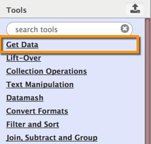]

- *Click* on the **Get Data** toolbox in the toolbox (the left panel)

---

.pull-right[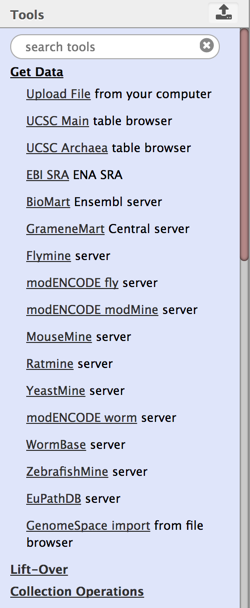]

# The Get Data toolbox section

- Expands to show data sources that have been *defined* on your server
  - The specific data sources available on your Galaxy instance are determine by the server's administrator
- All of these data sources can bring datasets (files) into your Galaxy workspace

???

This shows the list of data sources that were available on usegalaxy.org in mid 2017.

---

### **Upload File** data source

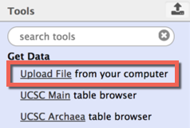

or

.image-25[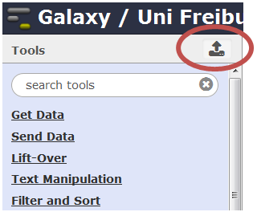]

???

Two ways to launch the upload file form.
---

# Upload files from your computer

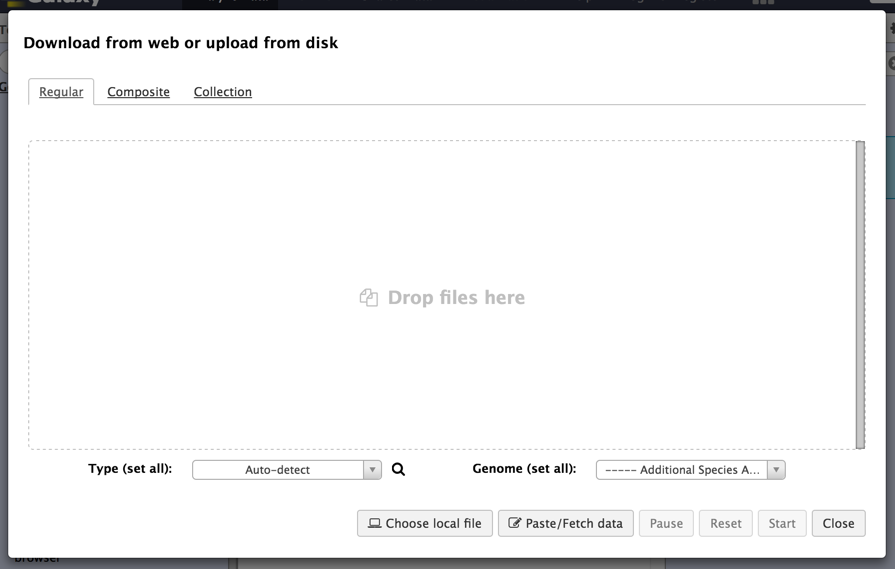

???

- The **Upload File** data source can import data:
  - from your computer
  - using a URL
  - by directly entering text
  - and via FTP

This is probably the most commonly used tool for bringing data into Galaxy, and it is installed on almost every Galaxy server.

---

# Upload files from your computer

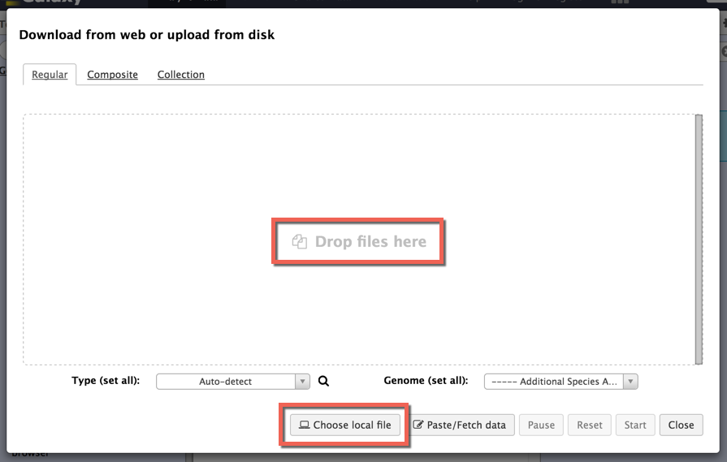

???

- Drag and drop is supported
- as is the standard file selection using your browser.

---

After dragging and dropping / choosing* local files:

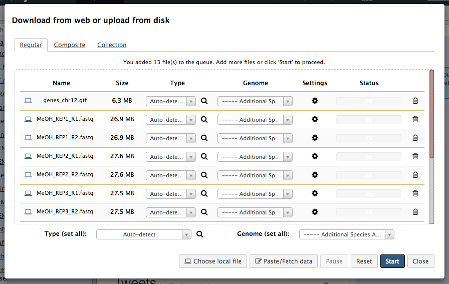

( * but before importing )

???

- Here we have imported 13 files
  - one with genome annotation in GTF format
  - 12 paired end read files from an RNA-Seq experiement*
  - could import them now and have Galaxy guess at their file types.

  * From UC Davis Training Material.

---

Could rely on Galaxy to set datatypes for imported datasets, but sometimes it guesses wrong.

Galaxy can't guess the build (genome assembly), so this needs to be manually set

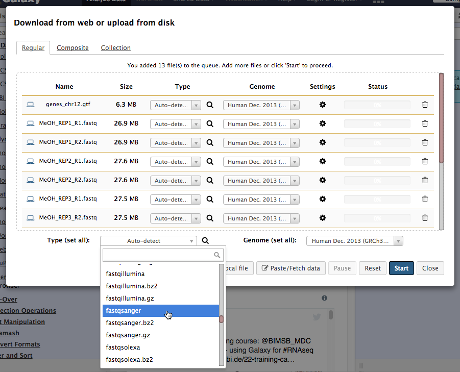

---

But now we need to fix the datatype of the first imported dataset, because it has a different datatype:

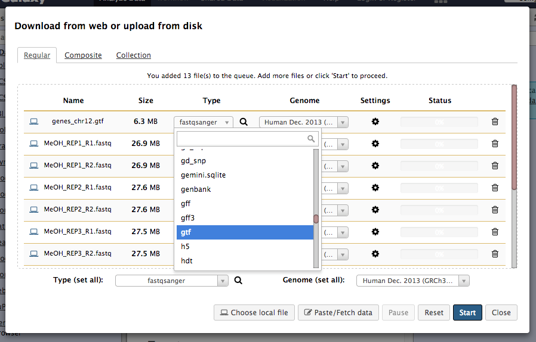

Can also set the build (genome assembly) for individual files.

???

- Here we are manually setting the first dataset's datatype to GTF, a common genome annotation format.

---

Once you have set everything, start the upload process:

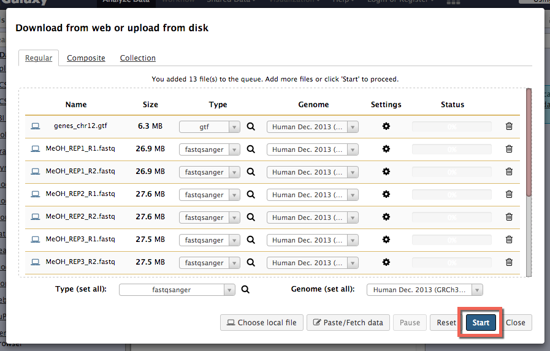

???

- Data transfer does not start until you click Start.

---
You can then close the form

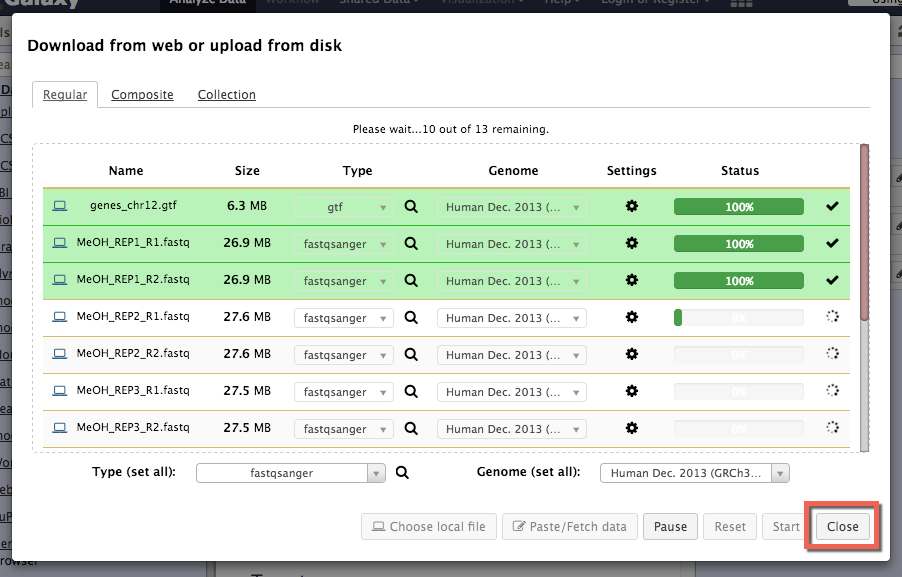

???

---

All the items will appear in your history

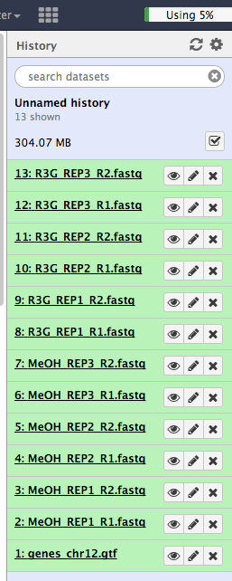

and are ready to use when green.

---

## Directly enter text

Sometimes it's useful to enter values directly.  This only works if your dataset is tiny.

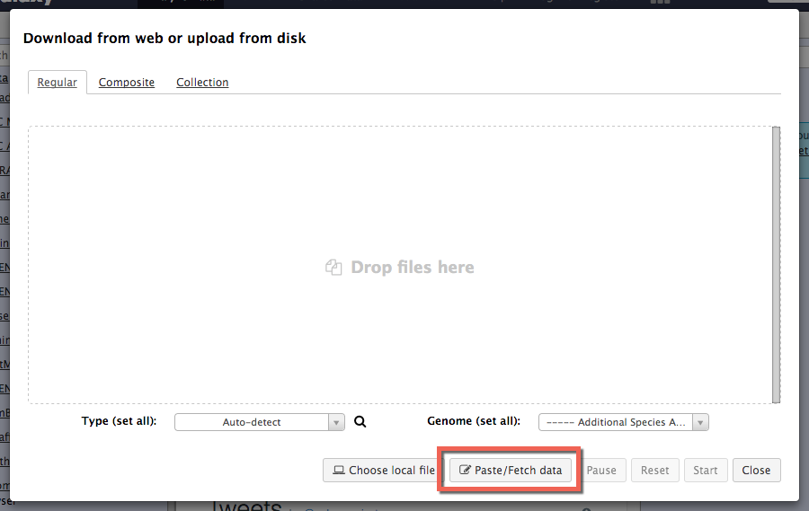

---

## Directly enter text

Enter the data by typing (or pasting) it in the input box:

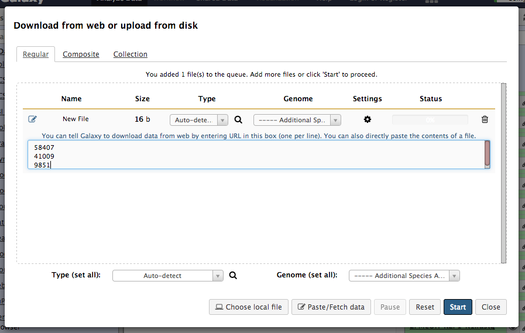

You can also set the datatype and build.
*Click* **Start**, and then **Close**, and the new item shows up as **Pasted Entry** in your history.

---

# Import using FTP

---

### Why use FTP?

- The local file upload method only works if your dataset is less than 2GB in size
- For larger datasets use FTP (File Transfer Protocol)

---

### How to use FTP

- The Galaxy server's administrator must have [enabled FTP](https://galaxyproject.org/admin/config/upload-via-ftp/) on the server
- You will need to create an account on that Galaxy Server
- You will need to install FTP software, or to run FTP from the shell

See https://galaxyproject.org/ftp-upload/

---

## Step 1: Create an account on the Galaxy server

- To use FTP, you'll need to have an account on the Galaxy server you are using
- See the *Creating an account on Galaxy* tutorial

---

## Step 2: Make sure you have FTP software: FileZilla

.pull-right[.image-25[]]

- [FileZilla](https://filezilla-project.org/) is a free FTP client that is available on [Windows](https://filezilla-project.org/download.php?platform=win64), [MacOS](https://filezilla-project.org/download.php?platform=osx), and [Linux](https://filezilla-project.org/download.php?platform=linux)
- There are many other options
- If you don't already have an FTP client, download and install FileZilla.

---

## Step 3: Establish FTP connection to your Galaxy server

- Run your FTP client (FileZilla in these slides) and establish a connection to the Galaxy server you are using (usegalaxy.org in this example)
- Provide
  - the instance's FTP server name (e.g. usegalaxy.org)
  - your full username (usually an email address) and password

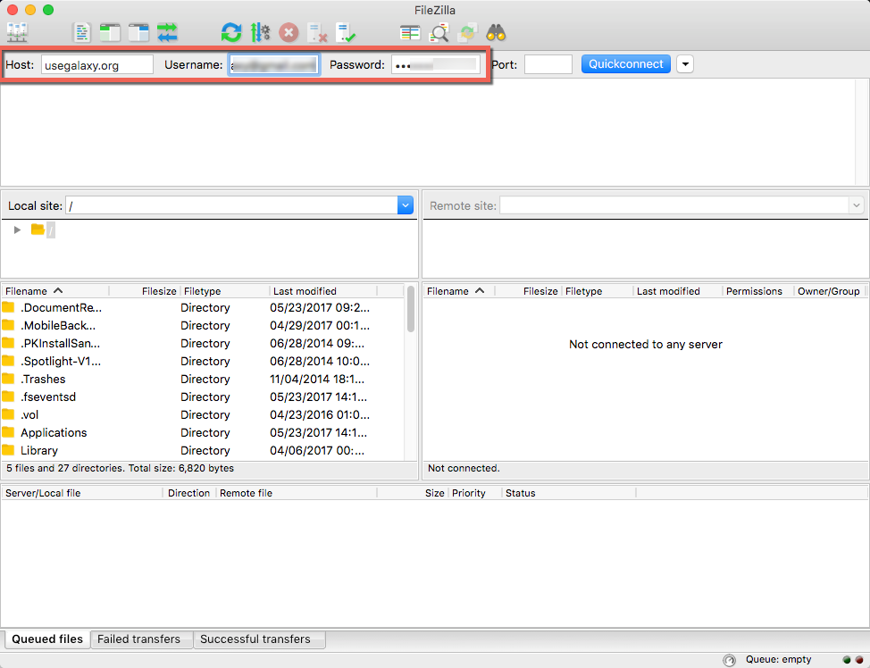

---

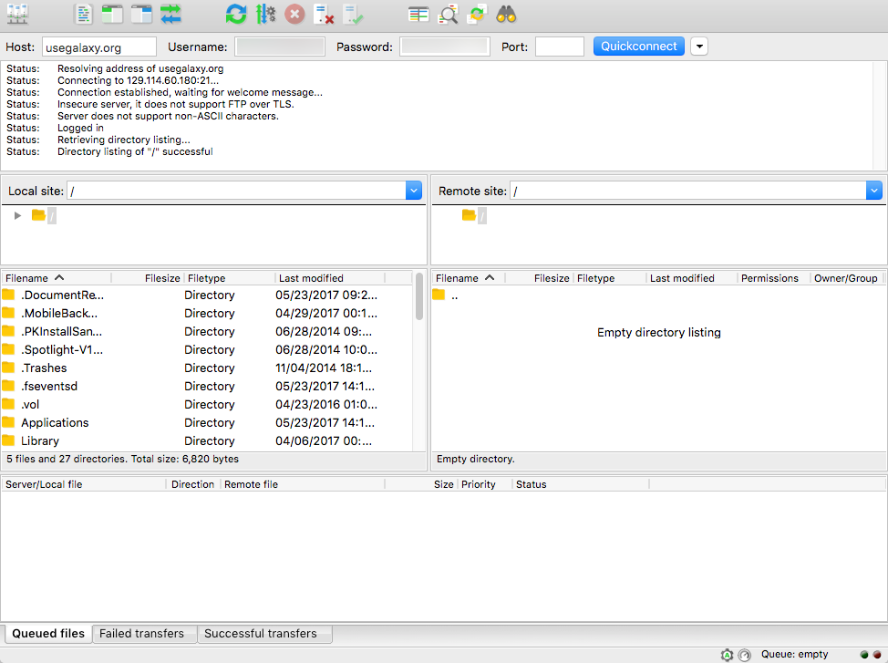

Successfully connected

---

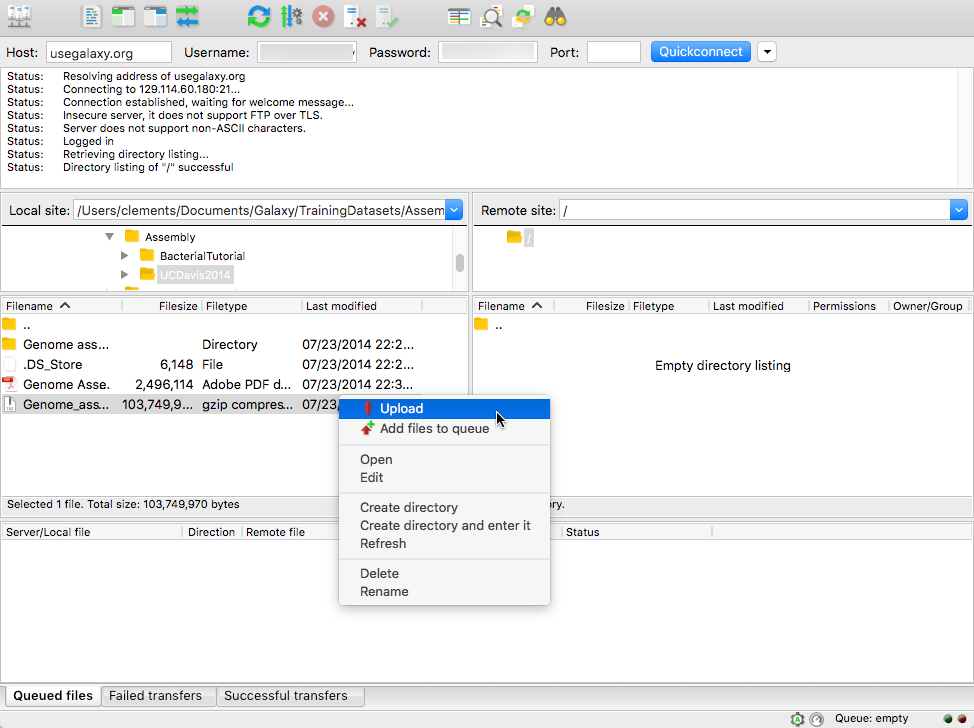

Right click on the files and upload them.

---

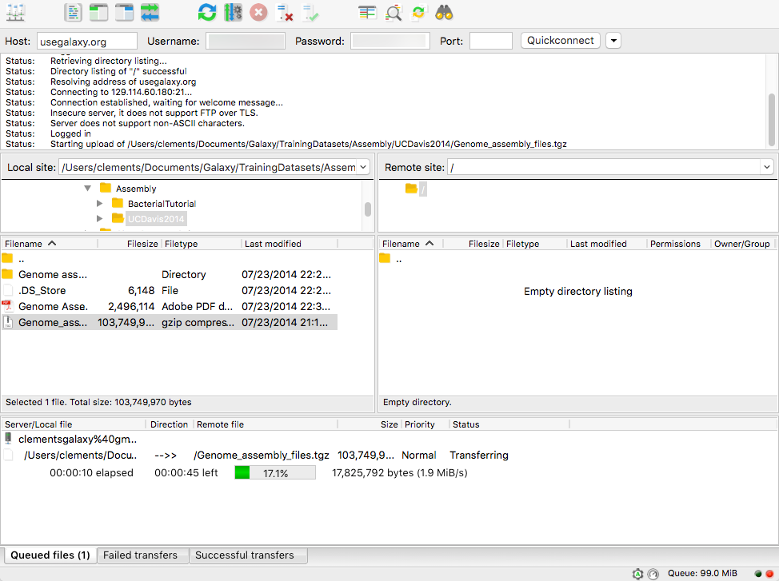

FTP Transfer in progress...

---

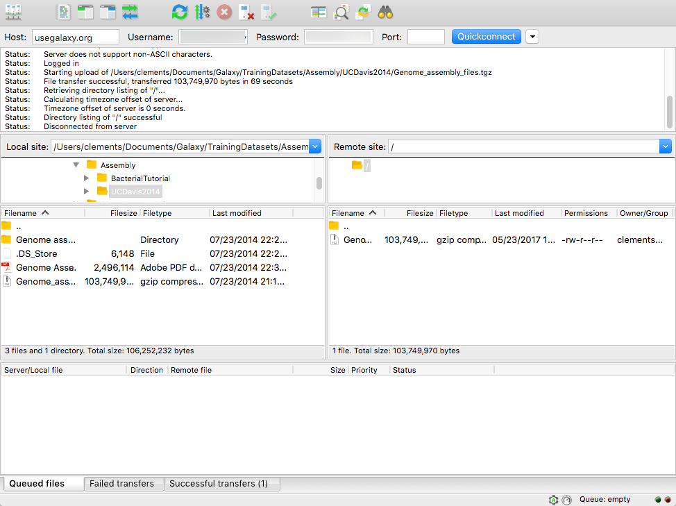

... and transfer complete.

Now what?
