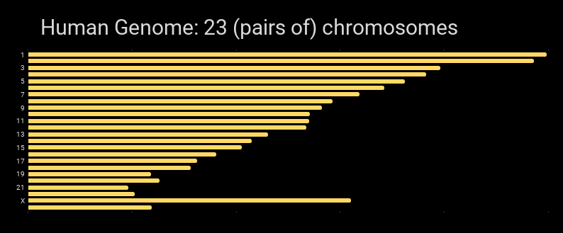
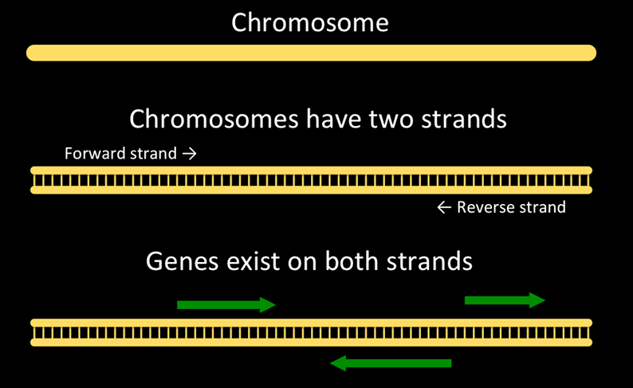
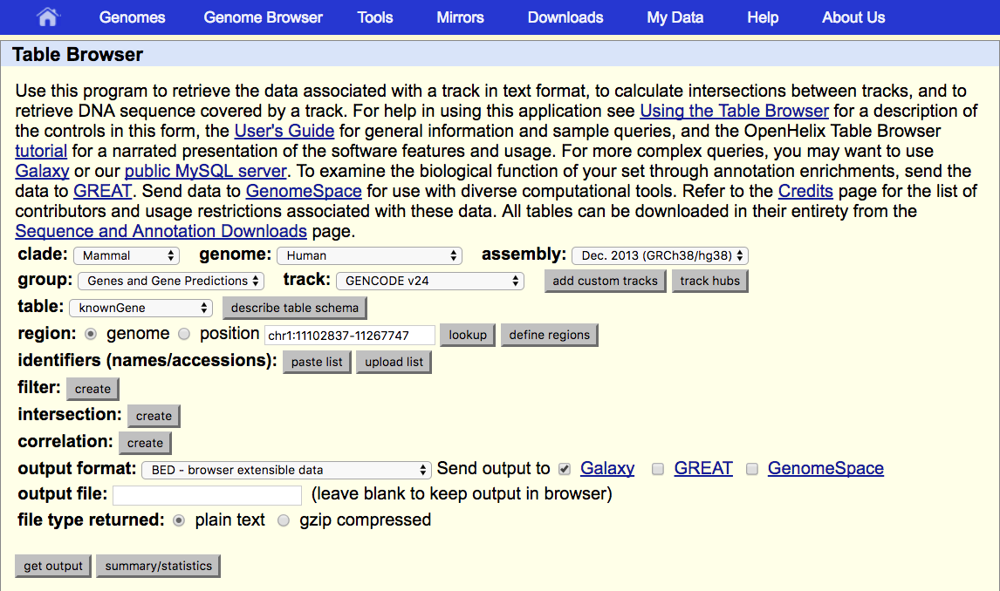
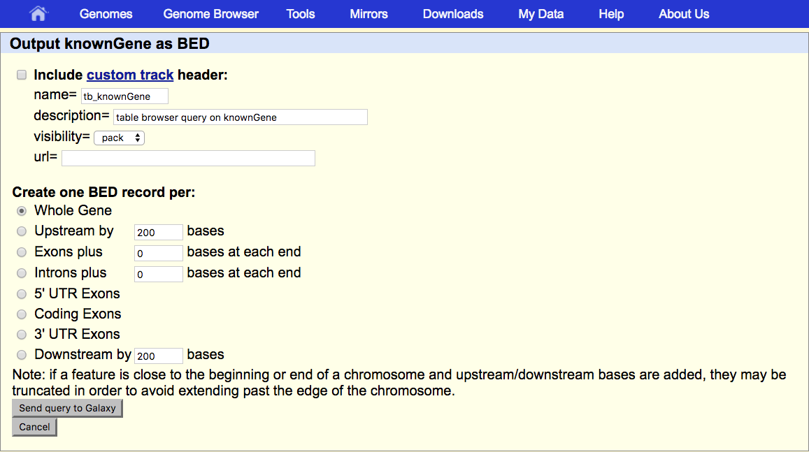
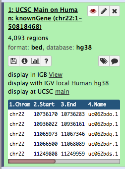
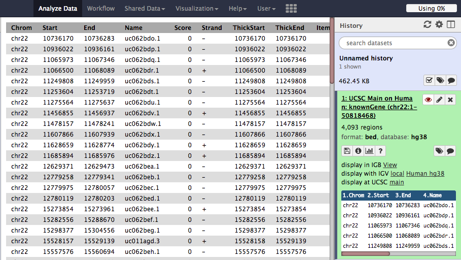
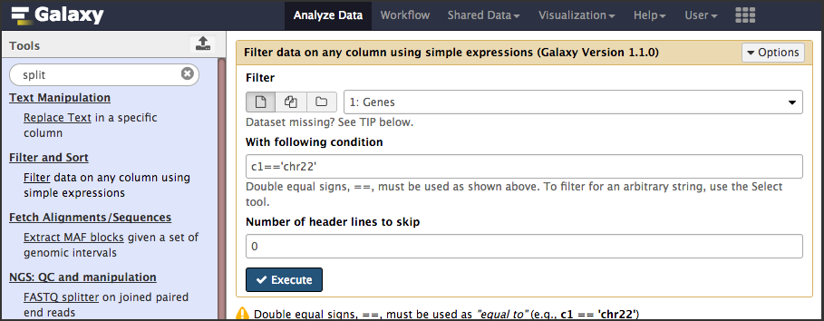
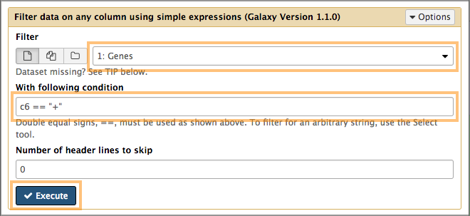
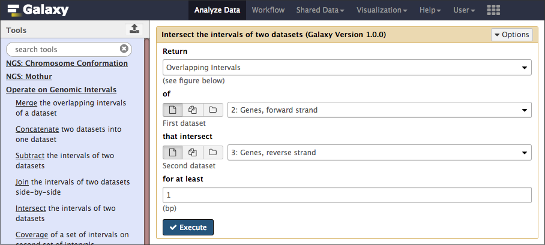
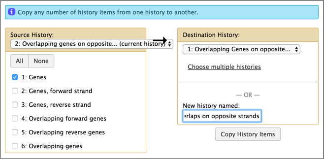

# Introduction to Galaxy
{:.no_toc}

This practical aims to familiarize you with the Galaxy user interface. It will teach you how to perform basic tasks such as importing data, running tools, working with histories, creating workflows, and sharing your work.

> ###   Audience
> This tutorial is for those who are new to Galaxy, genomics, and bioinformatics.  If you aren't new to bioinformatics you can just do the items listed in the Hands-On boxes (), or you can try one of the [other introductory tutorials](/topics/introduction/).
>
> This tutorial teaches the same basic content as [Galaxy 101](/topics/introduction/tutorials/galaxy-intro-101/tutorial.html), but requires less knowledge of biology to understand the questions this tutorial addresses.
{: .comment}

> ### Agenda
>
> In this tutorial, we will:
>
> 1. TOC
> {:toc}
>
{: .agenda}

# Pretreatments

> ###  Requirements
>
> To run this practical you will need
>
> 1. An internet-connected computer.  Galaxy can run on your laptop without an internet connection, but this practical requires access to resources on the web.
> 1. A web browser. [Firefox](https://www.mozilla.org/firefox) and [Google Chrome](https://www.google.com/chrome/) work well, as does [Safari](https://www.apple.com/safari/).  Internet Explorer is known to have issues with Galaxy so avoid using that.
> 1. Access to a Galaxy instance.  Galaxy is available in many ways. If you are doing this practical as part of a workshop, the instructor will tell you which instance to use. If you are doing this on your own, you can use [usegalaxy.org](https://usegalaxy.org).
{: .comment}

> ###  Our Motivating Question
> *I wonder if genes on opposite strands ever overlap with each other, and if so, how common is that?*
{: .question}

To explore this question we need a basic understanding of *genomes, chromosomes, strands,* and  *genes.*

> ###  Definitions 1
>
> * **Genome**
>> The genome is the collection of all DNA native to an organism. For humans, the genome is all of a person's chromosomes.
>
> * **Chromosome**
>> The largest unit of DNA organization in an organism.  Humans have two copies of 23 chromosomes.  Chromosomes are *linear* in humans, and all animals and plants.  (Bacteria have *circular* chromosomes.)
>
> * **Strand**
>> Chromosomes are *double-stranded*.  One is the forward strand, is typically drawn on top, and moves from left to right. The other, reverse strand, is typically drawn on the bottom and moves from right to left.  Genes can occur on either strand.  A single gene will have parts on only one stand.
>
> * **Gene**
>> "What is a gene?" is actually a hotly debated question.  For our purposes, a gene is a section of DNA on chromosome strand that creates a molecule used by an organism.
>
> Graphically, the human genome can be shown as the chromosomes that are in it:
>
> 
>
> And here's a representation of a chomosome, strands, and genes on the chromosome.
>
> 
{: .comment}

The question we are asking looks like:

*Non-overlapping genes are common.  How common are overlapping genes?*

## Get human gene definitions

To answer this question we need to know where genes start and stop on human chromosomes.  That seems like a simple question, but if you are new to bioinformatics it's actually a hard question to answer.  Web searches will land you at any number of useful places on the web, but without a lot of background knowledge it's hard to know what you want:  *What's the difference between sequence and annotation?  What are FASTA, BED, GTF, GFF3, and VCF?  What are GRCh37, GRCh38, hg19, and hg38 (and what happened to hg20 through hg37 - are they okay)?*

It turns out that for this particular question (and for many others), most **Galaxy** instances can help us find this information.

> ###  Hands-on: Log in to Galaxy
> In your web browser, *go to* **[your Galaxy instance](#-requirements)** and *log in or register*.
{: .hands_on}

The Galaxy interface consists of three main parts. The available tools are listed on the left, your analysis history is recorded on the right, and the middle panel will show the home page, tool forms, and dataset content.

> ###  Hands-on: Start with an empty history
>
> * If this is the first time you have used this Galaxy server, then your history panel will look like the image above.
>
> * If your history has datasets in it (there will be one or more green boxes, *datasets*, there) then create a new history:
>     1. Click the **gear icon** at the top of the history panel
>     2. Select the option **Create New** from the menu
{: .hands_on}

## Get data into Galaxy

There are [many ways to get data into a Galaxy instance](/topics/introduction/tutorials/galaxy-intro-get-data/slides.html). We are going to use the **Get Data** toolbox in the **Tools** panel on the left.

> ###  Hands-on: Open **Get Data** toolbox
>
>  
>
> *Click* on the **Get Data** toolbox to expand it.
{: .hands_on}

The **Get Data** toolbox contains a list of data sources that this Galaxy instance can get data directly from.  **Upload file** is quite useful for getting data from your computer or from the web (see the [Getting data into Galaxy slides](/topics/introduction/tutorials/galaxy-intro-get-data/slides.html#4).  Today we are going to use the **UCSC Main table browser**.

### Get genes

> ###  Hands-on: Go to UCSC
>
> 1. *Click* on **UCSC Main table browser** under the *Get Data* section of the tool panel to go to UCSC.
>
> 
{: .hands_on}

This will take you to the UCSC Table Browser:

 

The [UCSC Table Browser](https://genome.ucsc.edu/cgi-bin/hgTables) provides access to all the data that is shown in the [UCSC Genome Browser](https://genome.ucsc.edu/cgi-bin/hgGateway) (see [box](#-ucsc-genome-browser) below). If you are working on a species that UCSC supports (like human) then the Table Browser is a great place to get genomic data.

The Table Browser has a daunting number of options. Fortunately,they are all set to commonly used defaults, greatly simplifying things, and most of the options are already set to what we want:

* **clade:** `Mammal`
* **genome:** `Human`
* **assembly:** `Dec. 2013 (GRCh38/hg38)`
* **group:** `Genes and Gene Predictions`
* **track:** `GENCODE v24`

**clade** and **genome** seem pretty clear.  **assembly** asks which version/definition of the human genome we want.  (Any will do for our question, but UCSC is suggesting `hg38`, which is also the most recent.)  **group** is set to `Genes and Gene Predictions` which sounds like what we want. So far so good.

**track** has a bewildering list of options. UCSC suggests `GENCODE v24`.  A web search leads us to the [GENCODE web site](https://www.gencodegenes.org/) which prominently states:

> The GENCODE project produces high quality reference gene annotation and ...

Time for a few more definitions.

> ###  Definitions 2
>
> * **Reference genome**
>> A reference genome is the *genome of a single individual* that has been thoroughly studied, to the point that we know exactly what most of that individual's DNA is.  In practice a reference genome is used as shared map by researchers working on that organism. Reference genomes are updated periodically as techniques improve.
>
> * **Sequence**
>> A genome's sequence describes the DNA in that genome, down to the A, C, T, and G (single nucleotide) level including the exact location where each is.  Given a reference genome, you can ask questions like, "What's the DNA on chromosome 2 between positions 1,678,901 and 1.688,322?"
>
> * **Genome/Gene annotation**
>> The sequence tells us what DNA is where, but it doesn't tell us anything about the function of that DNA.  *Annotation* is additional information about particular regions of the genome like where genes, repeats, promotors, and centromeres are, or how active a particular gene is.
{: .comment}

The **track** option asks us which set of annotations do we want to get?  There are so many choices because annotation is the result of analysis and interpretation, and there are many ways to do this. (And in this case, many of the options aren't even genes or gene predictions.)

GENCODE is "high-quality" and  "gene annotation." That sounds like a good thing to use.  Lets stay with the default: `GENCODE V24`.

So far we haven't changed *anything* from the defaults.  Lets change something.  The default  **region** is the whole genome, which can be done, but it's a lot of information. For this exercise lets use just one (small) chromosome.

> ###  Hands-on: Limit the region and get the data.
>
> 1. Say that we just want chromosome 22
>   * For **region** select `position`.
>   * In the text box next to `position` enter `chr22` (case matters).
>     > 
>
> 2. *Click* the **get output** button.
>   * And, that doesn't actually get us the output.  It sends us to a second UCSC page that asks us exactly what we want.
> &nbsp;
>     > 
>
> 3. Under **Create one BED record per** make sure that **Whole Gene** is selected.
>
> 4. *Click* the **Send query to Galaxy** button at the bottom of the form.
{: .hands_on}

This returns us to Galaxy, first displaying a big green box (that's good!) and then returning us to the view we started with.  Excepnt that we now have an item in our history, the dataset from UCSC.

### History Item Status

Watch your new history item.  It will go through three statuses before it's done.

| Color | Icon | Meaning | |
| ---- | ---- | ---- |
| **Grey** | Clock | Item is waiting to start (wating for data transfer to start) |  |
| **Yellow** | Spinner | Item is running (data is actively being transferred). |  |
| **Green** | None | Item has finished successfully (data transfer complete). |  |

Occassionally you will also see a 4th status

* **Red**: Item did not finish successfully.

See the *Galaxy History Item Status* practical for more. [TODO]

## Examine the data

> ###  Hands-on: Look at the data.
> Once the dataset is green, *click* on the dataset name (something like **UCSC Main on Human...**)
{: .hands_on}

This expands the dataset and shows you information about it, and a preview of its contents.

1. The preview tells us  several things:
1. The dataset has over 4000 regions, meaning that there are over 4000 genes on chromosome 22.
1. The dataset is in **bed** format.  BED is one of several standard formats for representing genome annotation.  BED is a tabular format that we'll expand on below.  We got BED format because BED was preselected as the output format in the UCSC table browser.
1. The dataset's "database" is **hg38**.  This says which revision of the reference genome this data maps too.  hg38 is the latest human reference genome.  hg38 was also selected by default in UCSC.
1. Finally, it shows us the first 5 rows in the dataset.

The dataset preview is informative, but you can't see much of the actual dataset.  Lets use one of the dataset icons to see the whole dataset

> ###  Hands-on: Look at all the data.
> * *Click* on the **eye icon** to view the contents of the dataset.
>   > This displays all of the data
>     &nbsp;
>   > 
{: .hands_on}

### BED Format

[BED](https://genome.ucsc.edu/FAQ/FAQformat.html#format1) is one of several well-established tabular formats for genomic data.  Other formats include GFF3 and GTF.  For the type of analysis we are doing today, BED format is easiest to work with.  BED was created to power the UCSC Genome Browser.  BED files contain between 3 and 15 columns.  Our example BED file describes genes and contains 12 columns.

We care about columns 1, 2, 3, and 6:

| # | Column Name | Meaning |
| ---- | ---- | ---- |
| 1 | Chromosome | The name of the chromosome this gene is on. |
| 2 | Start | Where on the chromosome the gene starts. |
| 3 | End | Where on the chromosome the gene ends. |
| 6 | Strand | Which strand the gene is on.  `+` means forward (top, left to right), `-` means reverse (bottom, right to left) |

See the [BED format description at UCSC](https://genome.ucsc.edu/FAQ/FAQformat.html#format1) for a full description of all the columns.

## Naming

Galaxy allow you to name your analyses (your histories) and your datasets.  We only have one history ("Unnamed history") and one dataset ("UCSC Main on Human:...") so far, but it's a good idea to

1. Always name your histories
2. Name your input and final output datasets, and any significant intermediate datasets.

You don't have to do this.  Galaxy is quite happy for you to have an infinite number of "Unnamed history" histories, and to have all your datasets be obscurely named.  However, once you've run your first 5 unnamed analyses, all with obscurely named datasets, you'll might wish you would have named everything.

> ###  Hands-on: Name your stuff
>
> 1. **Name your history** to be meaningful and easy to find.
>    - *Click* on the title of the history and enter something like **Intro - Strands** as the name.  Hit the `enter` key on your keyboard to save it.
>   
> 1. **Rename your dataset**
>    - *Click* on the **pencil icon** to edit the dataset attributes.
>    - In the next screen change the name of the dataset to something like `Genes` or `Genes chr22`.
>    - *Click* the **Save** button at the bottom of the screen.
>
>    Your history should now look something like this:
>
>    
{: .hands_on}

## We've got the data - what's our plan for answering the question?

You have to know what's possible, before you can build a plan.  If you don't have experience with data analysis then you might not have any idea how you would answer our question.  Before we dive in using a particular solution, think about how you might solve this.  If you don't have any experience with tools, then think about how you might solve it manually, using pencil and paper (it may help to assume you have an infinite supply of helpers to do the pencil and paper work).

Here's how we'll answer this question.

1. Split the genes dataset in two: one for genes on the forward strand, and one for genes on the reverse strand.
1. Compare the two datasets to see which ones, if any, overlap.
1. Check how many (or what percentage) of our genes overlap with another gene.

It turns out that all of these steps are easy in Galaxy.

### Split the genes into forward and reverse datasets

How might we do this?  Column 6 contains the strand information.  Can we split genes into two datasets based on the value of Column 6.  How?  Lets take a look at our available tools.  And *whoa! There are over 40 toolboxes, and several hundred tools.* How are we going to find a tool that can do the split?

> ###  Searching for and launching a tool
>
> 1. Try the **tools search box**.  Think of terms that might describe what we want to do and type them in the search box.  Do you see anything promising?  Explore a little.
> 2. If you haven't already searched with it, *enter* `split` in the **tool search box**.  Near the top of the results is
>    - **Filter** data on any column using simple expressions.
>    - That might work.
> 3. *Click* on **Filter** to open the Filter tool in the middle panel.
> 4. Take a look at the **Syntax** and **Example** sections to understand what the tool does.
>
> 
{: .hands_on}

It doesn't say anything about Filter being able to split a file into multiple files.  It does look like we can use Filter to get only genes on the forward strand, or only genes on the reverse strand.  We would have to run Filter twice, once for forward strand genes, and once for reverse strand genes. Let's do that.

(You may have noticed during your search for tools that *all* tools have a similar look and feel.)

> ###  Hands-on: Run the Filter tool to get genes on the forward strand.
>
> * The filter tool has 3 fields:
>
>   1. **Dataset**: This pulldown will list any dataset from your history that this tool can work on.  In your case that's probably only one dataset.  Make sure this is set to your `Genes` dataset.
>   1. **Condition**: this free text field is where we specify which records we want in the output dataset.  *Enter* `c6 == "+"` in the text box.
>   * This specifies that column 6 (the strand) must be equal to (`==` is Python for *is equal to*) a plus sign.
>   1. **Header lines to skip**: Leave this as `0`. Our dataset does not have any header lines.
> * Finally, *click* the **Execute** button.
>   > 
{: .hands_on}

This adds another dataset to your history.  This one should contain only genes on the forward strand.  Once the dataset is green, *click* the **eye icon** to confirm this.  We also recommend that you rename this dataset to something like `Genes, forward strand` (remember how?).

Now we want to get the genes on the reverse strand.  There are actually many ways to get this.  Here are two of them.

> ###  Hands-on: Get genes on the reverse strand
>
> **Method 1**
>
> 1. Open the dataset preview by *clicking* on the name of the `Genes, forward strand` dataset.  This shows an icon than the uploaded `Genes` dataset did not: a looping arrow.
> 1. *Click* the **looping arrow** ("Run this job again") icon.  This won't actually run the job again.  What it will do is bring up the Filter tool form with *the exact same settings that were used to produce this dataset.*
> 1. Rather than run Filter again with the same settings, *change* **Condition** to `c6 == "-"`
> 1. *Click* the **Execute** button.
>
> **Method 2**
> 1. *Click* on **Filter** in the tool panel to open the Filter tool in the middle panel.
> 1. *Fill* the form as before, *except*:
>    * Make sure the **Dataset** pulldown is set to the `Genes` dataset.
>    * *Set* **Condition** to `c6 == "-"`.
> 1. *Click* the **Execute** button.
>
> **Both Methods**
> 1. *Rename* your new dataset to something like `Genes, reverse strand`
{: .hands_on}

The rerun button can be a huge help as you run more complex tools.

> ###  Tip: Empty result?
>
> If you used Method 2 and didn't explicitly set the dataset, then you ran Filter on the `Genes, forward strand` dataset. None of the genes in the forward strand dataset have "-" in column 6 so all of them were filtered out from the result.
>
> Try again and set the dataset to your `Genes` dataset.
{: .tip}

Your history should now have (at least) 3 datasets in it, with names like:

* `Genes`
* `Genes, forward strand`
* `Genes, reverse strand`

The number of genes in the `forward` plus `reverse` datasets should be the same as in the `Genes` dataset.  If they aren't can you figure out why?

### Check for overlaps

Genes are an example of a *genomic interval*.

> ###  Definitions 3
>
> * **Genomic interval**
>> In Galaxy, a *genomic interval* is a something that spans part of a chromosome (or some other linear frame of reference like a contig).  Genes are a common example of a genomic interval.  Even a chromosome is a genomic interval, albeit a very long one.
{: .comment}

Galaxy excels at answering questions about genomic intervals and different sets of genomic intervals relate to each other.  Lets take a look.

> ###  Hands-on: Genomic Interval Tools
>
> * In the tool panel, *open* the **Operate on Genomic Intervals** toolbox.  It's typically past the **NGS** toolboxes.
> * *Explore* the tools in this toolbox, looking for something that we can use to see which genes on opposite strands overlap.
{: .hands_on}

Of the tools in the **Operate on Genomic Intervals** toolbox, **Join** and particularly **Intersect** have the most promise.  Let's try **Intersect**.

> ###  Hands-on: Genomic Interval Tools
>
> 1. In the tool panel, *click* **Intersect** in the **Operate on Genomic Intervals** toolbox.
> 2. **Intersect**  with the following parameters:
>     - **Return** to `Overlapping Intervals`.
>       - This looks like it might return whole genes, while `Overlapping pieces` may return only the parts that overlap.  We suspect that whole genes might be more useful.
>     - **of** (the first dataset) to `Genes, forward strand`
>     - **that intersect** (the second dataset) to `Genes, reverse strand`
>     - **for at least** to `1`
>       - This will return genes with even just one position overlapping.
>     - *Click* **Execute**.
>     > 
>
> 3. Now repeat the intersect, but make the first dataset be the reverse genes, and the second be the forward genes.
>
> 4. Finally give both of the new datasets meaningful names, like `Overlapping forward genes` and `Overlapping reverse genes`
{: .hands_on}

## Results and final steps.

At this point we *could* say that we have answered our question. Using dataset previews in the history panel, we can compare the number of genes in the `Overlapping forward` and `Overlapping reverse` datasets with the number of genes in the full `Genes` dataset, and *conclude that overlapping genes on opposite strands are actually pretty common.*

However, before we rush off to publish our conclusions, let's

1. Get both the forward and reverse overlapping genes into a single dataset (one link will look better in our publication), and
2. *Visualize* our new dataset, just to double-check our results.

### Combine forward and reverse overlapping genes into one dataset.

What tool can we use to combine the two datasets into one?  Try *seraching* for `combine` or `join` or `stack` in the tool search box.  You'll find lots of tools, but none of them do what we want to do. *Some times you just have to manually look through toolboxes to find what you need.*  Where should we look?  It's probably not **Get Data** or **Send Data**, but it could easily be in any of the next 4 toolboxes: **Lift-Over, Collection Operations, Text Manipulation, or Datamash**.

It turns out that **Lift-Over** and **Collection Operations** are not what we want.  (But, take a look at them: if you are going to work with genomic data it won't take long before you'll need both.)

> ###  Hands-on: *Concatenate* two datasets
>
> 1. *Open* the **Text Manipulation** toolbox.
> 2. Near the top of the toolbox is **Concatenate datasets tail-to-head**. *Click* on it.  Lets try that tool.
> 3. **Concatenate**  with the following parameters:
>   * *Set* **Concatenate Dataset** to `Overlapping reverse genes`.
>   * *Click* **+ Insert Dataset**.  This adds a second dataset pull-down menu to the form.
>   * *Select* `Overlapping forward genes` as the second dataset.
> 4. *Click* **Execute**
> 5. *Rename* the resulting dataset something informative like `Overlapping genes`
{: .hands_on}

Once the concatenate operation is finished, preview the dataset in your history panel.  Does it have the expected number of genes in it?  If not, see if you can figure out what happened.

### Visualize the overlapping genes

Galaxy knows about several visualization options for lots of different dataset types, including BED.  Whenever you preview a dataset in the history panel, Galaxy provides links to these visualizations.  For BED files (which is the format we have), options include **IGB, IGV,** and **UCSC main.**  IGB and IGV are widely used desktop applications and eventually you may want to install one or both of them.  For now, let's visualize the data at UCSC, using the UCSC *Genome* Browser.

> ###  Hands-on: Display data in Genome Browser
>
> 1. *Click* on your `Overlapping genes` dataset in your history panel. This will show the dataset preview in the history panel.
> 2. *Click* on the **display at UCSC main** link.
>
> This will launch a new window, showing UCSC's Genome Browser with our dataset shown right at the top.  UCSC figures out that our first overlapping gene is ~11 million bases into chromosome 22, and it has landed us there.
>
>   
{: .hands_on}

> ###  Background: UCSC Genome Browser
>
> * *Genome browsers* are software for viewing genomic information graphically.  The [UCSC Genome Browser](https://genome.ucsc.edu/cgi-bin/hgGateway) (and most genome browsers) typically display different types of *annotation* about a region of a genome.  This is displayed as a stack of *tracks* and each track contains a different type of information.
>
> * Genome browsers are useful for seeing information in context and for seeing (and discovering) correlations between different types of information.  (They are also useful for visually checking results, which is what we are doing now.)
>
> * The UCSC Genome Browser has information on over 100 animals, and their [Archaeal Genome Browser](http://archaea.ucsc.edu/cgi-bin/hgGateway?db=pyrFur2) has genomic information on well over 100 microbial species.
{: .comment}

Now, take a look at one of our results.  (Any pair of overlapping genes will do.)  Our data is in the second to top track (**User Track / User Supplied Track**). That track shows a line of small black boxes, sometimes connected with a line.

> ###  Zoom in on an area of the chromosome that shows a set of *linked* black boxes
> To zoom in,
> * *Click* on the **Scale** track (the top track) just to the left of the start of the black boxes.
> * Now *drag* the mouse across the Scale track to just to the right of the  black boxes and let go.
>    > 
> * A window pops up describing several ways to interact with the browser.  Just *click* the **Zoom In** button at the bottom.
> * This redraws the window, this time zoomed in to what you highlighted.
> * Continue to zoom in until you have the set of linked black boxes you picked centered on the screen.
> * Once you are as zoomed as you want to be, click on one of the linked boxes.  This will expand the track:
>    > 
{: .hands_on}

The black boxes connected by lines represent genes, and each set of connected boxes is a single gene (actually, a single transcript of a gene).  Take a close look at the top several tracks.

* It looks like we preserved the gene definitions just fine.
* It looks like, sure enough, there are overlapping genes here, and they are on opposite sides.  The arrows on the connecting lines tell us which strand the gene is on.

Um, *what's up with the boxes and the lines connecting them?*

> ###  Definitions 4
>
> * **Exon**
>> In humans (and in all plants and animals) the molecules that are built from genes are often only built from a part of the DNA in the gene. The sections of DNA that can produce the molecules are called *exons*.
{: .comment}

As you may have guessed (or already kenw): The black boxes are exons.  *Genes* are defined as *covering the entire area from the first black box to the last connected black box.*

## Do we have a problem?

*Maybe.*

Our *ad hoc* review of identified overlapping genes in the UCSC Genome Browser has *(or should have!)* confirmed that every gene we said has an overlapping gene on the opposite strand does in fact have that.  So, our conclusion appears solid: A significant percentage of genes *do* overlap with other genes on the opposite strand.

But, our conclusion may not be as *significant* as we had hoped. If only parts of genes, the exons, make stuff in our bodies, then should we have run this analysis on just the exons rather then the entire genes?  Probably.

Let's refine our question slightly

> ###  Our Revised Motivating Question
> *I wonder if **exons** on opposite strands ever overlap with each other, and if so, how common is that?*
{: .question}

### So, I have to do this all over again, but with exons?

*Well, yes and no.*  We will have to run the analysis again, this time on exons instead of whole genes. But we won't have to manually recreate every step of our analysis. Galaxy enables us to create a reusable *workflow* from the analysis we just did, and then we can rerun the analysis, as one step, anytime we want to, and on any dataset.

## Walk through the workflow tutorial

Run the [Create a reusable workflow from a history](../galaxy-intro-history-to-workflow/) tutorial for how to do this, *and then come back here to run your newly created workflow with the exon data.*

## Rerun analysis with exon data

We want to run the same analysis, but this time only look for overlaps that happen in *exons*, the parts of genes that produce stuff our body uses.  Before we start looking at exons, let's start a new history, one that contains only the genes file we got from UCSC. We could go back to UCSC and refetch the file, but there is an easier way.

> ###  Hands-on: Create a new history that contains some data from current history
>
> 1. *Click* on the **gear icon** at the top of the current history.
> 2. *Select* the **Copy Datasets** option from the pull down menu.  This launches the copy datasets form.
> 3. Under **Source History:**, *select* the dataset(s) you want to copy to the new history.
>    - In our case, we only want the `Genes` dataset.
> 4. Under **Destination Hiistory** enter an informative history name in the **New history named:** box.  
>    - For example, `Exon overlaps on opposite strands`
>    > 
> 5. *Click* the **Copy History Items** button to create your new history.
>    - This creates a new history (with the copied dataset) and thows up a green box saying:
>    >  1 dataset copied to 1 history: `name you gave your new history`.
> 6. The history name is a link.  *Click* on it.
{: .hands_on}

### Get the exon data

And your new history appears in the history panel with the copied *genes* dataset.  What we need is *exons.* How can we get the exon information?  There are two relatively easy ways to get this information, one of which will be very familiar.

The first method involves going back to the UCSC Table Browser.  Everything on the first form would stay the same: We still want human, hg38, GENCODE v24, and just `chr22`. The second form is what changes.  Instead of getting the **Whole Gene**, we need to retrieve the **Coding Exons** only.

The second method is to use the **Gene BED To Exon/Intron/Codon BED expander** tool in the **Operate on Genomic Intervals** toolbox to extract the exon information from the genes BED file we already have. (*Of course!* you say.  Umm, there is no way that you should have known that you already had this information in the genes file, or that this tool existed.)

> ###  Get the exon data
>
> 1. Get the exon information, either by revisting UCSC, or by using the **Gene BED To Exon/Intron/Codon BED expander** tool.  If you use the expander tool select **Coding Exons only** from the **Extract** pull-down.
> 2. Give the resulting dataset a meaningful name.
{: .hands_on}

If you got the data from UCSC it will look something like this:

Your history should now have two datasets: one describing entire genes, and one describing just the exons.

### Rerun the analysis, this time on exons.

When you did the *History to Workflow* tutorial you created a new workflow that was then added to your list of defined workflows.  

> ###  Run the workflow on the exon data.
>
> 1. *Click* the **Workflow** tab in the menu at the top of the Galaxy page.
>    - This lists all of your defined workflows, including the one you just created.
> 2. *Click* on the newly created workflow and select **Run** from the pull-down menu.
>    - This launches the workflow run form (which you also saw when testing this workflow)
> 3. *Select* **No** under **Send results to a new history**
> 4. *Set* the first (and only) input dataset to the `Exons` dataset, using the pull-down menu.
> 5. *Click* the **Run workflow** button.
{: .hands_on}

And Galaxy launches the workflow and says (in a nice big green box) something like:

> You can check the status of queued jobs and view the resulting data by refreshing the History pane.

Which in this case *is the truth*.  You can refresh the history panel by either reloading the whole page, of by clicking the looping arrow icon at the top of the history panel.  What you'll see is a stack of history steps that will go from queued to running to done as you watch them.

All steps in the history will be green when the workflow is done. Oonce that happens compare your output dataset with your input dataset?  What percentage of exons overlap with other exons on the opposite strand, and is it common or rare?  Is is a smaller percentage than we saw for whole genes?  

## Are we done?

Probably.  Note that we can no longer say what percentage of *genes* overlap.  We *can* say what percentage of exons overlap, and that is probably close enough for our goals.  If it isn't and we actually need to say what percentage of genes overlap, then we will have to do some extra work.  This can be done is several ways, but the Galaxy 101 tutorial may give you some ideas on how to follow this question all the way to genes.

# Conclusion
{: .no_toc}

:tada: Well done! :clap: You have just performed your first analysis in Galaxy.

# What next?

Sharing tutorial

# Final thoughts

## Why not use Excel for this?

You could use Excel or another spreadsheet program to do this analysis.  Here, we learned how to use Galaxy by answering a question.  You could just as easily learn Excel by answering the same question, and if the goal is to learn how to use a tool, then either tool would be great. But what if you are working on a question where your analysis matters?  Maybe you are working with human clinical data trying to diagnose a set of symptoms, or you are working on research that will eventually be published and maybe earn you a Nobel Prize?

In these cases your analysis, *and the ability to reproduce it exactly*, is vitally important, and Excel won't help you here. It doesn't track changes and it offers very little insight to others on how you got from your initial data to your conclusions.

Galaxy, on the other hand, *automatically records every step of your analysis.*  And when you are done, you can share your analysis with anyone.  You can even include a link to it in a paper (or your acceptance speech).  In addition, you can create a reusable workflow from your analysis that others (or yourself) can use on other datasets.

Another challenge with spreadsheet programs is that they don't scale to support *next generation sequencing (NGS)* datasets, a common type of data in genomics, and which often reach gigabytes or even terabytes in size.
