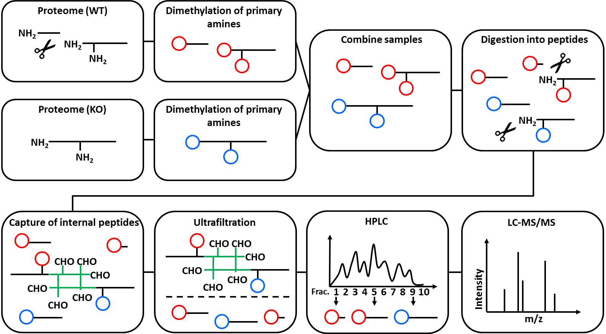
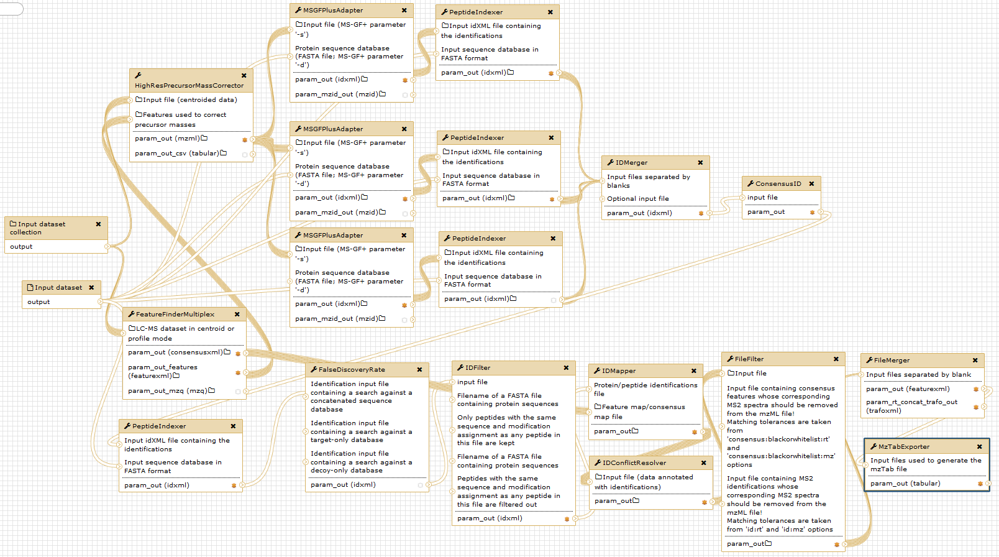

N-Tails is a special Proteomics technique to analyze peptide abundancy changes of protein N-termini. Prior to the MS measurement, N-Tails enriches unmodified, as well as acetylated N-termini. Both common and "unusual" N-termini are identified, where "unusual" means that the protein N-terminus was changes.
This is best explained by an example: directly after translation, a protein has exactly one N-terminus. When a protease is cutting the protein in half, each half has its own N-terminus. While the N-terminus of the first half protein is exactly the same as the one of the full protein precursor ("native N-terminus"), the N-terminus of the second half is different ("neo-N-terminus") and depends on the amino acid sequence where the protein was cut.
The N-Tails technique includes the use of heavy isotope dimethyl labelling.

The figure below illustrates the mechanism of N-Tails. It was originally published by Stefan Tholen (doctoral thesis, not available online). Further reading on N-Tails and other N-terminal techniques, see [Tholen et al., Springer Vienna, 2013](https://dx.doi.org/10.1007/978-3-7091-0885-7_5).

The N-Tails technique was originally designed to research protease biology and has most often been used in this field. It was originally published in [Kleifeld et al., Nat. Biotechnol., 2010](https://www.ncbi.nlm.nih.gov/pubmed/20208520).

> ### :nut_and_bolt: Comment: Interpretation of N-Tails results
>
> Be careful not to overinterprete the results of N-Tails experiments. While the technique **is** fit to identify direct protease substrates, it does not discriminate direct from indirect ("downstream") effects. Thus, most of the identified N-termini will **not** be direct protease substrates, even if their change in protein abundance is statistically significant.
> This warning is not specific for the N-Tails technique, but applies as well to other proteomic N-terminal screening techniques (e.g. COFRADIC).
> {: .comment}

This workflow was originally built in the OpenMS framework "TOPPAS" and published in [Lai, Weisser et al., MCP, 2016](https://www.ncbi.nlm.nih.gov/pubmed/27087653). It was converted to OpenMS v2.1, rebuild for the Galaxy framework and tested on the original dataset by Melanie Föll. It was designed for data analysis of a three samples combined in one MS run, a technique based on dimethyl stable isotope labeling (SIL). For more information on SIL, consult [this tutorial]({{site.url}}/topics/proteomics/tutorials/protein-quant-sil/tutorial.html). The original data were generated using pre-fractionation. Thus, peptides of one biological experiment are measured in multiple consecutive MS runs (one run per fraction).

The figure below gives an overview of the used Galaxy nodes. For further description of the workflow, please consider the [original publication](https://www.ncbi.nlm.nih.gov/pubmed/27087653).

## Input

The workflow needs three input files:

  1) A collection of mzML files (multiple fractions of the same experiment).
  2) A FASTA protein database for the organism of interest. For more information on protein databases, consult [this tutorial]({{site.url}}/topics/proteomics/tutorials/database-handling/tutorial.html)

## Customizing the Workflow

- *Running the workflow on a non-prefractionated sample:* Simply use only one file as an input.
- *Running the workflow on a double dimethyl labeling (only light and heavy labeling):* remove the third `MSGFPlusAdapter` :wrench: and the following `PeptideIndexer` :wrench: . Make sure that the mass changes are correctly given in the `MSGFPlusAdapter` :wrench: .

## Citation

If you use this workflow directly, or any derivative of it, in work leading to a scientific publication,
please cite:

Lai, Z.W., Weisser, J., Nilse, L., Costa, F., Keller, E., Tholen, M., Kizhakkedathu, J.N., Biniossek, M., Bronsert, P., and Schilling, O. (2016). Formalin-Fixed, Paraffin-Embedded Tissues (FFPE) as a Robust Source for the Profiling of Native and Protease-Generated Protein Amino Termini. Mol. Cell. Proteomics 15, 2203–2213.
