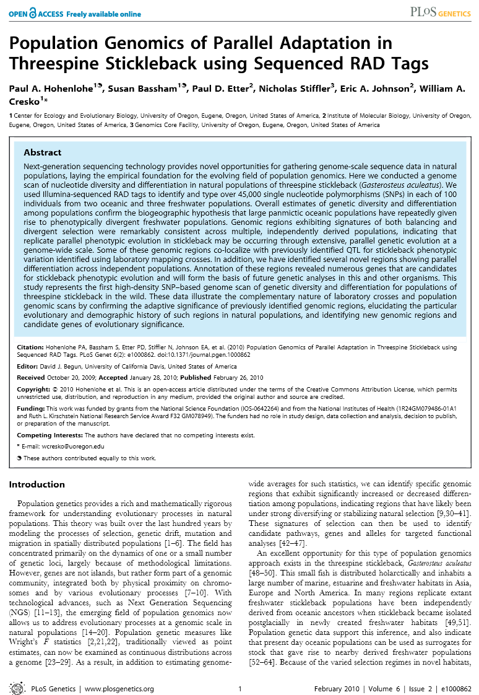
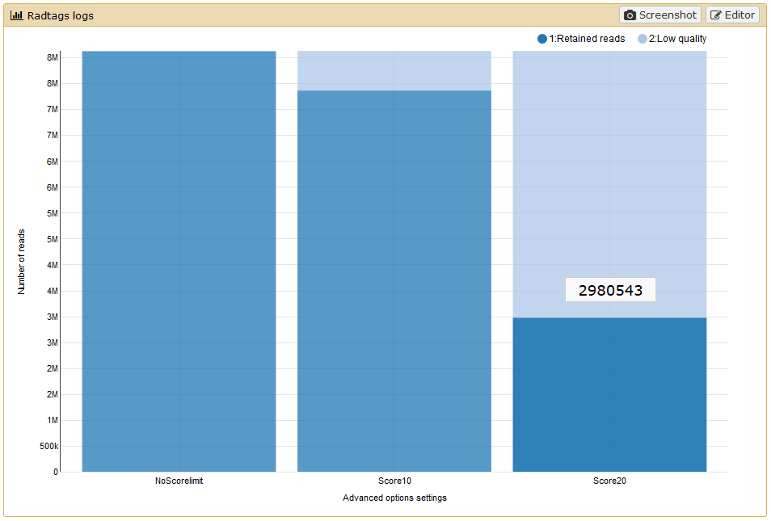
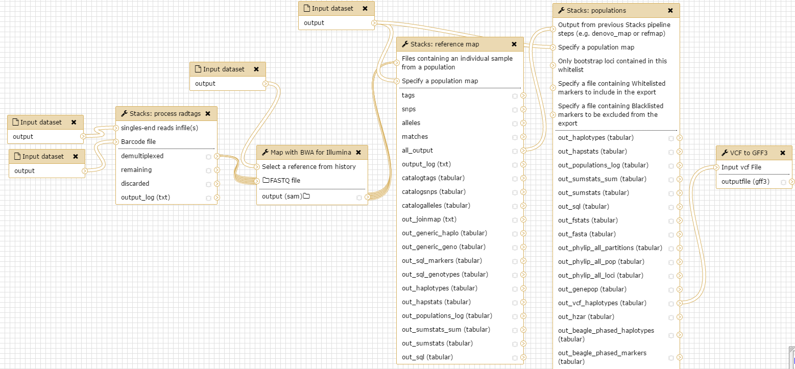

# Introduction
{:.no_toc}

In the study of [Hohenlohe *et al.* 2010](http://journals.plos.org/plosgenetics/article?id=10.1371/journal.pgen.1000862), a genome scan of nucleotide diversity and differentiation in natural populations of threespine stickleback *Gasterosteus aculeatus* was conducted. Authors used Illumina-sequenced RAD tags to identify and type over 45,000 single nucleotide polymorphisms (SNPs) in each of 100 individuals from two oceanic and three freshwater populations.



We here proposed to re-analyze these data at least until the population genomics statistics calculation step using STACKS pipeline. *Gasterosteus aculeatus* draft genome will be used here as reference genome. In a reference-based RAD-seq data analysis, the reads are aligned (or mapped) against a reference genome to constrain our analysis to focus on already discovered loci. A de-novo approach can also be conducted (see [de_novo tutorial]({{site.baseurl}}/topics/sequence-analysis/tutorials/de-novo-rad-seq/tutorial.html), enhancing discoverability of new loci of interest but also of false positive one).


> ### Agenda
>
> In this tutorial, we will deal with:
>
> 1. TOC
> {:toc}
>
{: .agenda}

# Pretreatments

## Data upload

The original data is available at NCBI SRA ENA under accession number [SRR034310](https://trace.ncbi.nlm.nih.gov/Traces/sra/?run=SRR034310) as part of the NCBI SRA ENA study accession number [SRP001747](https://trace.ncbi.nlm.nih.gov/Traces/sra/?study=SRP001747).

We will look at the first run SRR034310 out of seven which includes 16 samples from 2 populations, 8 from Bear Paw (freshwater) and 8 from Rabbit Slough (oceanic). We will download the reads directly from SRA and the remaining data (i.e reference genome, population map file, and barcodes file) from [Zenodo](https://zenodo.org/record/1134547#.WkugUjfjJXI). 


> ###  Hands-on: Data upload
>
> 1. Create a new history for this RAD-seq exercise. If you are not inspired, you can name it "STACKS 1.42 RAD: population genomics with reference genome" for example...
> 2. **Upload Reads from SRA** : Run `EBI SRA`
>    - Select the Run from the results of the search for `SRR034310` (which will present you 1 Experiment (SRX015877) and 1 Run (SRR034310)). 
>    - Click the link in the column **FASTQ files (Galaxy)** of the results table
>    - This will redirect to the Galaxy website and start the download.
> 3. Upload remaining training data from Zenodo: 
>    - Open the Galaxy Upload Manager
>    - Select **Paste/Fetch Data**
>    - Paste the following links into the text field
>    ```
>    https://zenodo.org/record/1134547/files/Barcode_SRR034310.txt
>    https://zenodo.org/record/1134547/files/Details_Barcode_Population_SRR034310.txt
>    https://zenodo.org/record/1134547/files/Reference_genome_11_chromosomes.fasta
>    ```
>
>    > ###  Comments
>    > If you are using the [GenOuest Galaxy instance](https://galaxy.genouest.org), you can load the dataset using 'Shared Data' <i class="fa fa-long-arrow-right"></i> 'Data Libraries' <i class="fa fa-long-arrow-right"></i> '1 Galaxy teaching folder' <i class="fa fa-long-arrow-right"></i> 'EnginesOn' <i class="fa fa-long-arrow-right"></i> 'RADseq' <i class="fa fa-long-arrow-right"></i> 'Stickelback population genomics' <i class="fa fa-long-arrow-right"></i> 'SRR034310'
>
>    > ###  Tip: Changing the file type `fastq.gz` to `fastqsanger.gz` once the data file is in your history.
>    > As we know here that the datatype is fastqsanger, we can directly change it through the upcoming method. Normally, you need to execute FastQGroomer to be sure to have a correct fastqsanger file format. And if you don't know how your quality score is encoded on raw fastQ files, please, use the FastQC tool to determine it!
>    >
>    > * Click on the pencil button displayed in your dataset in the history
>    > * Choose **Datatype** on the top
>    > * Select `fastqsanger.gz`
>    > * Press **Save**
>
>    As default, Galaxy takes the link as name. It also do not link the dataset to a database or a reference genome.
>
>    > ###  Comments
>    > - Add the "stickleback" custom build from the Fasta reference genome file
>    > - Edit the "Database/Build" to select "stickleback"
>    > - Rename the datasets according to the samples
>

The sequences are raw sequences from the sequencing machine, without any pretreatments. They need to be demultiplexed. To do so, we can use the Process Radtags tool from STACKS.

## Demultiplexing reads

For demultiplexing, we use the Process Radtags tool from [STACKS](https://www.g3journal.org/content/1/3/171.full) .

> ###  Hands-on: 
>
> 1. **Process Radtags** : Run `Stacks: process radtags` on FastQ file to demultiplex the reads
>  - Single-end or paired-end reads files: Single-end files
>  - singles-end reads infile(s): SRR034310.fastq(.gz)
>  - Barcode file: Barcode fileBarcodes_SRR034310.tabular
>  - Number of enzymes: One
>  - Enzyme: sbfI
>  - Capture discarded reads to a file: Yes
>  - Output format: fastq


> ###  Questions
>
> 1. How many reads were on the original dataset?
> 2. How many are kept?
> 3. Can you try to explain the reason why we loose a lot of reads here?
> 4. What kind of information this result gives concerning the upcoming data analysis and the barcodes design in general ?
>
>    <details>
>    <summary>Click to view answers</summary>
>    The informations can be found in the results log file:
>    <ol type="1">
>    <li>8895289 total reads</li>
>    <li>8139531 retained reads</li>
>    <li>There are no sequences filtered because of low quality. This is because radtags didn't apply quality related filtering since the corresponding advanced option (Discard reads with low quality scores) has not been enabled. So here, all not retained sequences are removed because of an ambiguous barcode (626265) or an ambiguous RAD-Tag (129493). This means that some barcodes are not exactly what was specified on the barcode file and that sometimes, no SbfI restriction enzyme site was found. This can be due to some sequencing problems but here, this is also due to the addition, in the original sequencing library, of RAD-seq samples from another study. This strategy is often used to avoid having too much sequences beginning with the exact same nucleotide sequence which may cause Illumina related issues during sequencing and cluster analysis </li>
>    <li>Sequencing quality is essential! Each time your sequencing quality decreases, you loose data and thus essential biological information!</li>
>    </ol>
>    In addition to the overall statistics the numbers of retained and removed reads are also given for each bar code sequence.
>    </details>

In order to obtain results of higher quality we will play with the advanced options:  

> ###  Hands-on: 
>
> 2. **Process Radtags** : Re-Run `Stacks: process radtags` on FastQ file playing with parameters
>   - In `advanced options`, activate the `Discard reads with low quality scores` option and play with the score limit (default vs 20 vs 10 for example) and examine the change in reads retained. 
>   - Note that you can play also with the sliding window score threshold, by default 15% of the length of the read. This sliding window parameter allows notably the user to deal with the declining quality at the 3' end of reads.

Then we generate a graphical display of the changes: 

> ###  Hands-on: 
> 
> First we cut the interesting lines of each `result.log with Stacks: process radtags` 
>
> 3. **Select lines that match an expression** applying `^R1.fq.gz` on the log files and then
> 4. **Concatenate datasets tail-to-head** on the resulting data sets
> 
> Alternatively just copy/paste these lines on the Galaxy upload tool using Paste/fetch data section and modifying the File header by sample and filename by Score 10 / Score 20 and noscorelimit for example... Before Starting the upload, you can select the `Convert spaces to tabs` option through the `Upload configuration` wheel. If you did not pay attention to the order you can just sort the file using the first column.

```
quality	Retained Reads	Low Quality	Ambiguous Barcodes	Ambiguous RAD-Tag	Total
20	2980543		5158988		626265		129493		8895289
10	7373160		766371		626265		129493		8895289
nolimit	8139531		0		626265		129493		8895289
```

You can use the `Charts` functionality through the Visualize button to plot the data. 




Using a filter like `clean data, remove any read with an uncalled base` has only little impact:

TODO with which parameter combination the results have been determined?


The demultiplexed sequences are raw sequences from the sequencing machine, without any pretreatments. They need to be controlled for their quality.

## Quality control

For quality control, we use similar tools as described in [NGS-QC tutorial]({{site.baseurl}}/topics/sequence-analysis/): [FastQC](https://www.bioinformatics.babraham.ac.uk/projects/fastqc/).

> ###  Hands-on: Quality control
>
> 1. **FastQC** : Run FastQC on FastQ files to control the quality of the reads
>
>    > ###  Questions
>    >
>    > 1. What is the read length?
>    >
>    >    <details>
>    >    <summary>Click to view answers</summary>
>    >    <ol type="1">
>    >    <li>The read length is 32 bp</li>
>    >    </ol>
>    >    </details>
>

Note the quality drop at bases 5-10 which are the cut site of the RADSeq
protocol (TGCAGG). This is caused by the extremely uneven distribution the
sequencer observes TGCAGG in lockstep on all spots/clusters, i.e. all clusters
light up at the same time. Therefore the sequencer can not be sure that each
spot/cluster is correct which is expressed by the lower quality score. Usually
PhiX is added to reduce this problem, but in the publication it is not stated 
if and to which extent this was done here. 
Still, approximately ~99% of the cases match nucleotide expected for the cut 
site sequence.  
TODO the question now is: is that to be expected? Can we refer some document here?
Also note that the nucleotide distribution of the inidices (bases 1-4) is 
slightly skewed.


As there is a draft genome for *Gasterosteus aculeatus*, we can use this information and map the sequences on this genome to identify polymorphism.

# Mapping

To make sense of the reads, their positions within *Gasterosteus aculeatus* genome must be determined. This process is known as aligning or 'mapping' the reads to the reference genome.

> ###  Comment
>
> Do you want to learn more about the principles behind mapping? Follow our [training]({{site.baseurl}}/topics/sequence-analysis/)

Here we will use BWA. BWA is a fast light-weighted tool that aligns relatively short sequences (queries) to a sequence database (large), such as the human reference genome. It is developed by Heng Li at the Sanger Insitute.

*[Li et Durbin, Bioinformatics, 2009](https://www.ncbi.nlm.nih.gov/pubmed/19451168)*


> 1. **Map with BWA - map short reads (< 100 bp) against reference genome ** : 
> 
> - Will you select a reference genome from your history or use a built-in index?: Use a genome from history and build index
> - Use the following dataset as the reference sequence: chromFa
> - Select input type: Single fastq
> - Select fastq dataset: One dataset collections containing the demultiplexed (in the following we discuss the TODO which setting we discuss?)
> - Leave everything else 

**BWA** generates BAM files with the mapped reads.

We next want to run Stacks on the freshwater and oceanic populations.

# SNP calling from radtags

Run `Stacks: Reference map` Galaxy tool. This program will run pstacks, cstacks, and sstacks using a perl scrip (ref_map.pl) on the members of the population, accounting for the alignments of each read.

> ###  Comment
>
> Information on ref_map.pl and its parameters can be found online: https://creskolab.uoregon.edu/stacks/comp/ref_map.php.

> **Stacks: Reference map** : 
> - Select your usage: Population 
> - Files containing an individual sample from a population: Choose the mapped reads (data collection)
> - Specify a population map: Population_map.txt
> - Minimum depth of coverage: 3
>
>    > ###  Comment
>    >
>    > If you are using a file presenting population information and individual name in a different manner than expected by STACKS, you can use Galaxy tools like `Regex Replace` or `Cut columns from a table` to generate it.

> Once Stacks has completed running, investigate the output files: `Summary from Stacks ref_map.log with Stacks` and `Catalog haplotypes (*)` (snps, alleles and tags). 
> TODO: Summary from Stacks has some quite nice html output (seems preferable to the log file which is named ref_map.log .. not results.log)
> Notice that each locus now has a chromosome/base pair specified in each of the `*tags.tsv` files and in the catalog files.
> TODO: probably the tags summary file? 
> TODO: Would be nice to have some specific informations to look for in the files.  

# Calculate population genomics statistics
> **Stacks: populations** : Run the last step of **Stacks: Reference map** pipeline specifying data filtering options (minimum percentage of individuals in a population required to process a locus for that population: 0.75 , output options (VCF and Structure) and enabling SNP and haplotype-based F statistics calculation.
> - Input type: Stacks output
> - Output from previous Stacks pipeline steps (e.g. denovo_map or refmap): Full output from ref_map 
> - Specify a population map: Population_map.txt 
> - Minimum percentage of individuals in a population required to process a locus for that population: 0.75
> - Output results in Variant Call Format (VCF): yes
> - Output results in Structure Format: yes
> - Enable SNP and haplotype-based F statistics: yes
> 
> Now look at the output in the file `batch_1.sumstats` named `SNP and Haplotype-based F statistics with Stacks: populations ...` on your history. This file is also reachable on the data collection nammed `Full output from ref_map .....` with his original name `batch_1.sumstats`. There are a large number of statistics calculated at each SNP, so use Galaxy tools like filter, cut, and sort to focus on some.

>
>    > ###  Question
>    >
>    > 1. What is the maximum value of FST at any SNP?
>    > 2. How many SNPs reach this FST value?
>    >
>    >    <details>
>    >    <summary>Click to view answers</summary>
>    >    <ol type="1">
>    >    <li>0.75</li>
>    >    <li>3500</li>
>    >    </ol>
>    >    </details>
> TODO: There is no column named `FST`, but one named `Fst'` (column 30). I find larger values than 0.75 in my results (e.g. 1.00.


# Conclusion
{:.no_toc}

In this tutorial, we have analyzed real RAD sequencing data to extract useful information, such as which loci are candidate regarding the genetic differentiation between freshwater and oceanic Stickelback populations. To answer these questions, we analyzed RAD sequence datasets using a reference-based RAD-seq data analysis approach. This approach can be sum up with the following scheme:



