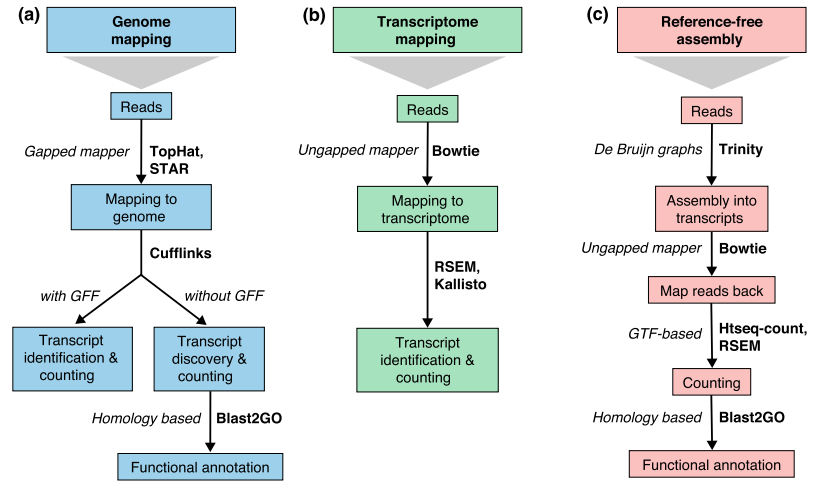
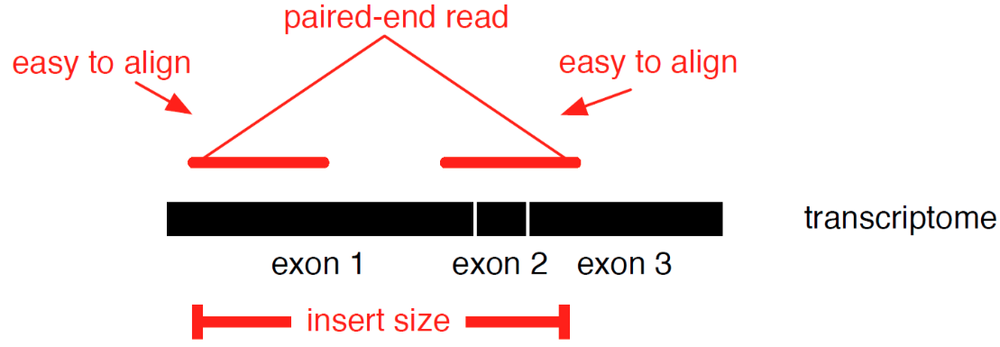
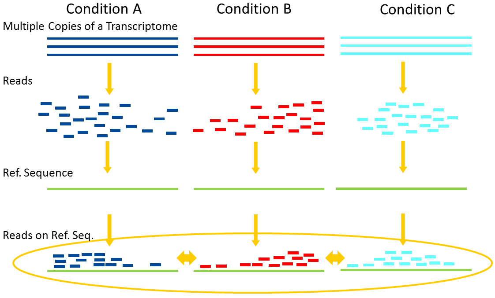
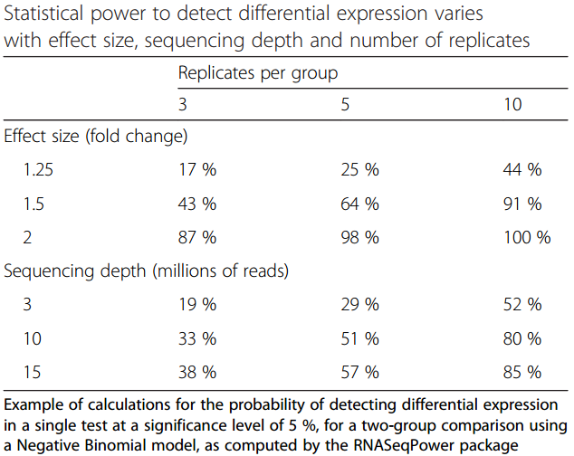
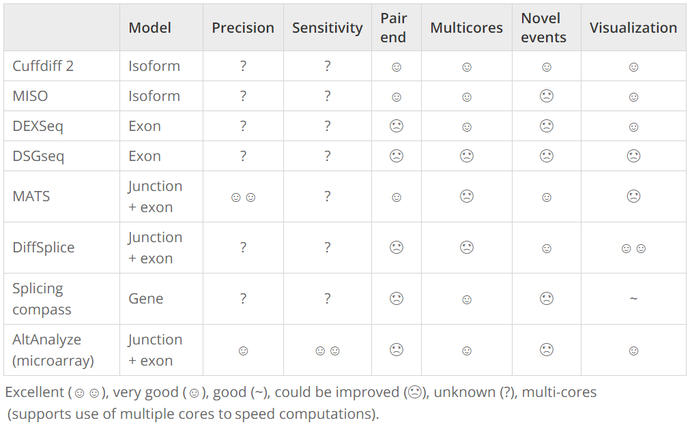

# What is RNA sequencing?

---

### RNA sequencing

RNA 

- Transcribed form of the DNA 
- Active state of the DNA

RNA sequencing 

- RNA quantification at single base resolution
- Cost efficient analysis of the whole transcriptome in a high-throughput manner

---

### Where does my data come from?


<small>[*Zang and Mortazavi, Nature, 2012*](http://www.nature.com/ni/journal/v13/n9/full/ni.2407.html)</small>

---

### Principle of RNA sequencing


<small>[*Korf, Nat Met, 2013*](http://www.nature.com/nmeth/journal/v10/n12/full/nmeth.2735.html)</small>

---

### Challenges of RNA sequencing
                            
- Different origin for the sample RNA and the reference genome
- Presence of incompletely processed RNAs or transcriptional background noise
- Sequencing biases (*e.g.* PCR library preparation)

---

### Benefits of RNA sequencing


---

### FASTQ-files

```bash
@4:1:4888:1039:Y 
TGAACGCTGTTTCCAAGAAATGCTGGAAGAGGTCGATGGGTGTTATCTCTG
+ 
IIIHIIIIIIIIIIIIIIIIIIIIIIIIIH!CBCBBBB@=B@A?1@==<@=
```
                            
- 50+ million reads per data set (~15 GB data for one human fastq-file)
- Unique identifier per read
- Nucleotide sequence with single base resolution
- Quality score for each base

---

### 2 main research applications for RNA-Seq

- Transcript discovery

    > *Which RNA molecules are in my sample?*

    - Novel isoforms and alternative splicing 
    - Non-coding RNAs
    - Single nucleotide variations
    - Fusion genes

- RNA quantification

    > *What is the concentration of RNAs?*

    - Absolute gene expression (within sample)
    - Differential gene expression (between biological samples)
    - Isoform expression / differential exon usage / alternative splicing

---

## How to analyze RNA seq data for RNA quantification?

---

### RNA quantification


<small>[*Pepke et al, Nat Met, 2009*](http://www.nature.com/nmeth/journal/v6/n11s/full/nmeth.1371.html)</small>

---

### Overview of the Data Processing


- No available standardized workflow 
- Multiple possible best practices for every dataset

---

## Data Pre-processing

.image-50[]

1. Adapter clipping to trim the sequencing adapters 
2. Quality trimming to remove wrongly called and low quality bases

.footnote[See [NGS Quality control](../../NGS-QC/slides/index.html)]

---

## Annotation of RNA-Seq reads

.image-75[]

How do I identify my reads?

---

### 3 main strategies for annotations



<small>
[*Conesa et al, Genome Biol, 2016*](https://genomebiology.biomedcentral.com/articles/10.1186/s13059-016-0881-8)
</small>

---

### Sources of reference annotations

- Joint projects to produce and maintain annotations on selected organisms: EMBL-EBI, UCSC, RefSeq, Ensembl, ...
- Annotations of known genes, repeats, ... in GTF file format

---

### Transcriptome alignment



*See [NGS Mapping](../../NGS-mapping/slides/index.html)*

- Need reliable gene models
- No detection of novel genes

.footnote[Figures by Ernest Turro, EMBO Practical Course on Analysis of HTS Data, 2012]

---

### Genome alignment

Splice-aware read alignment


Detection of novel genes and isoforms

.footnote[Figures by Ernest Turro, EMBO Practical Course on Analysis of HTS Data, 2012]

---

### *De novo* transcriptome assembly

No need for a reference genome ...

---

## Quantification of transcript level


What is the expression level of the genomic features?

---

### Counting the number of reads per features

Easy!!

But some challenges

- How to handle multi-mapped reads (*i.e.* reads with multiple alignments)?
- How to distinguish between different isoforms?
    - At gene level?
    - At transcript level?
    - At exon level?

---


## Differential Expression Analysis


---

### Differential Expression Analysis

.image-75[]
 
Account for variability of expression across biological replicates<br>with the help of counts

---

### Normalization

Make the expression levels comparable across

- Features: genes, isoforms
- Libraries: samples

---

### Normalization methods

- [*FPKM/RPKM*](http://www.nature.com/nmeth/journal/v5/n7/abs/nmeth.1226.html) (Cufflinks/Cuffdiff)
- [*TMM*](https://genomebiology.biomedcentral.com/articles/10.1186/gb-2010-11-3-r25) (edgeR)
- [*DESeq2*](https://genomebiology.biomedcentral.com/articles/10.1186/s13059-014-0550-8) (DESeq2)
    
    Normalize counts *k<sub>ij</sub>* for gene *i* in library *j* by size factor *s<sub>j</sub>*

.footnote[*"Only the DESeq and TMM normalization methods are robust to the presence of different library sizes and widely different library compositions..."* - Dillies et al., Brief Bioinf, 2013]

---

### Analysis of Differential Gene Expression (DGE)

Idea

- Model the gene counts by negative binomial distribution
- Account for variability of gene expression across biological replicates

---

### Impact of sequencing depth and number of replicates

.image-50[]

<small> [*Conesa et al, Genome Biol, 2016*](https://genomebiology.biomedcentral.com/articles/10.1186/s13059-016-0881-8)</small>

**Recommendation: At least 3 biological replicates**

???

- Number of replicates has greater effect on DE detection accuracy than sequencing depth (more replicates = increased statistical power)
- DE detection of lowly expressed genes is very sensitive to number of reads and replication
- DE detection of highly expressed genes possible already at low sequencing depth

---

### Detection of Alternative Splicing



<small>
[*Hooper, Hum. Genomics, 2014*](http://humgenomics.biomedcentral.com/articles/10.1186/1479-7364-8-3)
</small>

---

### Visualization

- Integrative Genomics Viewer ([*IGV*](http://bib.oxfordjournals.org/content/14/2/178.full?keytype=ref&%2520ijkey=qTgjFwbRBAzRZWC)) 

    Visualization of the aligned BAM files

- [*Sashimi plots*](http://bioinformatics.oxfordjournals.org/content/early/2015/01/21/bioinformatics.btv034)
    
    Quantitative visualization of read coverage along exons and splice junctions

- [*CummeRbund*](http://compbio.mit.edu/cummeRbund/manual_2_0.html)

    Visualization package for Cufflinks high-throughput sequencing data

---

### Where do I find data?

- Sequencing data which you have prepared by yourself or you have obtained from your colleagues
- Sequence Read Archive - [*SRA*](https://www.ncbi.nlm.nih.gov/sra)
- Gene Expression Omnibus - [*GEO*](https://www.ncbi.nlm.nih.gov/geo/)
- Ensembl - [*e!*](http://www.ensembl.org/info/website/tutorials/sequence.html)
- The Cancer Genome Atlas - [*TCGA*](https://tcga-data.nci.nih.gov/docs/publications/tcga/?)
- ... our tutorial


