# Introduction
{:.no_toc}

The data provided here are part of a Galaxy tutorial that analyzes RNA-seq data from a study published by *Wu et al.* in 2014 [DOI:10.1101/gr.164830.113](http://genome.cshlp.org/content/early/2014/10/12/gr.164830.113.abstract). The goal of this study was to investigate "the dynamics of occupancy and the role in gene regulation of the transcription factor Tal1, a critical regulator of hematopoiesis, at multiple stages of hematopoietic differentiation." To this end, RNA-seq libraries were constructed from multiple mouse cell types including G1E - a GATA-null immortalized cell line derived from targeted disruption of GATA-1 in mouse embryonic stem cells - and megakaryocytes. This RNA-seq data was used to determine differential gene expression between G1E and megakaryocytes and later correlated with Tal1 occupancy. This dataset (GEO Accession: GSE51338) consists of biological replicate, paired-end, poly(A) selected RNA-seq libraries. Because of the long processing time for the large original files, we have downsampled the original raw data files to include only reads that align to chromosome 19 and a subset of interesting genomic loci identified by Wu *et al*.

# Analysis strategy

The goal of this exercise is to identify what transcripts are present in the G1E and megakaryocyte cellualr states and which transcripts are differentially expressed between the two states. We will use a *de novo* transcript reconstruction strategy to infer transcript structures from the mapped reads in the absence of the actual annotated transcript structures. This will allow us to identify novel transcripts and novel isoforms of known transcripts, as well as identify differentially expressed transcripts.

> ### Agenda
>
> In this tutorial, we will deal with:
>
> 1. TOC
> {:toc}
>
{: .agenda}

## Data upload

Due to the large size of this dataset, we have downsampled it to only include reads mapping to chromosome 19 and certain loci with relevance to hematopoeisis. This data is available at [`Zenodo`](https://zenodo.org/record/583140#.WSW3NhPyub8), where you can find the forward and reverse reads corresponding to replicate RNA-seq libraries from G1E and megakaryocyte cells and an annotation file of RefSeq transcripts we will use to generate our transcriptome database.

> ### :pencil2: Hands-on: Data upload
>
> 1. Create a new history for this RNA-seq exercise
> 2. Open the data upload manager (Get Data -> Upload file)
> 3. Copy and paste the links for the reads and annotation file
> 4. Select **Paste/Fetch Data**
> 5. Paste the link(s) into the text field
> 6. Change the datatype of the read files to **fastqsanger**
> 7. Change the datatype of the annotation file to **gtf** and assign the Genome as **mm10**
> 8. Press **Start**
> 9. Rename the files in your history to retain just the necessary information (*e.g.* "G1E R1 forward reads")
>
>    > ### :bulb: Tip: Importing data via links
>    > Data available from zenodo: 
>    >
>    > Below are the links to the read files that can be copied and pasted in the upload manager.
>    > - https://zenodo.org/record/583140/files/G1E_rep1_forward_read_%28SRR549355_1%29
>    > - https://zenodo.org/record/583140/files/G1E_rep1_reverse_read_%28SRR549355_2%29
>    > - https://zenodo.org/record/583140/files/G1E_rep2_forward_read_%28SRR549356_1%29
>    > - https://zenodo.org/record/583140/files/G1E_rep2_reverse_read_%28SRR549356_2%29
>    > - https://zenodo.org/record/583140/files/Megakaryocyte_rep1_forward_read_%28SRR549357_1%29
>    > - https://zenodo.org/record/583140/files/Megakaryocyte_rep1_reverse_read_%28SRR549357_2%29
>    > - https://zenodo.org/record/583140/files/Megakaryocyte_rep2_forward_read_%28SRR549358_1%29
>    > - https://zenodo.org/record/583140/files/Megakaryocyte_rep2_reverse_read_%28SRR549358_2%29
>    > - https://zenodo.org/record/583140/files/RefSeq_reference_GTF_%28DSv2%29
>    > You will need to fetch the link to the annotation file yourself ;)
>    {: .tip}
>
{: .hands_on}

## Quality control

For quality control, we use similar tools as described in [NGS-QC tutorial]({{site.url}}/topics/sequence-analysis/): [FastQC](https://www.bioinformatics.babraham.ac.uk/projects/fastqc/) and [Trimmomatic](http://www.usadellab.org/cms/?page=trimmomatic).

> ### :pencil2: Hands-on: Quality control
>
> 1. **FastQC** :wrench:: Run `FastQC` on the forward and reverse read files to assess the quality of the reads.
>
>    > ### :question: Questions
>    >
>    > 1. What is the read length?
>    > 2. Is there anything interesting about the quality of the base calls based on the position in the reads?
>    >
>    >    

>    >    
Click to view answers

>    >    <ol type="1">
>    >    <li>The read length is 99 bp</li>
>    >    <li>The quality of base calls declines throughout a sequencing run. </li>
>    >    </ol>
>    >    

>    {: .question}
>
> 2. **Trimmomatic** :wrench:: Trim off the low quality bases from the ends of the reads to increase mapping efficiency. Run `Trimmomatic` on each pair of forward and reverse reads.
>
>    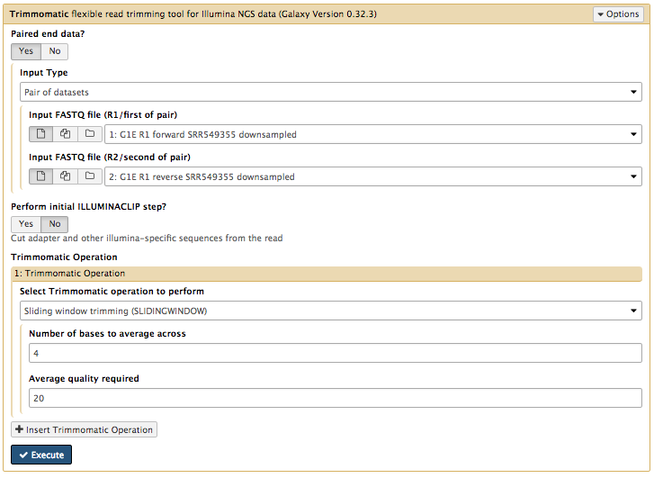
>
> 3. **FastQC** :wrench:: Re-run `FastQC` on trimmed reads and inspect the differences.
>
>    > ### :question: Questions
>    >
>    > 1. What is the read length?
>    > 2. Is there anything interesting about the quality of the base calls based on the position in the reads?
>    >
>    >    

>    >    
Click to view answers

>    >    <ol type="1">
>    >    <li>The read lengths range from 1 to 99 bp after trimming</li>
>    >    <li>The average quality of base calls does not drop off as sharply at the 3' ends of reads.</li>
>    >    </ol>
>    >    

>    {: .question}
> 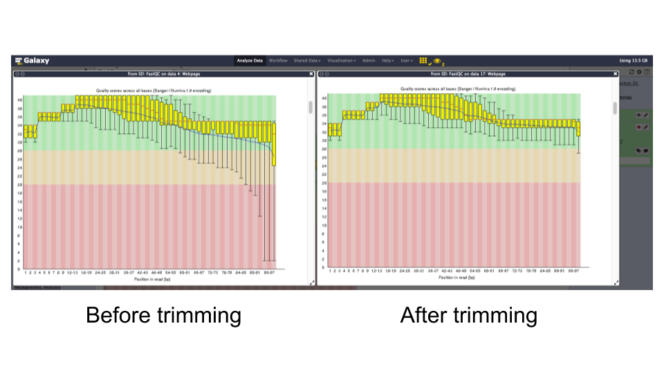
{: .hands_on}

Now that we have trimmed our reads and are fortunate that there is a reference genome assembly for mouse, we will align our trimmed reads to the genome.

> ### :nut_and_bolt: Comment
>
> Instead of running a single tool multiple times on all your data, would you rather run a single tool on multiple datasets at once? Check out the [dataset collections](https://galaxyproject.org/tutorials/collections/) feature of Galaxy!
{: .comment}

# Mapping

To make sense of the reads, their positions within mouse genome must be determined. This process is known as aligning or 'mapping' the reads to the reference genome.

> ### :nut_and_bolt: Comment
>
> Do you want to learn more about the principles behind mapping? Follow our [training]({{site.url}}/topics/sequence-analysis/)
{: .comment}

In the case of a eukaryotic transcriptome, most reads originate from processed mRNAs lacking introns. Therefore, they cannot be simply mapped back to the genome as we normally do for reads derived from DNA sequences. Instead, the reads must be separated into two categories:

- Reads contained within mature exons - these align perfectly to the reference genome
- Reads that span splice junctions in the mature mRNA - these align with gaps to the reference genome

Spliced mappers have been developed to efficiently map transcript-derived reads against genomes. [`HISAT`](https://ccb.jhu.edu/software/hisat2/index.shtml) is an accurate and fast tool for mapping spliced reads to a genome. Another popular spliced aligner is [`TopHat`](https://ccb.jhu.edu/software/tophat/index.shtml), but we will be using `HISAT` in this tutorial.

> ### :nut_and_bolt: Comment
> As it is sometimes quite difficult to determine which settings correspond to those of other programs, the following table might be helpful to identify the library type:
>
> Library type | **Infer Experiment** | **TopHat** | **HISAT** | **htseq-count** | **featureCounts**
> --- | --- | --- | --- | --- | ---
> PE | 1++,1--,2+-,2-+ | FR Second Strand | FR | yes | 1
> PE | 1+-,1-+,2++,2-- | FR First Strand | RF | reverse | 2
> SE | ++,-- | FR Second Strand | F | yes | 1
> SE | +-,-+ | FR First Strand | R | reverse | 2
> SE,PE | undecided | FR Unstranded | default | no | 0
>
{: .comment}

> ### :pencil2: Hands-on: Spliced mapping
>
> 1. **HISAT** :wrench:: Run `HISAT` on one forward/reverse read pair and modify the following settings:
>    - **Single end or paired reads?**: Individual paired-end reads
>    - **Source for the reference genome to align against**: Use a built-in genome > Mouse (Mus Musculus): mm10
>    - **Spliced alignment parameters**: Specify spliced alignment parameters
>    - **Specify strand-specific information**: First Strand (R/RF)
>    - **Transcriptome assembly reporting**: Report alignments tailored for transcript assemblers including StringTie.
>
>       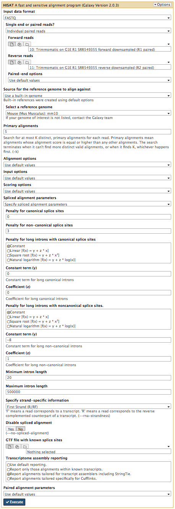
>
> 2. **HISAT** :wrench:: Run `HISAT` on the remaining forward/reverse read pairs with the same parameters.
>
{: .hands_on}

# De novo transcript reconstruction
Now that we have mapped our reads to the mouse genome with `HISAT`, we want to determine transcript structures that are represented by the aligned reads. This is called *de novo* transcriptome reconstruction. This unbiased approach permits the comprehensive identification of all transcripts present in a sample, including annotated genes, novel isoforms of annotated genes, and novel genes. While common gene/transcript databases are quite large, they are not comprehensive, and the *de novo* transcriptome reconstruction approach ensures complete transcriptome(s) identification from the experimental samples. The leading tool for transcript reconstruction is `Stringtie`. Here, we will use `Stringtie` to predict transcript structures based on the reads aligned by `HISAT`.

> ### :pencil2: Hands-on: Transcriptome reconstruction
>
> 1. **Stringtie** :wrench:: Run `Stringtie` on the `HISAT` alignments using the default parameters.
>    - Use batch mode to run all four samples from one tool form.
> 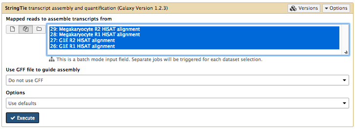
{: .hands_on}

# Transcriptome assembly

We just generated four transcriptomes with `Stringtie` representing each of the four RNA-seq libraries we are analyzing. Since these were generated in the absence of a reference transcriptome, and we ultimately would like to know what transcript structure corresponds to which annotated transcript (if any), we have to make a **transcriptome database**. We will use the tool `Stringtie - Merge` to combine redundant transcript structures across the four samples and the RefSeq reference. Once we have merged our transcript structures, we will use `GFFcompare` to annotate the transcripts of our newly created transcriptome so we know the relationship of each transcript to the RefSeq reference.

> ### :pencil2: Hands-on: Transcriptome assembly
>
> 1. **Stringtie-merge** :wrench:: Run `Stringtie-merge` on the `Stringtie` assembled transcripts along with the RefSeq annotation file we imported earlier.
>    - Use batch mode to inlcude all four `Stringtie` assemblies as "input_gtf".
>    - Select the "RefSeq GTF mm10" file as the "guide_gff".
> 
>
> 2. **GFFCompare** :wrench:: Run `GFFCompare` on the `Stringtie-merge` generated transcriptome along with the RefSeq annotation file.
>    - Select the output of `Stringtie-merge` as the GTF input.
>    - Select "Yes" under `Use Reference Annotation" and select the "RefSeq GTF mm10" file as the "Reference Annotation".`
> 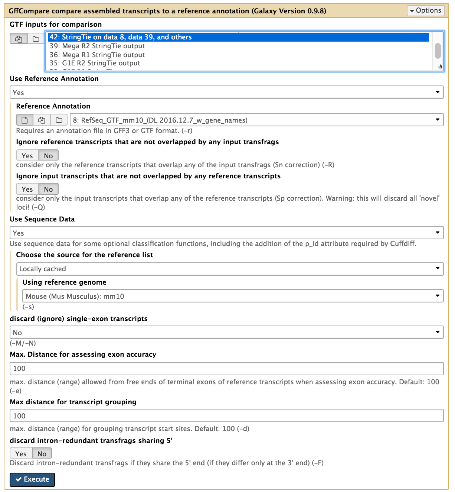
>
{: .hands_on}

> ### :nut_and_bolt: Note: Transcript categorization used by `GFFcompare`
>
> |**Class code** | **Transcript category**|
> |:---:|:---|
> |= | Annotated in reference|
> |j | Novel isoform of reference|
> |u | Intergenic|
> |x | Anti-sense|
> |r | Repetitive|
> |c | Contained in exon of reference|
> |s | Anti-sense spliced intronic|
> |e | Single exon transfrag overlapping a reference exon and at least 10 bp of a reference intron, indicating a possible pre-mRNA fragment.|
> |i | A transfrag falling entirely within a reference intron|
> |o | Generic exonic overlap with a reference transcript|
> |p | Possible polymerase run-on fragment (within 2Kbases of a reference transcript)|
{: .comment}

# Analysis of the differential gene expression

We just generated a transriptome database that represents the transcripts present in the G1E and megakaryocytes samples. This database provides the location of our transcripts with non-redundant identifiers, as well as information regarding the origin of the transcript.

We now want to identify which transcripts are differentially expressed between the G1E and megakaryocyte cellular states. To do this we will implement a counting approach using `FeatureCounts` to count reads per transcript. Then we will provide this information to `DESeq2` to generate normalized transcript counts (abundance estimates) and significance testing for differential expression.

## Count the number of reads per transcript

To compare the abundance of transcripts between different cellular states, the first essential step is to quantify the number of reads per transcript. [`FeatureCounts`](http://bioinf.wehi.edu.au/featureCounts/ ) is one of the most popular tools for counting reads in genomic features. In our case, we'll be using `FeatureCounts` to count reads aligning in exons of our `GFFCompare` generated transcriptome database.

The recommended mode is "union", which counts overlaps even if a read only shares parts of its sequence with a genomic feature and disregards reads that overlap more than one feature.

> ### :pencil2: Hands-on: Counting the number of reads per transcript
>
> 1. **FeatureCounts** :wrench:: Run `FeatureCounts` on the aligned reads (`HISAT` output) using the `GFFCompare` transcriptome database as the annotation file.
>
>    - Using the batch mode for input selection, choose the four `HISAT` aligned read files
>    - **Gene annotation file**:  in your history, then select the `annotated transcripts` GTF file output by `GFFCompare` (this specifies the "union" mode)
>    - Expand **Options for paired end reads**
>    - **Orientation of the two read from the same pair**: Reverse, Forward (rf)
>    - Expand **Advanced options**
>    - **GFF gene identifier**: enter "transcript_id"
>    - **Strand specificity of the protocol**: select "Stranded (reverse)"
> 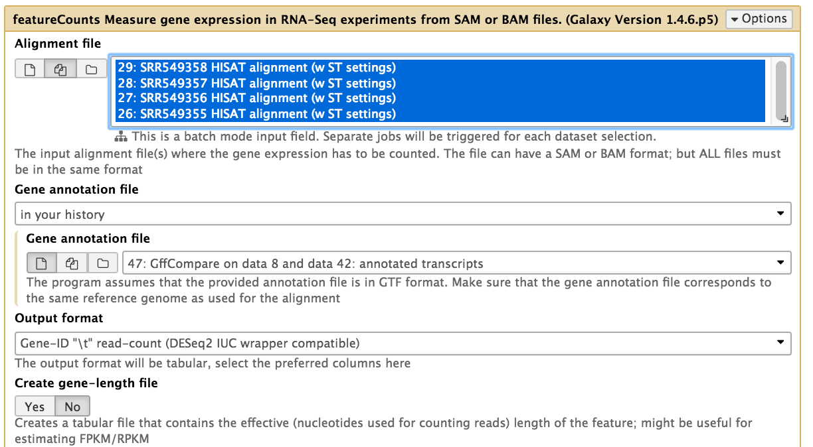
> 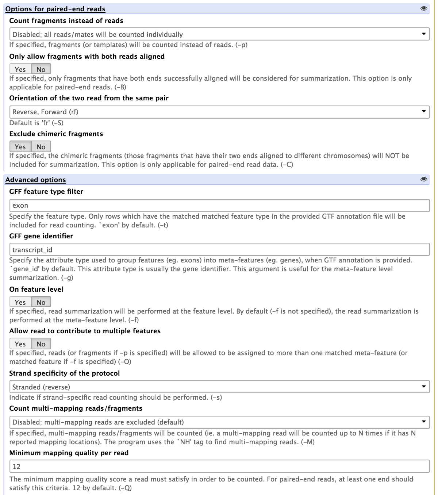
>
{: .hands_on}

## Perform differential gene expression testing

Transcript expression is estimated from read counts, and attempts are made to correct for variability in measurements using replicates. This is absolutely essential to obtaining accurate results. We recommend having at least two biological replicates.

[`DESeq2`](https://bioconductor.org/packages/release/bioc/html/DESeq2.html) is a great tool for differential gene expression analysis. It accepts read counts produced by `FeatureCounts` and applies size factor normalization:

- Computation for each gene of the geometric mean of read counts across all samples
- Division of every gene count by the geometric mean
- Use of the median of these ratios as sample's size factor for normalization

> ### :pencil2: Hands-on:
>
> 1. **DESeq2** :wrench:: Run `DESeq2` with the following parameters:
>    - Specify "G1E" as the first factor level (condition) and select the count files corresponding to the two replicates
>    - Specify "Mega" as the second factor level (condition) and select the count files corresponding to the two replicates
>
>       > ### :nut_and_bolt: Comment
>       >
>       > You can select several files by holding down the CTRL (or COMMAND) key and clicking on the desired files
>       {: .comment}
>    - **Visualising the analysis results**: Yes
>    - **Output normalized counts table**: Yes
> 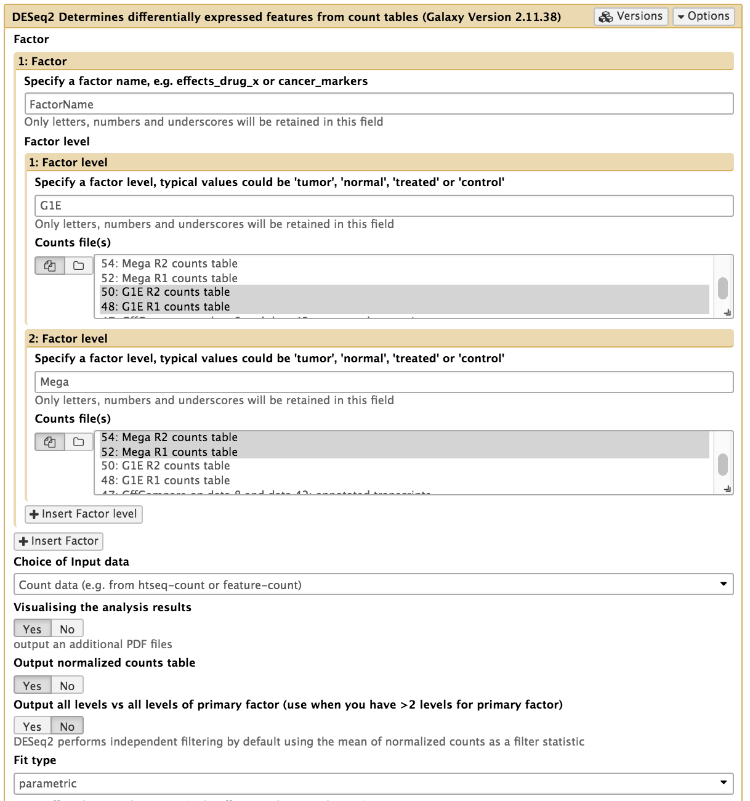
{: .hands_on}

The first output of `DESeq2` is a tabular file. The columns are:

1.	Gene identifiers
2.	Mean normalized counts, averaged over all samples from both conditions
3.	Logarithm (base 2) of the fold change (the values correspond to up- or downregulation relative to the condition listed as Factor level 1)
4.	Standard error estimate for the log2 fold change estimate
5.	[Wald](http://data.princeton.edu/wws509/notes/c2s3.html) statistic
6.	*p*-value for the statistical significance of this change
7.	*p*-value adjusted for multiple testing with the Benjamini-Hochberg procedure which controls false discovery rate ([FDR](http://www.biostathandbook.com/multiplecomparisons.html))

> ### :pencil2: Hands-on:
>
>1. **Filter** :wrench:: Run `Filter` to extract genes with a significant change in gene expression (adjusted *p*-value less than 0.05) between treated and untreated samples
>
>    > ### :question: Question
>    >
>    > How many transcripts have a significant change in expression between these conditions?
>    >
>    > 

>    > 
Click to view answers

>    > To filter, use "c7<0.05". And we get 249 transcripts with a significant change in gene expression between the G1E and megakaryocyte cellular states.
>    > 

>    {: .question}
>
> 2. **Filter** :wrench:: Determine how many transcripts are up or down regulated in the G1E state.
>
>    > ### :nut_and_bolt: Comments
>    > Rename your datasets for the downstream analyses
>    {: .comment}
>
>    > ### :question: Question
>    >
>    > Are there more upregulated or downregulated genes in the treated samples?
>    >
>    > 

>    > 
Click to view answers

>    > To obtain the up-regulated genes in the G1E state, we filter the previously generated file (with the significant change in transcript expression) with the expression "c3>0" (the log2 fold changes must be greater than 0). We obtain 102  genes (40.9% of the genes with a significant change in gene expression). For the down-regulated genes in the G1E state, we did the inverse and we find 149 transcripts (59% of the genes with a significant change in transcript expression).
>    > 

>    {: .question}
{: .hands_on}

In addition to the list of genes, `DESeq2` outputs a graphical summary of the results, useful to evaluate the quality of the experiment:

1. Histogram of *p*-values for all tests

    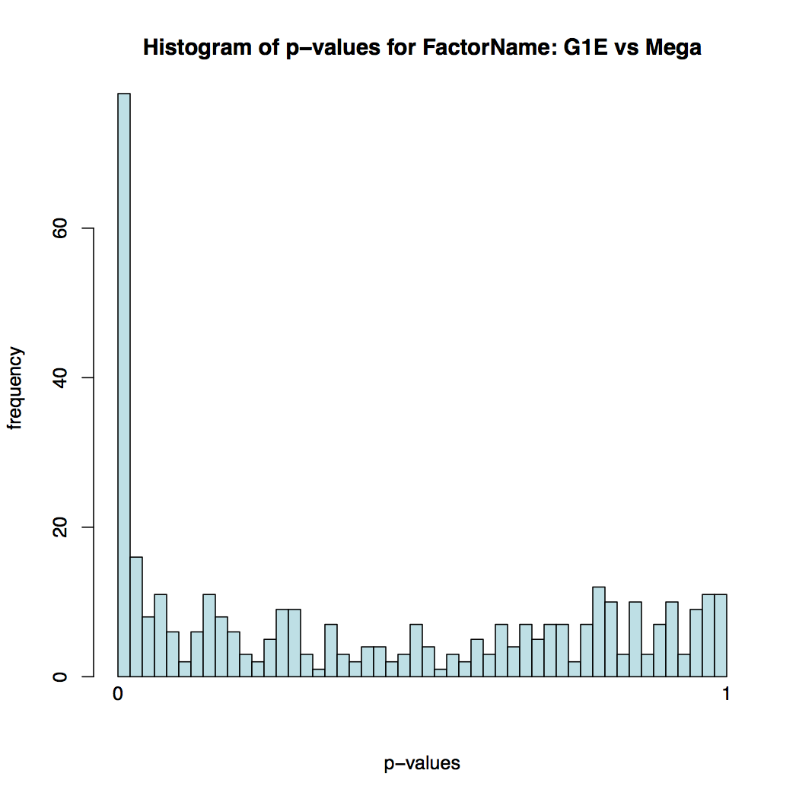

2. [MA plot](https://en.wikipedia.org/wiki/MA_plot): global view of the relationship between the expression change of conditions (log ratios, M), the average expression strength of the genes (average mean, A), and the ability of the algorithm to detect differential gene expression. The genes that passed the significance threshold (adjusted p-value < 0.1) are colored in red.

    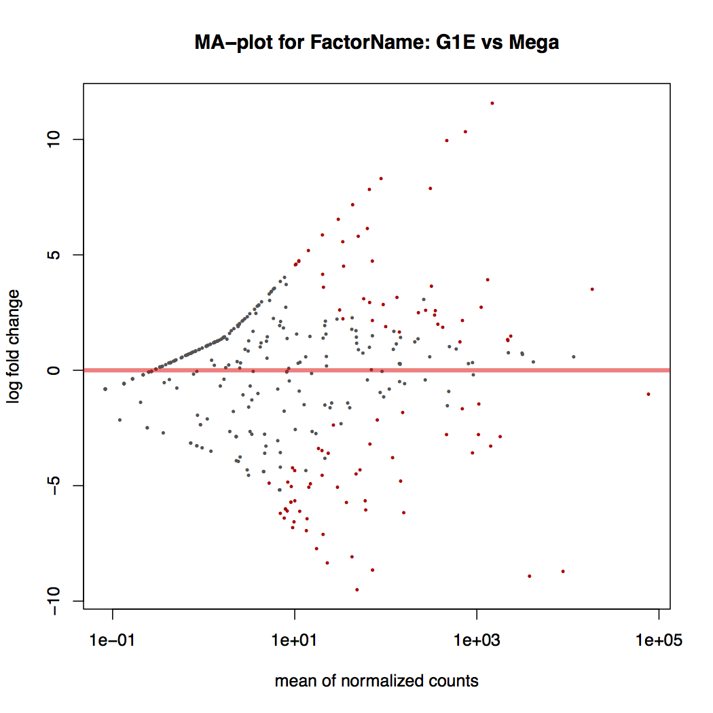

3. Principal Component Analysis ([PCA](https://en.wikipedia.org/wiki/Principal_component_analysis)) and the first two axes

    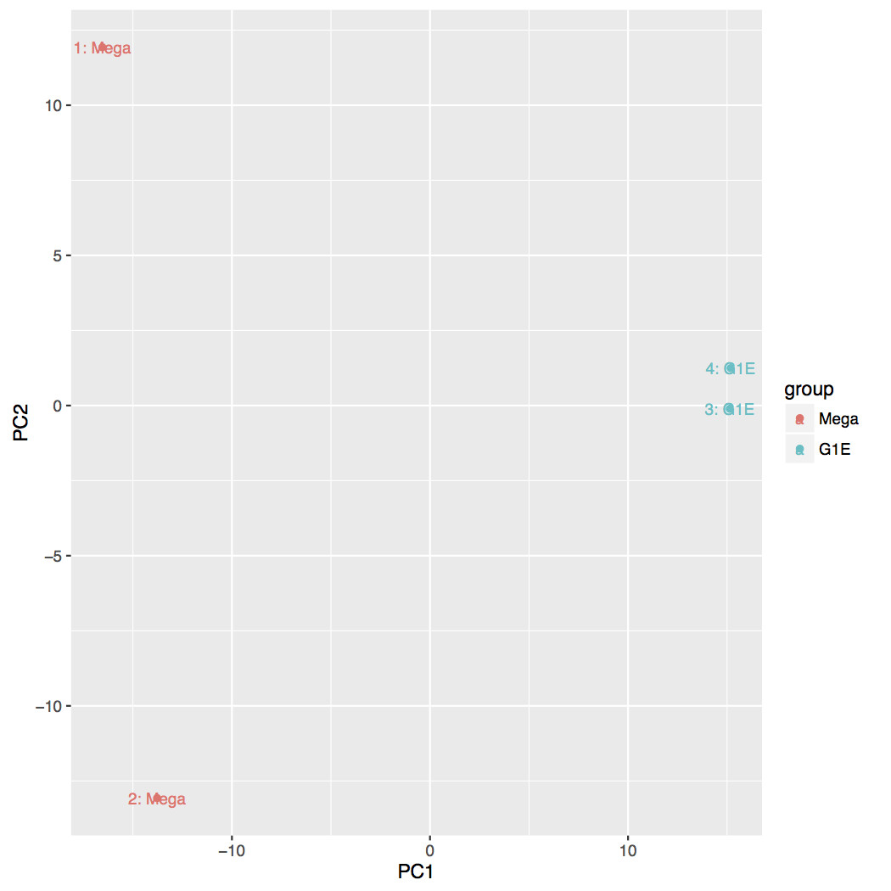

    Each replicate is plotted as an individual data point. This type of plot is useful for visualizing the overall effect of experimental covariates and batch effects.

4. Heatmap of sample-to-sample distance matrix: overview over similarities and dissimilarities between samples

    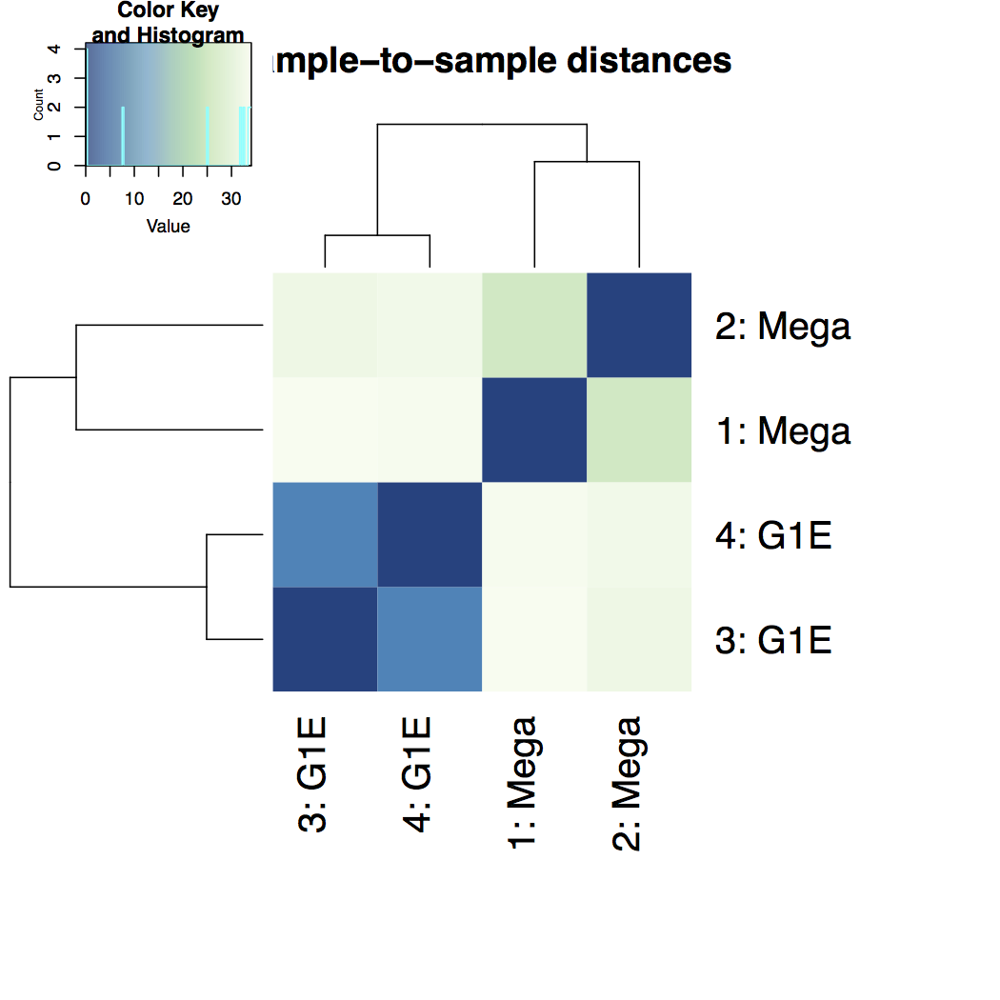

5. Dispersion estimates: gene-wise estimates (black), the fitted values (red), and the final maximum a posteriori estimates used in testing (blue)

    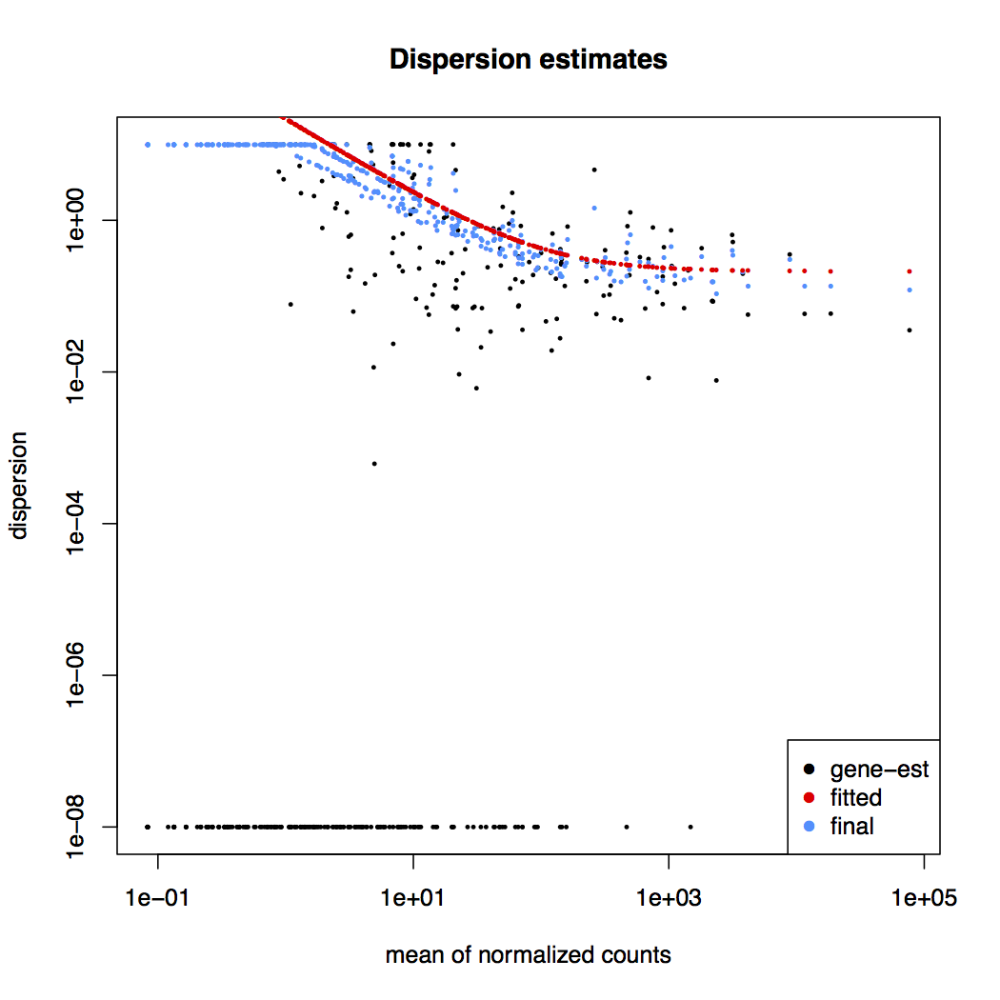

    This dispersion plot is typical, with the final estimates shrunk from the gene-wise estimates towards the fitted estimates. Some gene-wise estimates are flagged as outliers and not shrunk towards the fitted value. The amount of shrinkage can be more or less than seen here, depending on the sample size, the number of coefficients, the row mean and the variability of the gene-wise estimates.

For more information about `DESeq2` and its outputs, you can have a look at [`DESeq2` documentation](https://www.bioconductor.org/packages/release/bioc/manuals/DESeq2/man/DESeq2.pdf).

# Visualization
Now that we have a list of transcript expression levels and their differential expression levels, it is time to visually inspect our transcript structures and the reads they were predicted from. It is a good practice to visually inspect (and present) loci with transcripts of interest. Fortunately, there is a built-in genome browser in Galaxy, **Trackster**, that make this task simple (and even fun!).

In this last section, we will convert our aligned read data from BAM format to bigWig format to simplify observing where our stranded RNA-seq data aligned to. We'll then initiate a session on Trackster, load it with our data, and visually inspect our interesting loci.

> ### :pencil2: Hands-on: Converting aligned read files to bigWig format
>
> 1. **bamCoverage** :wrench:: Run `bamCoverage` on all four aligned read files (`HISAT` output) with the following parameters:
>    - **Bin size in bases**: 1
>    - **Effective genome size**: mm9 (2150570000)
>    - Expand the **Advanced options**
>    - **Only include reads originating from fragments from the forward or reverse strand**: forward
> 2. **Rename** :wrench:: Rename the outputs to reflect the origin of the reads and that they represent the reads mapping to the PLUS strand.
>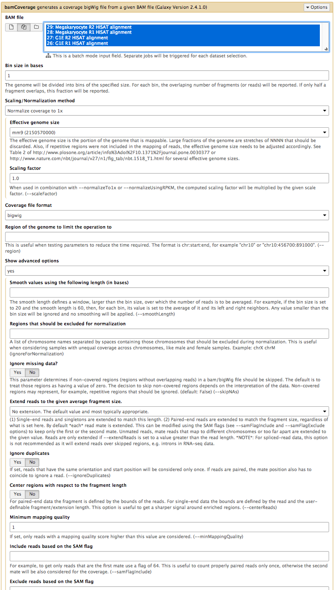
>
> 3. **bamCoverage** :wrench:: Repeat Step 1 except changing the following parameter:
>    - **Only include reads originating from fragments from the forward or reverse strand**: reverse
> 4. **Rename** :wrench:: Rename the outputs to reflect the origin of the reads and that they represent the reads mapping to the MINUS strand.
> 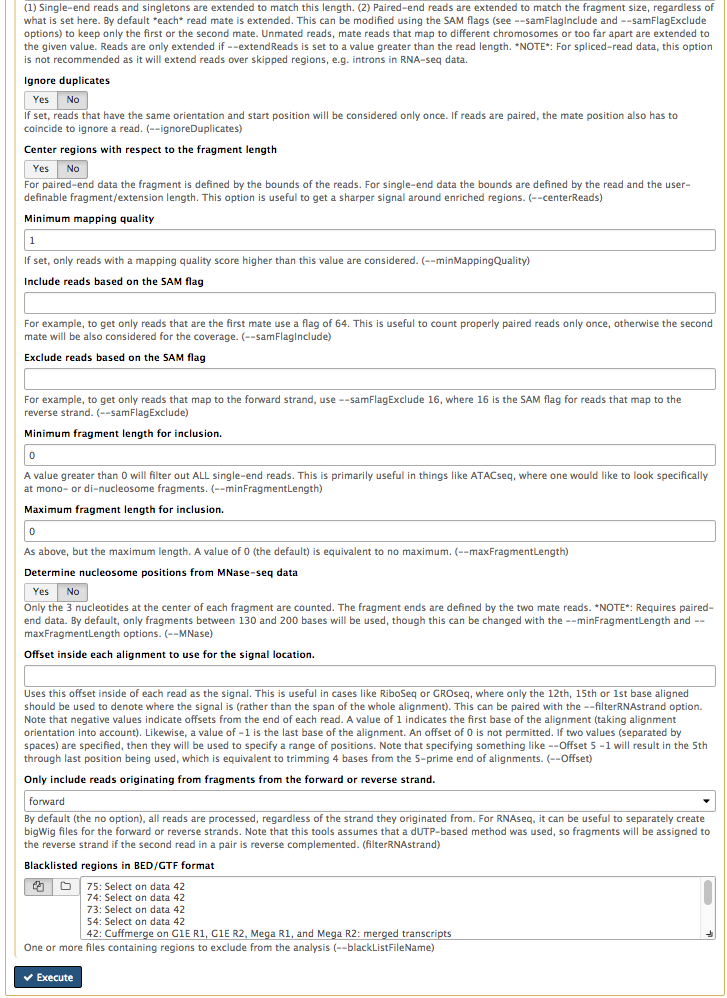
{: .hands_on}

> ### :pencil2: Hands-on: Trackster based visualization
>
> 1. **Viz** :wrench:: On the center console at the top of the Galaxy interface, choose " Visualization" -> "New track browser"
>    - Name your visualization someting descriptive under "Browser name:"
>    - Choose "Mouse Dec. 2011 (GRCm38/mm10) (mm10)" as the "Reference genome build (dbkey)
>    - Click "Create" to initiate your Trackster session
> 
>
> 2. **Viz** :wrench:: Click "Add datasets to visualization"
>    - Select the "RefSeq GTF mm10" file
>    - Select the output files from `Stringtie`
>    - Select the output file from `GFFCompare`
>    - Select the output files from `bamCoverage`
>
> 3. :wrench:: Using the grey labels on the left side of each track, drag and arrange the track order to your preference.
>
> 4. :wrench:: Hover over the grey label on the left side of the "RefSeq GTF mm10" track and click the "Edit settings" icon.
>    - Adjust the block color to blue (#0000ff) and antisense strand color to red (#ff0000)
>
> 5. :wrench:: Repeat the previous step on the output files from `StringTie` and `GFFCompare`.
>
> 6. :wrench:: Hover over the grey label on the left side of the "G1E R1 plus" track and click the "Edit settings" icon.
>    - Adjust the color to blue (#0000ff)
>
> 7. :wrench:: Repeat the previous step on the other three bigWig files representing the plus strand.
>
> 8. :wrench:: Hover over the grey label on the left side of the "G1E R1 minus" track and click the "Edit settings" icon.
>    - Adjust the color to red (#ff0000)
>
> 9. :wrench:: Repeat the previous step on the other three bigWig files representing the minus strand.
>
> 10. :wrench:: Adjust the track height of the bigWig files to be consistent for each set of plus strand and minus strand tracks.
> 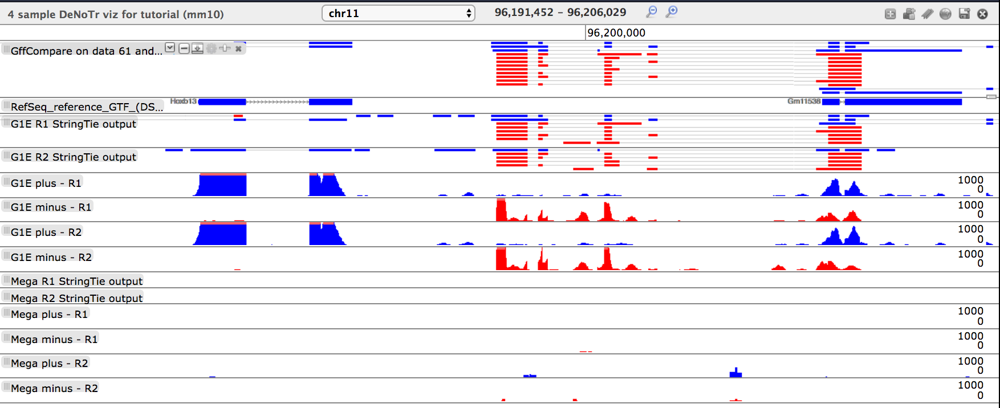
> 11. :wrench:: Direct Trackster to the coordinates: chr11:96191452-96206029, what do you see?
>
>    > ### :question: Question
>    > what do you see?
>    >    

>    >    
Click to view answers

>    >    <ol type="1">
>    >    <li>There are two clusters of transcripts that are exclusively expressed in the G1E background</li>
>    >    <li>The left-most transcript is the Hoxb13 transcript</li>
>    >    <li>The center cluster of transcripts are not present in the RefSeq annotation and are determined by `GFFCompare` to be "u" and "x"</li>
>    >    </ol>
>    >    

>    {: .question}
>
{: .hands_on}

# Conclusion
{:.no_toc}

In this tutorial, we have analyzed real RNA sequencing data to extract useful information, such as which genes are up- or down-regulated by depletion of the Pasilla gene and which genes are regulated by the Pasilla gene. To answer these questions, we analyzed RNA sequence datasets using a reference-based RNA-seq data analysis approach. This approach can be sum up with the following scheme:

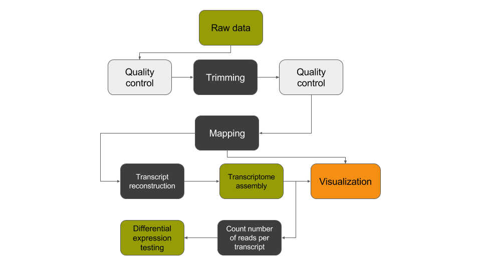

> # Workflow
> This analysis pipeline can be recreated using the workflow here: [https://tinyurl.com/GTNdenovoRNAseqWorkflow ](https://tinyurl.com/GTNdenovoRNAseqWorkflow)
