# Introduction
{:.no_toc}

Small, noncoding RNA (sRNA) molecules, typically 18-40nt in length, are key features of post-transcriptional regulatory mechanisms governing gene expression. Through interactions with protein cofactors, these tiny sRNAs typically function by perfectly or imperfectly basepairing with substrate RNA molecules, and then eliciting downstream effects such as translation inhibition or RNA degradation. Different subclasses of sRNAs - *e.g.* microRNAs (miRNAs), Piwi-interaction RNAs (piRNAs), and endogenous short interferring RNAs (siRNAs) - exhibit unique characteristics, and their relative abundances in biological contexts can indicate whether they are active or not. In this tutorial, we will examine expression of the piRNA subclass of sRNAs and their targets in *Drosophila melanogaster*.

The data used in this tutorial are from polyphosphatase-treated sRNA sequencing (sRNA-seq) experiments in *Drosophila*. The goal of this study was to determine how siRNA expression changes in flies treated with RNA interference (RNAi) to knock down Symplekin, which is a component of the core cleaveage completx. To that end, in addition to sRNA-seq, mRNA-seq experiments were performed to determine whether targets of differentially expressed siRNAs were also differentially expressed. The original published study can be found [here](https://www.ncbi.nlm.nih.gov/pubmed/28415970). Because of the long processing time for the large original files - which contained 7-22 million reads each - we have downsampled the original input data to include only a subset of usable reads.

# Analysis strategy

In this exercise we will identify what small RNAs are present in *Drosophila* Dmel-2 tissue culture cells treated with either RNAi against  core cleavage complex component Symplekin or blank (control) RNAi (published data available in GEO at [GSE82128](https://www.ncbi.nlm.nih.gov/geo/query/acc.cgi?acc=GSE82128)). In this study, biological triplicate sRNA- and mRNA-seq libraries were sequenced for both RNAi conditions. After removing contaminant ribosomal RNA (rRNA) and miRNA reads, we will identify and quantify endogenous siRNAs from sequenced reads and test for differential abundance. We will follow a popular small RNA analysis pipeline developed for piRNAs by the Phillip Zamore Lab and the ZLab (Zhiping Weng) at UMass Med School called [PiPipes](https://github.com/bowhan/piPipes). Although PiPipes was developed for analysis of piRNAs, many of the basical principles can be applied to other classes of small RNAs.

It is of note that this tutorial uses datasets that have been de-multiplexed so that the input data files are a single FASTQ formatted file for each sample. Because sRNAs are typically much smaller than fragments generated for RNA-seq or other types of deep sequencing experiments, single-end sequencing strategies are almost always used to sequence sRNAs. This tutorial uses the *Collections* feature of Galaxy to orgainze each set of replicates into a single group, making tool form submission easier and ensuring reproducibility.

> ### Agenda
>
> In this tutorial, we will deal with:
>
> 1. TOC
> {:toc}
>
{: .agenda}

## Data upload and organization

Due to the large size of the original sRNA-seq datasets, we have downsampled them to only inlcude a subset of reads. These datasets are avaialble at [`Zenodo`](https://doi.org/10.5281/zenodo.826906) where you can find the FASTQ files corresponding to replicate sRNA-seq experiments and additional annotation files for the *Drosophila melanogaster* genome version dm3.

> ### :pencil2: Hands-on: Data upload and organization
>
> 1. Create a new history and name it something meaningful (*e.g.* sRNA-seq tutorial)
> 1. Open the Data Upload Manager by selecting *Get Data* from the Tool Panel and clicking *Upload File*
> 1. Select *Paste/Fetch Data*
> 1. Copy each link for the read (.fastqsanger), annotation (.tab), and reference sequence (.fa) files, and paste each link into a separate text field
>    - Set the datatype of the read (.fastqsanger) files to **fastq**
>    - Set the datatype of the annotation (.tab) file to **tab** and assign the Genome as **dm3**
>    - Set the datatype of the reference (.fa) files to **fasta** and assign the Genome as **dm3**
> 1. Click *Start*
> 1. Rename the files in your history to something meaningful (*e.g.* Blank_RNAi_sRNA_rep1.fastq)
> 1. Build a *Dataset list* for each set of replicate FASTQ files
>    - Click the *Operations on multiple datasets* check box at the top of the history panel
>    - Check the three boxes next to the blank RNAi (control) sRNA-seq samples
>    - Click *For all selected...* and choose *Build dataset list*
>    - 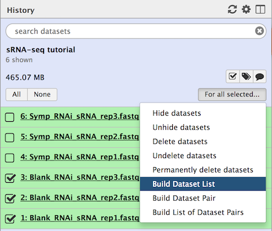
>    - Ensure that only the three blank samples are selected, and enter a name for the new collection (*e.g.* Blank RNAi sRNA-seq)
>    - 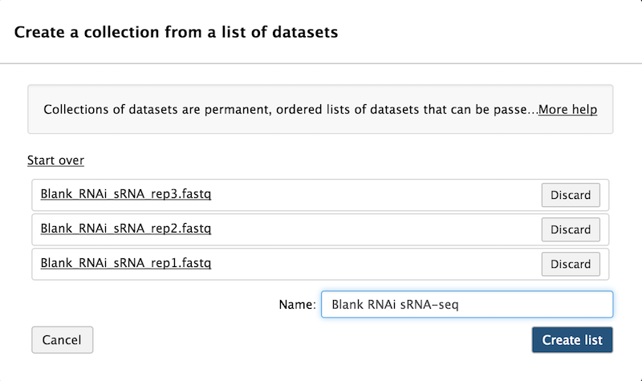
>    - Click *Create list*
>    - Repeat for the three *Symplekin* RNAi samples
>    - 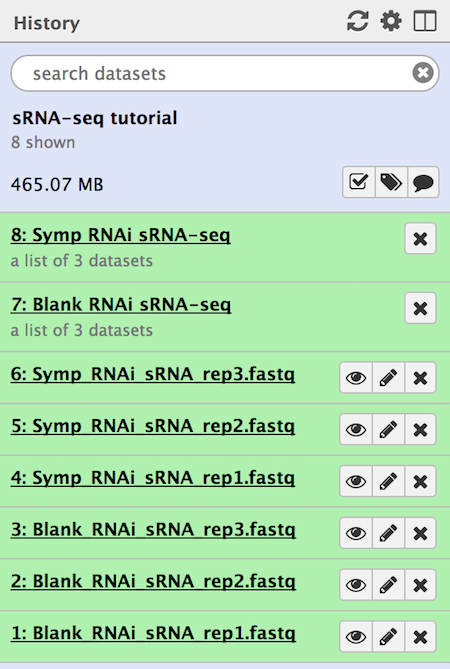
>
{: .hands_on}

## Read quality checking

Read quality scores (phred scores) in FASTQ-formatted data can be encoded by one of a few different encoding schemes. Most Galaxy tools assume that input FASTQ files are using the Sanger/Illumina 1.9 encoding scheme. If the input FASTQ files are using an alternate encoding scheme, then some tools will not interpret the quality score encodings correctly. It is good practice to confirm the quality encoding scheme of your data and then convert to Sanger/Illumina 1.9, if necessary. We can check the quality encoding scheme using the [FastQC](https://www.bioinformatics.babraham.ac.uk/projects/fastqc/) tool (further described in the [NGS-QC tutorial]({{site.url}}topics/sequence-analysis)).

> ### :pencil2: Hands-on: Quality checking
>
> 1. **FastQC** :wrench:: Run `FastQC` on each collection of FASTQ read files to assess the overall read/base quality and quality score encoding scheme using the following parameters:
>    - **Short read data from your current history**: Click the "Dataset collection" tab and then select the blank RNAi sRNA-seq dataset collection
>    
> 1. Repeat for the *Symplekin* RNAi dataset collection
>
>    > ### :question: Questions
>    >
>    > 1. What quality score encoding scheme is being used for each sample?
>    > 1. What is the read length for each sample?
>    > 1. What does the base/read quality look like for each sample?
>    > 1. Are there any adaptors present in these reads? Which one(s)?
>    >
>    >    

>    >    
Click to view answers

>    >    <ol type="1">
>    >    <li>All samples use the Illumina 1.9 quality encoding scheme, so we do **not** need to convert. </li>
>    >    <li>All samples have a read length of 50 nt. </li>
>    >    <li>The base quality across the entire length of the reads is good (phred score > 28 for the most part). </li>
>    >    <li>Yes, the "Illumina Universal Adapter" is present. </li>
>    >    </ol>
>    >    

>    {: .question}
>
>    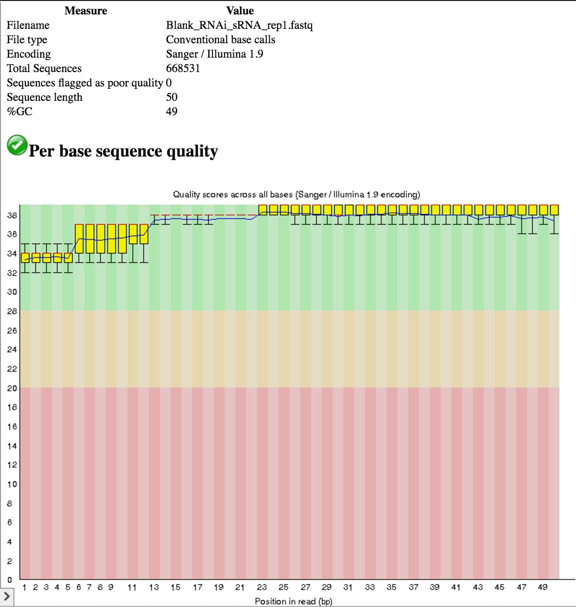
>    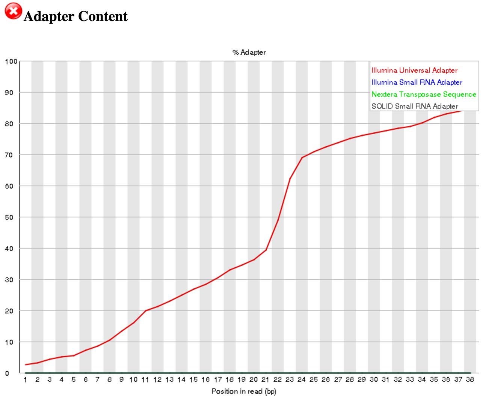
>
> **THE FOLLOWING STEP IS NOT NEEDED FOR THIS TUTORIAL**. But, if your data are not in **Sanger / Illumina 1.9 format**, then complete the following step.
>
> 1. **FASTQ Groomer** :wrench:: Run `FASTQ Groomer` on each collection of FASTQ read files to convert the quality scores from Illumina 1.5 to Sanger/Illumina 1.9 encoding using the following parameters:
>    - **File to groom**: Click the "Dataset collection" tab and then select the control RNAi sRNA-seq dataset collection
>    - **Input FASTQ quality scores type**: Illumina 1.3-1.7
>
{: .hands_on}

*If you are following this tutorial OR your data were already in Sanger / Illumina 1.9 format*: Changes the datatype of each input file to 'fastqsanger'.

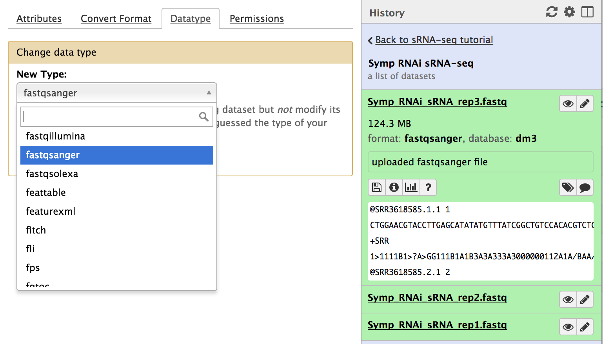

*If your data were not in Sanger / Illumina 1.9 format*: After `FASTQ Groomer` finishes, click on the groomed dataset collection name and then click on the name of one of the datasets. You should see that the format is **fastqsanger** instead of **fastq**, meaning you have successfully converted the quality score encoding scheme.

Go back to the `FASTQC` output and scroll down to the "Adapter Content" section. You can see that Illumina Universal Adapters are present in **>80%** of the reads. The next step is to remove these artificial adaptors because they are not part of the biological sRNAs. If a different adapter is present, you can update the **Adapter sequence to be trimmed off** in the `Trim Galore!` step described below.

## Adaptor trimming

sRNA-seq library preparation involves adding an artificial adaptor sequence to both the 5' and 3' ends of the small RNAs. While the 5' adaptor anchors reads to the sequencing surface and thus are not sequenced, the 3' adaptor is typically sequenced immediately following the sRNA sequence. In the example datasets here, the 3' adaptor sequence is identified as the Illumina Universal Adapter, and needs to be removed from each read before aligning to a reference. We will be using the Galaxy tool `Trim Galore!` which implements the [`cutadapt`](https://cutadapt.readthedocs.io/en/stable/) tool for adapter trimming.

> ### :pencil2: Hands-on: Adaptor trimming
>
> 1. **Trim Galore!** :wrench:: Run `Trim Galore!` on each collection of FASTQ read files to remove Illumina adapters from the 3' ends of reads with the following parameters:
>    - **Is this library paired- or single-end?**: Single-end
>    - **Reads in FASTQ format**: Click the "Dataset collection" tab and then select the blank RNAi sRNA-seq dataset
>    - **Trimming reads?**: Illumina universal
>    - **Trim Galore! advanced settings**: Full parameter list
>    - **Trim low-quality ends from reads in addition to adapter removal**: 0
>    - **Overlap with adapter sequence required to trim a sequence**: 6
>    - **Discard reads that became shorter than length INT**: 12
>    - **Generate a report file**: Yes
>
>    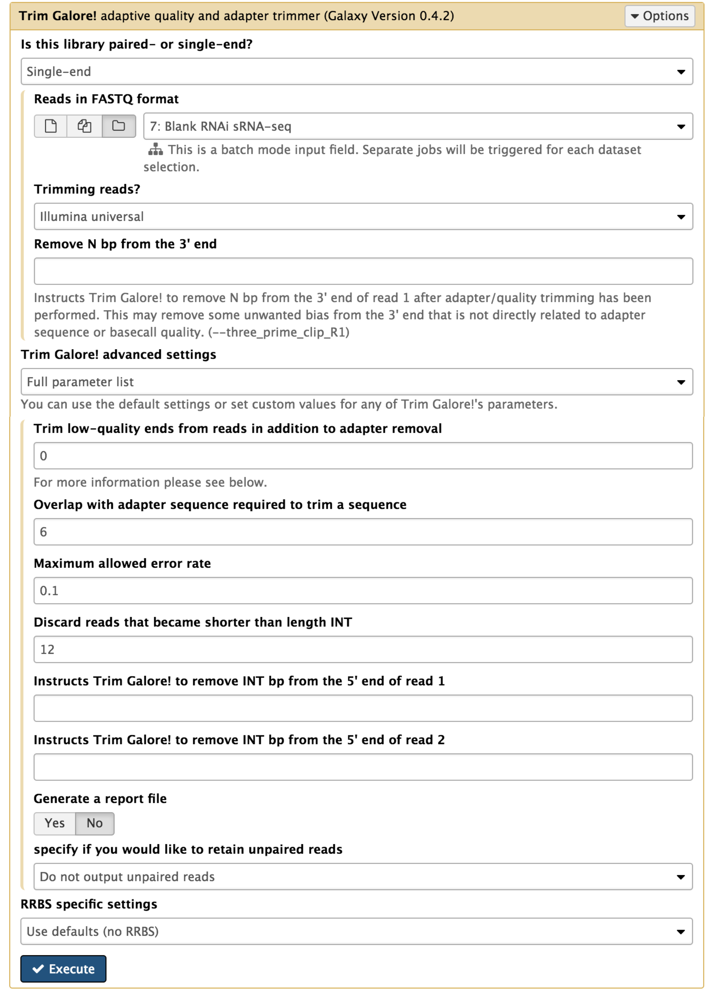
>
> 1. Repeat for the *Symplekin* RNAi dataset collection
>
>    We don't want to trim for quality because the adapter-trimmed sequences represent a full small RNA molecule, and we want to maintain the integrity of the entire molecule. We increase the minimum read length required to keep a read because small RNAs can potentially be shorter than 20 nt (the default value). We can check out the generated report file for any sample and see the command for the tool, a summary of the total reads processed and number of reads with an adapter identified, and histogram data of the length of adaptor trimmed. We also see that a very small percentage of low-quality bases have been trimmed
>
> 1. **FastQC** :wrench:: Run `FastQC` on each collection of trimmed FASTQ read files to assess whether adapters were successfully removed.
>
>    > ### :question: Questions
>    >
>    > 1. What is the read length?
>    > 1. Are there any adaptors present in these reads? Which one(s)?
>    >
>    >    

>    >    
Click to view answers

>    >    <ol type="1">
>    >    <li>The read lengths range from 12 to 50 nt after trimming.</li>
>    >    <li>No, Illumina Universal Adaptors are no longer present. No other adapters are present.</li>
>    >    </ol>
>    >    

>    {: .question}
>
> 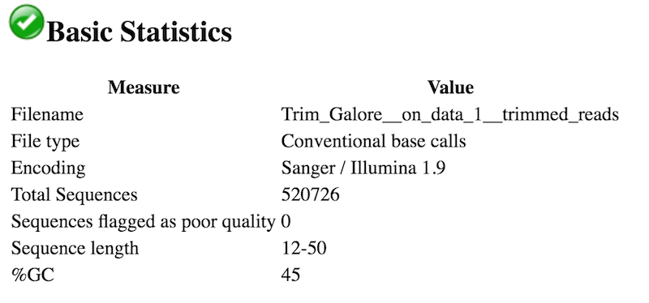
> 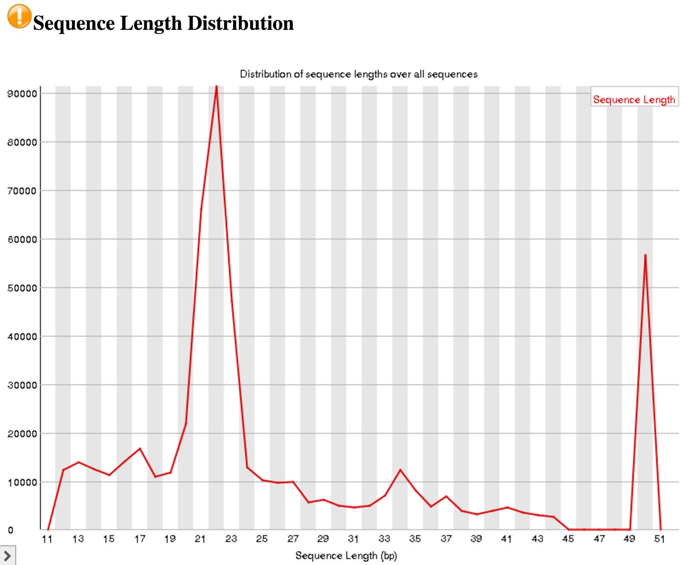
>
{: .hands_on}

An interesting thing to note from our `FastQC` results is the *Sequence Length Distribution* results. While many RNA-seq experiments have normal distribution of read lengths, an unusual spike at 22nt is observed in our data. This spike represents the large set of endogenous siRNAs that occur in the cell line used in this study, and is actually confirmation that our dataset captures the biological molecule we are interested in.

Now that we have converted to *fastqsanger* format and trimmed our reads of the Illumina Universal Adaptors, we will align our trimmed reads to reference *Drosophila* rRNA and miRNA sequences (dm3) to remove these artifacts. Interestingly, *Drosophila* have a short 2S rRNA sequence that is 30nt long and typically co-migrates with sRNA populations during gel electrophoresis. rRNAs make up a very large proportion of all non-coding RNAs, and thus need to be removed. Oftentimes, experimental approaches can be utilized to deplete or avoid capture of rRNAs, but these methods are not always 100% efficient. We also want to remove any miRNA sequences, as these are not relevant to our analysis. After removing rRNA and miRNA reads, we will analyze the remaining reads as siRNA and piRNA sequences.

## Hierarchical read alignment to remove rRNA/miRNA reads

To first identify rRNA-originating reads (which we are not interested in in this case), we will align the reads to a reference set of rRNA sequences using [`HISAT2`](https://ccb.jhu.edu/software/hisat2/index.shtml), an accurate and fast tool for aligning reads to a reference.

> ### :pencil2: Hands-on: Heirarchical alignment to rRNA and miRNA reference sequences
>
> 1. **HISAT2** :wrench:: Run `HISAT2` on each collection of trimmed reads to align to reference rRNA sequences with the following parameters:
>    - **Single end or paired reads?**: Individual unpaired reads
>    - **Reads**: Click the "Dataset collection" tab and then select the blank RNAi sRNA-seq dataset of trimmed FASTQ files
>    - **Source for the reference genome to align against**: Use a genome from history
>    - **Select the reference genome**: Dmel_rRNA_sequences.fa
>    - **Spliced alignment parameters**: Specify spliced alignment parameters
>    - **Specify strand-specific information**: Second Strand (F/FR)
>
>       
>
> 1. Repeat for the *Symplekin* RNAi dataset collection
>
>    We now need to extract the *unaligned* reads from the output BAM file for aligning to reference miRNA sequences. We can do this by using the `Filter SAM or BAM, output SAM or BAM` tool to obtain reads with a bit flag = 4 (meaning the read is unaligned) and then converting the filtered BAM file to FASTQ format with the `Convert from BAM to FastQ` tool.
>
> 1. **Filter SAM or BAM, output SAM or BAM** :wrench:: Run `Filter SAM or BAM, output SAM or BAM` on each collection of HISAT2 output BAM files with the following parameters:
>    - **SAM or BAM file to filter**: Click the "Dataset collection" tab and then select the blank RNAi sRNA-seq dataset of aligned HISAT2 BAM files
>    - **Filter on bitwise flag**: Yes
>    - **Only output alignments with all of these flag bits set**: Check the box next to "The read in unmapped"
>
> 1. Repeat for the *Symplekin* RNAi dataset collection
>
>       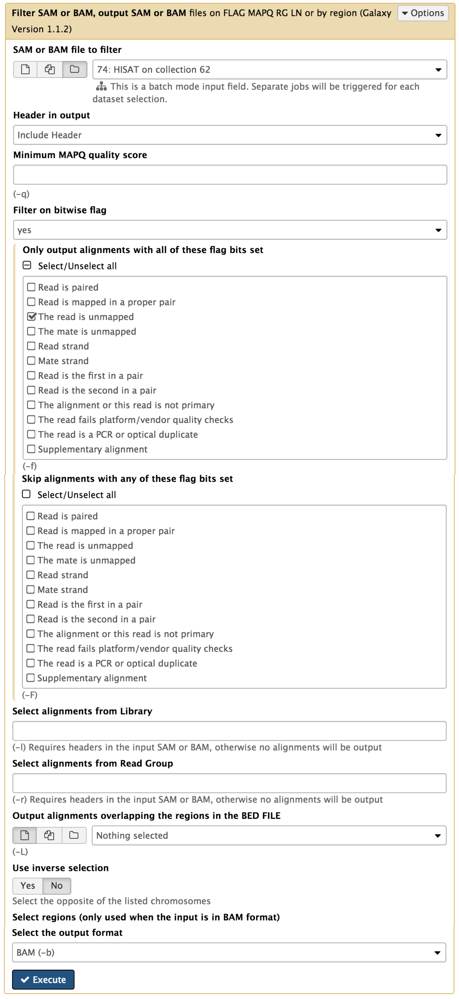
>
> 1. **Convert from BAM to FastQ** :wrench:: Run `Convert from BAM to FastQ` on each collection of filtered HISAT2 output BAM files with the following parameters:
>    - **Convert the following BAM file to FASTQ**: Click the "Dataset collection" tab and then select the blank RNAi sRNA-seq dataset of filtered HISAT2 BAM files
>
> 1. Click "Execute"
> 1. Repeat for the *Symplekin* RNAi dataset collection
>
>       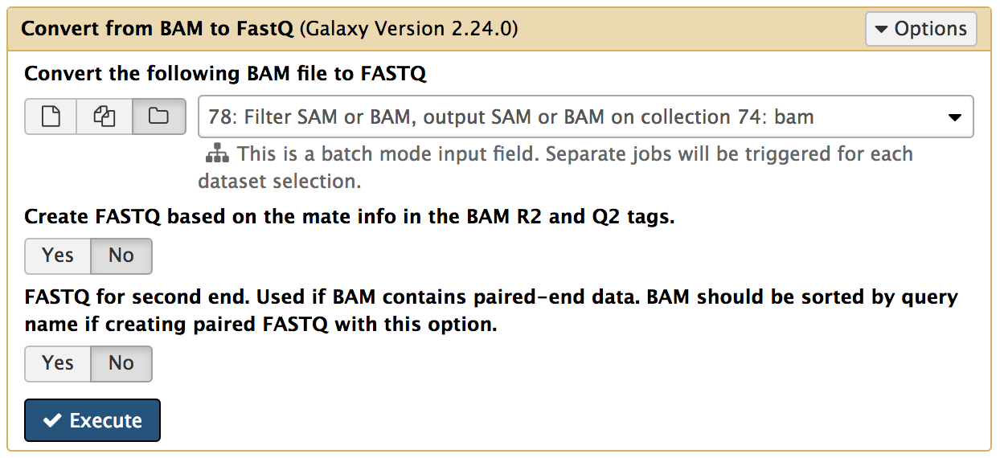
>
>    Next we will align the non-rRNA reads to a known set of miRNA hairpin sequences to identify miRNA reads.
>
> 1. **HISAT2** :wrench:: Run `HISAT2` on each collection of filtered HISAT2 output FASTQ files to align non-rRNA reads to reference miRNA hairpin sequences using the following parameters:
>    - **Single end or paired reads?**: Individual unpaired reads
>    - **Reads**: Click the "Dataset collection" tab and then select the blank sRNA-seq dataset of non-rRNA FASTQ files
>    - **Source for the reference genome to align against**: Use a genome from history
>    - **Select the reference genome**: Dmel_miRNA_sequences.fa
>    - **Spliced alignment parameters**: Specify spliced alignment parameters
>    - **Specify strand-specific information**: Second Strand (F/FR)
> 1. Repeat for the *Symplekin* RNAi dataset collection
>
>    For this tutorial we are not interested in miRNA reads, so we need to extract *unaligned* reads from the output BAM files. To do this, repeat the `Filter SAM or BAM, output SAM or BAM` and `Convert from BAM to FastQ` steps for each dataset collection. Finally, rename the converted FASTQ files something meaningful (*e.g.* "non-r/miRNA control RNAi sRNA-seq").
>
> In some instances, miRNA-aligned reads are the desired output for downstream analyses, for example, if we are investigating how loss of key miRNA pathway components affect levels of pre-miRNA and mature miRNAs. In this case, the BAM output of HISAT2 can directly be used in subsequent tools as it contains the subset of reads aligned to miRNA sequences.
>
{: .hands_on}

## Small RNA subclass distinction

In *Drosophila*, non-miRNA small RNAs are typically divided into two major groups: endogenous siRNAs which are 20-22nt long and piRNAs which are 23-29nt long. We want to analyze these sRNA subclasses independently, so next we are going to filter the non-r/miRNA reads based on length using the `Manipulate FASTQ` tool.

> ### :pencil2: Hands-on: Extract subclasses
>
> 1. **Manipulate FASTQ** :wrench:: Run `Manipulate FASTQ` on each collection of non-r/miRNA reads to identify siRNAs (20-22nt) using the following parameters.
>    - **FASTQ File**: Click the "Dataset collection" tab and then select the blank RNAi sRNA-seq dataset of non-r/miRNA FASTQ files
>    - **Match Reads**: Click "Insert Match Reads"
>    - **Match Reads by**: Set to "Sequence Content"
>    - **Match by**: Enter: ^.{12,19}$|^.{23,50}$
>    - **Manipulate Reads**: Click "Insert Manipulate Reads"
>    - **Manipulate Reads on**: Set to "Miscellaneous actions"
>    - **Miscellaneous Manipulation Type**: Set to "Remove Read"
> 1. Repeat `Manipulate FASTQ` for the *Symplekin* RNAi dataset collection
> 1. Rename each resulting dataset collection something meaningful (*i.e.* "blank RNAi - siRNA reads (20-22nt)")
>
>       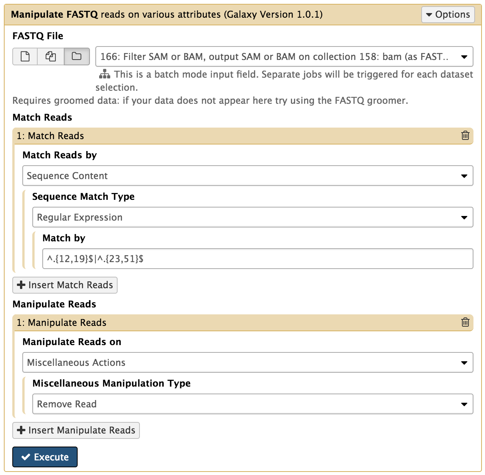
>
>    The regular expression in the **Match by** parameter tells the tool to identify sequences that are length 12-19 or 23-50 (inclusive), and the **Miscellaneous Manipulation Type** parameter tells the tool to remove these sequences. What remains are sequences of length 20-22nt. We will now repeat these steps to identify 23-29nt piRNA sequences.
>
> 1. **Manipulate FASTQ** :wrench:: Run `Manipulate FASTQ` on each collection of non-r/miRNA reads to identify piRNAs (23-29nt) using the following parameters.
>    - **FASTQ File**: Click the "Dataset collection" tab and then select the blank RNAi sRNA-seq dataset of non-r/miRNA FASTQ files
>    - **Match Reads**: Click "Insert Match Reads"
>    - **Match Reads by**: Set to "Sequence Content"
>    - **Match by**: Enter: ^.{12,22}$|^.{30,50}$
>    - **Manipulate Reads**: Click "Insert Manipulate Reads"
>    - **Manipulate Reads on**: Set to "Miscellaneous actions"
>    - **Miscellaneous Manipulation Type**: Set to "Remove Read"
> 1. Repeat `Manipulate FASTQ` for the *Symplekin* RNAi dataset collection
> 1. Rename each resulting dataset collection something meaningful (*i.e.* "blank RNAi - piRNA reads (23-29nt)")
>
>       
>
> 1. **FastQC** :wrench:: Run `FastQC` on each collection of siRNA and piRNA read files to confirm the correct read lengths.
>
>       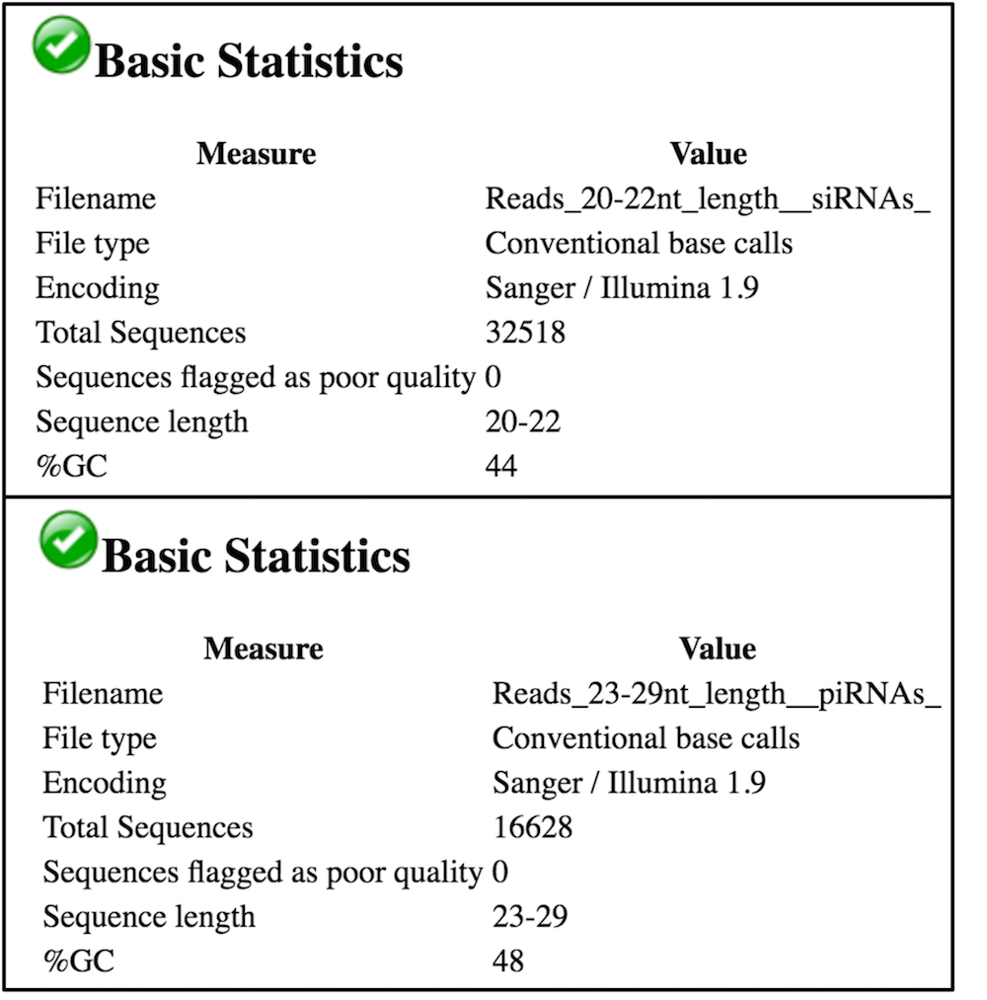
>
> We see in the above image (for Blank RNAi, replicate 3) that we have ~32k reads that are 20-22nt long in our Reads_20-22_nt_length_siRNAs file and ~16k reads that are 23-29nt long in our Reads_23-29_nt_length_piRNAs file, as expected. Given that we had ~268k trimmed reads in the Blank RNAi replicate 3 file, siRNAs represent ~12.1% of the reads and piRNAs represent ~6.2% of the reads in this experiment.
>
{: .hands_on}

The next step in our analysis pipeline is to identify which RNA features - e.g. protein-coding mRNAs, transposable elements - the siRNAs and piRNAs align to. Most fly piRNAs originate from and thus align to transposable elements (TEs) but some also originate from genome piRNA clusters or protein-coding genes. siRNAs are thought to inhibit TE mobility and potentially target mRNAs for degradation via an RNA-interference (RNAi) mechanism. Ultimately, we want to know whether an RNA feature (TE, piRNA cluster, mRNA, etc.) has significantly different numbers of siRNAs or piRNAs targeting it. To determine this, we will use `Salmon` to simultaneously align and quantify siRNA reads against known target sequences to estimate siRNA abundance per target. For the remainder of the tutorial we will be focusing on siRNAs, but similar approaches can be done for piRNAs, miRNAs, or any other subclass of small, non-coding RNAs.

## siRNA abundance estimation

We want to identify which siRNAs are differentially abundance between the blank and *Symplekin* RNAi conditions. To do this we will implement a counting approach using `Salmon` to quantify siRNAs per RNA feature. Specifically, we will analyzing mRNA and TE elements by counting siRNAs against a FASTA file of transcript sequences, not the reference genome. This approach is especially useful in this case because we are interested in TEs, which occur at many copies (100s - 1000s) in the genome, and thus will result in multiple alignments if we align to the genome with a tool like `HISAT2`. Further, we will be counting abundance of siRNAs that align *sense* or *antisense* to an RNA feature independently, as opposite sense alignments are correlated with unique downstream silencing effects. Then, we will provide this information to `DESeq2` to generate normalized counts and significance testing for differential abundance of siRNAs per feature.

> ### :pencil2: Hands-on: siRNA abundance estimation
>
> 1. **Salmon** :wrench:: Run `Salmon` on each collection of siRNA reads (20-22nt) to quantify the abundance of *antisense* siRNAs at relevant targets. We will focus on abundance of siRNAs on mRNAs and transposable elements using the following parameters:
>    - **Select a reference transcriptome from your history or use a built-in index?**: Use one from the history
>    - **Select the reference transcriptome**: Select the reference mRNA and TE fasta file
>    - **The size should be odd number**: 19
>    - **FASTQ/FASTA file**: Click the "Dataset collection" tab and then select the Blank RNAi siRNA (20-22nt) reads
>    - **Specify the strandedness of the reads**: read 1 (or single-end read) comes from the reverse strand (SR)
>    - **Additional Options**: Click to expand options
>    - **Incompatible Prior**: 0
>
>       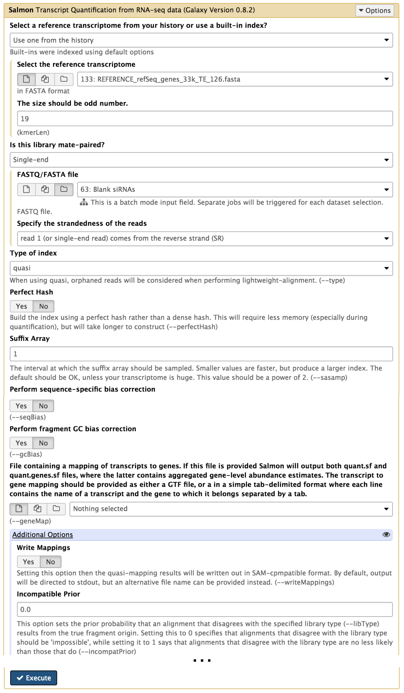
>
> 1. Repeat `Salmon` for the *Symplekin* RNAi siRNAs (20-22nt) reads dataset collection
> 1. **Salmon** :wrench:: Repeat step 1 on each collection of siRNA reads (20-22nt) to quantify the abundance of *sense* siRNAs at relevant targets by changing the following parameters:
>    - **Specify the strandedness of the reads**: read 1 (or single-end read) comes from the forward strand (SF)
> 1. Repeat `Salmon` for the *Symplekin* RNAi siRNAs (20-22nt) reads dataset collection
>
{: .hands_on}

The output of `Salmon` includes a table of RNA features, estimated counts, transcripts per million, and feature length. We will be using the TPM quantification column as input to `DESeq2` in the next section.

## siRNA differential abundance testing

[`DESeq2`](https://bioconductor.org/packages/release/bioc/html/DESeq2.html) is a great tool for differential expression analysis, but we also employ it here for estimation of abundance of reads targeting each of our RNA features. As input, `DESeq2` can take *t*ranscripts *p*er *m*illion (TPM) counts produced by `Salmon` for each feature. TPMs are estimates of the relative abundance of a given transcript in units, and analogously can be used here to quantify siRNAs that align either sense or antisense to transcripts.

> ### :pencil2: Hands-on: siRNA differential abundance testing
>
> 1. **DESeq2** :wrench:: Run `DESeq2` to test for differential abundance of *antisense* siRNAs at mRNA and TE features using the following parameters:
>    - **Specify a factor name**: Enter: RNAi
>    - Under "1: Factor level": **Specify a factor level**: Enter: Symplekin
>    - Under "1: Factor level": **Counts file(s)**: Click the "Dataset collection" tab and then select the Symplekin RNAi siRNA counts from reverse strand (SR)
>    - Under "2: Factor level": **Specify a factor level**: Enter: RNAi
>    - Under "2: Factor level": **Counts file(s)**: Click the "Dataset collection" tab and then select the Symplekin RNAi siRNA counts from reverse strand (SR)
>    - **Choice of Input data**: Select "TPM values (e.g. from sailfish and salmon)
>    - **Tabular file with Transcript - Gene mapping**: Select reference tx2g (transcript to gene) file (available through zenodo link)
>    - **Output normalized counts table**: Yes
>
>       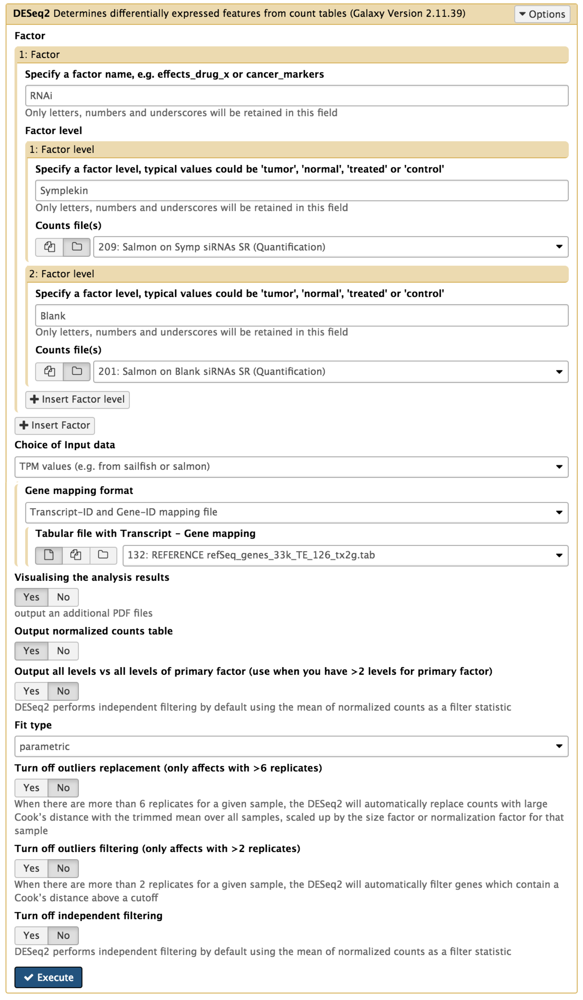
>
> 1. Repeat `DESeq2` for the *sense* siRNAs at mRNA and TE features changing the following parameters:
>    - Under "1: Factor level": **Counts file(s)**: Click the "Dataset collection" tab and then select the Symplekin RNAi siRNA counts from forward strand (SF)
>    - Under "2: Factor level": **Counts file(s)**: Click the "Dataset collection" tab and then select the Symplekin RNAi siRNA counts from forward strand (SF)
> 1. **Filter** :wrench:: Run `Filter` to extract features with a significantly different *antisense* siRNA abundance (adjusted *p*-value less than 0.05).
>    - **Filter**: Select the `DESeq2` result file from testing *antisense* (SR) siRNA abundances
>    - **With following condition**: Enter: c7<0.05
>
>       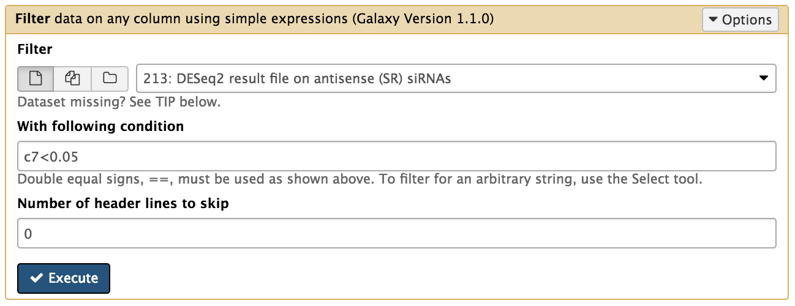
>
> 1. Repeat `Filter` for the *sense* siRNAs at mRNA and TE features changing the following parameters:
>    - **Filter**: Select the `DESeq2` result file from testing *sense* (SF) siRNA abundances
>
>    > ### :question: Question
>    >
>    > How many features have a significant difference in *antisense* and *sense* siRNA abundance in the *Symplekin* RNAi condition?
>    >
>    > 

>    > 
Click to view answers

>    > There are 87 *antisense* and 15 *sense* features that have significanlty different siRNA abundances.
>    > 

>    {: .question}
>
{: .hands_on}

For more information about `DESeq2` and its outputs, have a look at [`DESeq2` documentation](https://www.bioconductor.org/packages/release/bioc/manuals/DESeq2/man/DESeq2.pdf).

## Visualization

Coming soon!

## Conclusion
{:.no_toc}

Analysis of small RNAs is a complicated and intricate process due to the diversity in characteristics, functionality, and nuances of small RNA subclasses. The goal of this tutorial is to introduce you to a common small RNA workflow that specifically identifies changes in endogenous siRNA abundances that target protein-coding mRNAs and transposable elements. The steps presented here can be rearranged and modified based on small RNA features of specific systems and the needs of the user.

## Small RNA analysis (general) pipeline

